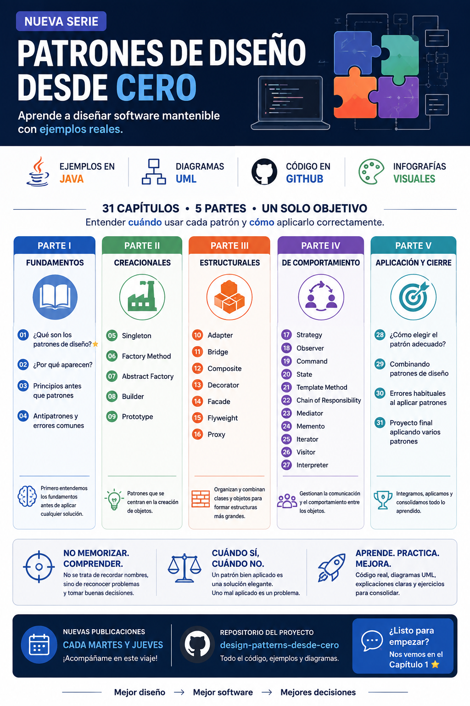

# 📚 Patrones de Diseño desde Cero

> **Aprende a diseñar software mantenible con ejemplos reales.**

Serie de Ingeniería de Software dedicada a comprender los **patrones de diseño**, los problemas que intentan resolver y cuándo tiene sentido utilizarlos.

El objetivo de esta serie no es memorizar una lista de patrones, sino aprender a **reconocer problemas de diseño, analizar el contexto y tomar mejores decisiones al diseñar software**.

Todos los ejemplos de código están desarrollados en **Java** y los diseños se representan mediante **UML**, utilizando principalmente **PlantUML**.

---

## 🎯 Objetivo

Los patrones de diseño suelen presentarse como una lista de nombres que debemos aprender:

- Singleton
- Factory Method
- Builder
- Adapter
- Strategy
- Observer
- etc.

Pero conocer sus nombres no significa saber cuándo utilizarlos.

Esta serie parte de una idea fundamental:

> **Los problemas de diseño son el punto de partida. Los patrones son una posible solución.**

Por eso comenzaremos desde los fundamentos y avanzaremos progresivamente hasta la aplicación de varios patrones en un proyecto final.

---

# 📖 Contenido de la serie

La serie está organizada en **5 Partes y 31 Capítulos**.

---

## 📖 PARTE I - FUNDAMENTOS

| # | Capítulo |
|---:|---|
| 1 | [¿Qué son los patrones de diseño?](parte-01-fundamentos/capitulo-01-que-son-los-patrones-de-diseno/README.md#-capítulo-1---qué-son-los-patrones-de-diseño)|
| 2 | [¿Por qué aparecen?](parte-01-fundamentos/capitulo-02-por-que-aparecen/README.md#-capítulo-2---por-qué-aparecen) |
| 3 | [Principios antes que patrones](parte-01-fundamentos/capitulo-03-principios-antes-que-patrones/README.md#-capítulo-3---principios-antes-que-patrones) |
| 4 | [Antipatrones y errores comunes](parte-01-fundamentos/capitulo-04-antipatrones-y-errores-comunes/README.md#-capítulo-4---antipatrones-y-errores-comunes) |

---

## 🏗️ PARTE II - PATRONES CREACIONALES

| # | Capítulo/Patrón |
|---:|---|
| 5 | [Singleton](parte-02-creacionales/capitulo-05-singleton/README.md#-capítulo-5---singleton) |
| 6 | [Factory Method](parte-02-creacionales/capitulo-06-factory-method/README.md#-capítulo-6---factory-method) |
| 7 | [Abstract Factory](parte-02-creacionales/capitulo-07-abstract-factory/README.md#-capítulo-7---abstract-factory) |
| 8 | [Builder](parte-02-creacionales/capitulo-08-builder/README.md#-capítulo-8---builder) |
| 9 | [Prototype](parte-02-creacionales/capitulo-09-prototype/README.md#-capítulo-9---prototype) |

---

## 🧱 PARTE III - PATRONES ESTRUCTURALES

| # | Capítulo/Patrón |
|---:|---|
| 10 | [Adapter](parte-03-estructurales/capitulo-10-adapter/README.md#-capítulo-10---adapter) |
| 11 | [Bridge](parte-03-estructurales/capitulo-11-bridge/README.md#-capítulo-11---bridge) |
| 12 | [Composite](parte-03-estructurales/capitulo-12-composite/README.md#-capítulo-12---composite) |
| 13 | Decorator |
| 14 | Facade |
| 15 | Flyweight |
| 16 | Proxy |

---

## 🔄 PARTE IV - PATRONES DE COMPORTAMIENTO

| # | Capítulo/Patrón |
|---:|---|
| 17 | Strategy |
| 18 | Observer |
| 19 | Command |
| 20 | State |
| 21 | Template Method |
| 22 | Chain of Responsibility |
| 23 | Mediator |
| 24 | Memento |
| 25 | Iterator |
| 26 | Visitor |
| 27 | Interpreter |

---

## 🎯 PARTE V - APLICACIÓN PRÁCTICA Y CIERRE

| # | Capítulo |
|---:|---|
| 28 | ¿Cómo elegir el patrón adecuado? |
| 29 | Combinando patrones de diseño |
| 30 | Errores habituales al aplicar patrones |
| 31 | Proyecto final aplicando varios patrones |

---

# ☕ Tecnología

Los ejemplos y recursos técnicos del proyecto utilizan principalmente:

- **Java** — lenguaje utilizado para los ejemplos.
- **UML** — representación visual de los diseños.
- **PlantUML** — creación de los diagramas UML.
- **Git** — control de versiones.
- **GitHub** — alojamiento y evolución del proyecto.

---

# 📊 UML

Los diagramas UML se desarrollan principalmente utilizando **PlantUML**.

Siempre que sea posible, los diagramas se conservarán en formato fuente (`.puml`) para que puedan:

- Consultarse.
- Modificarse.
- Versionarse.
- Regenerarse.
- Exportarse a diferentes formatos.

La intención es que los diagramas no sean únicamente imágenes, sino parte del material técnico del proyecto.

---

# 🧩 Los 23 patrones de diseño

Durante la serie estudiaremos los **23 patrones de diseño clásicos**, agrupados en tres categorías.

## 🏗️ Creacionales

Patrones relacionados con la creación de objetos.

- Singleton
- Factory Method
- Abstract Factory
- Builder
- Prototype

## 🧱 Estructurales

Patrones relacionados con la composición y organización de clases y objetos.

- Adapter
- Bridge
- Composite
- Decorator
- Facade
- Flyweight
- Proxy

## 🔄 De comportamiento

Patrones relacionados con la comunicación y distribución de responsabilidades entre objetos.

- Strategy
- Observer
- Command
- State
- Template Method
- Chain of Responsibility
- Mediator
- Memento
- Iterator
- Visitor
- Interpreter

---

# 📌 Principio fundamental

> **Los patrones de diseño no son el punto de partida.**
>
> **Los problemas de diseño son el punto de partida.**

Aprender patrones no consiste únicamente en saber qué es Singleton, Factory o Strategy.

Consiste en aprender a observar nuestro software, identificar problemas y preguntarnos:

> **¿Cómo podría diseñar esto mejor?**

---

# 🖼️ Infografía

Aquí os dejo una infografía sobre la estructura de la serie.

---

# ⭐ Si este proyecto te resulta útil

Si estás aprendiendo sobre diseño de software, eres desarrollador, estudiante o simplemente quieres mejorar la calidad de tus aplicaciones:

⭐ Dale una estrella al repositorio.

🍴 Haz un fork.

💬 Comparte tus ideas y propuestas.

🐛 Abre un issue si encuentras algún problema.

Y, sobre todo...

> **Aprendamos a diseñar software mejor.**