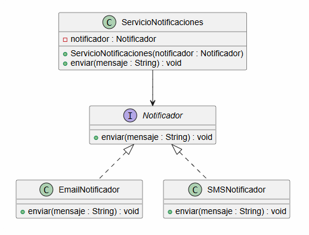

# 📚 Patrones de Diseño desde Cero

> **Aprende a diseñar software mantenible con ejemplos reales.**

# 📖 Capítulo 1 - ¿Qué son los patrones de diseño?

> **📚 Patrones de Diseño desde Cero**  
> **📖 Parte I - Fundamentos**

---

## 🧠 Introducción

Seguro que en algún momento has escuchado hablar de:

- 🧩 **Singleton**
- 🏭 **Factory**
- 🏗️ **Builder**
- 🔌 **Adapter**
- 🎯 **Strategy**
- 👀 **Observer**

Son nombres habituales cuando hablamos de diseño de software.

Pero antes de aprender cada uno de ellos debemos responder a dos preguntas fundamentales:

> **¿Qué es realmente un patrón de diseño?**

y

> **¿Para qué sirve?**

Este capítulo establece las bases de toda la serie.

El objetivo no es comenzar memorizando patrones, sino entender **por qué existen y qué problema intentan resolver**.

---

# 🎯 Objetivos de aprendizaje

Al finalizar este capítulo deberías ser capaz de:

- Comprender qué es un patrón de diseño.
- Entender para qué sirven.
- Diferenciar un patrón de una librería o un framework.
- Comprender la relación entre **problema, solución y contexto**.
- Entender por qué un patrón no debe aplicarse automáticamente.
- Reconocer que primero debemos identificar el problema de diseño.
- Comprender que, en determinadas situaciones, la mejor solución puede ser no utilizar ningún patrón.

---

# ❌ El problema

Durante el desarrollo de software es habitual comenzar con soluciones sencillas.

Y esto no es algo negativo.

De hecho, una solución sencilla suele ser exactamente lo que necesitamos al principio.

El problema aparece cuando la aplicación crece.

Nuevos requisitos, nuevas funcionalidades y nuevos comportamientos pueden hacer que una solución inicialmente sencilla empiece a acumular responsabilidades.

Por ejemplo, imaginemos una aplicación que necesita enviar diferentes tipos de notificaciones.

Podríamos comenzar con una clase como esta:

```java
public class ServicioNotificaciones {

    public void enviarEmail(String mensaje) {
        // ...
    }

    public void enviarSMS(String mensaje) {
        // ...
    }

    public void enviarPush(String mensaje) {
        // ...
    }
}
```

Al principio parece una solución perfectamente razonable.

Tenemos una única clase y tres métodos claramente identificados.

Pero la aplicación continúa creciendo.

Entonces empiezan a aparecer nuevas necesidades:

- ¿Qué ocurre si añadimos WhatsApp?
- ¿Y si queremos cambiar el proveedor de SMS?
- ¿Y si cada tipo de notificación tiene reglas diferentes?
- ¿Y si queremos incorporar nuevos canales sin modificar continuamente la misma clase?

El problema empieza a dejar de ser simplemente de código.

Tenemos un **problema de diseño**.

---

# 💡 Motivación

Cuando una aplicación crece, determinados problemas de diseño aparecen una y otra vez.

Podemos encontrarnos con:

- Clases con demasiadas responsabilidades.
- Código fuertemente acoplado.
- Dificultad para incorporar nuevos comportamientos.
- Dependencias difíciles de sustituir.
- Código complicado de mantener.
- Cambios que afectan a demasiadas partes del sistema.

Estos problemas no son exclusivos de una aplicación concreta.

A lo largo del tiempo, los desarrolladores han encontrado problemas similares en diferentes sistemas y contextos.

Y, ante problemas recurrentes, aparecen soluciones que pueden ser reutilizadas.

Ahí es donde entran en juego los patrones de diseño.

---

# 🧩 ¿Qué es un patrón de diseño?

Un patrón de diseño es una **solución reutilizable a un problema de diseño que aparece de forma recurrente en el desarrollo de software**.

La definición es importante, pero todavía lo es más comprender qué hay detrás de ella.

Un patrón no nos dice simplemente:

> **"Escribe este código."**

Nos ayuda a responder:

> **"Tengo este problema de diseño. ¿Existe una solución conocida que pueda aplicar en este contexto?"**

Por eso hay tres conceptos fundamentales:

### 🔹 Problema

¿Qué dificultad de diseño estamos intentando resolver?

### 🔹 Solución

¿Qué estrategia o estructura puede ayudarnos a resolverla?

### 🔹 Contexto

¿En qué situación tiene sentido aplicar esa solución?

Podemos representarlo así:

```text
┌─────────────┐
│  PROBLEMA   │
└──────┬──────┘
       │
       ▼
┌─────────────┐
│   CONTEXTO  │
└──────┬──────┘
       │
       ▼
┌─────────────┐
│  SOLUCIÓN   │
└──────┬──────┘
       │
       ▼
┌─────────────┐
│   PATRÓN    │
└─────────────┘
```

---

# 🚫 ¿Qué NO es un patrón de diseño?

Comprender lo que **no** es un patrón de diseño es tan importante como conocer su definición.

## ❌ No es una librería

Una librería proporciona código que podemos utilizar en nuestra aplicación.

Un patrón describe una forma de abordar un problema de diseño.

---

## ❌ No es un framework

Un framework proporciona una estructura y unas reglas sobre las que construir una aplicación.

Un patrón no controla nuestro proyecto ni impone una arquitectura completa.

---

## ❌ No es una clase que podamos copiar y pegar

Un patrón no consiste necesariamente en una clase concreta.

Puede implicar:

- Clases.
- Interfaces.
- Relaciones.
- Responsabilidades.
- Colaboraciones entre objetos.

El código final dependerá del contexto concreto en el que se aplique.

---

## ❌ No es una receta obligatoria

Conocer un patrón no significa que debamos utilizarlo.

Un patrón solamente tiene sentido cuando **resuelve un problema real de nuestro diseño**.

---

# ☕ Un ejemplo sencillo en Java

Volvamos al ejemplo de las notificaciones.

Una posible evolución consiste en separar el comportamiento mediante una abstracción.

```java
public interface Notificador {

    void enviar(String mensaje);
}
```

Podemos crear diferentes implementaciones:

```java
public class EmailNotificador implements Notificador {

    @Override
    public void enviar(String mensaje) {
        System.out.println(
            "Enviando email: " + mensaje
        );
    }
}
```

```java
public class SMSNotificador implements Notificador {

    @Override
    public void enviar(String mensaje) {
        System.out.println(
            "Enviando SMS: " + mensaje
        );
    }
}
```

Y hacer que nuestro servicio dependa de la abstracción:

```java
public class ServicioNotificaciones {

    private final Notificador notificador;

    public ServicioNotificaciones(
            Notificador notificador) {

        this.notificador = notificador;
    }

    public void enviar(String mensaje) {
        notificador.enviar(mensaje);
    }
}
```

Podemos utilizarlo así:

```java
public class Main {

    public static void main(String[] args) {

        Notificador notificador =
                new EmailNotificador();

        ServicioNotificaciones servicio =
                new ServicioNotificaciones(notificador);

        servicio.enviar(
                "Hola desde Patrones de Diseño"
        );
    }
}
```

Con este diseño, `ServicioNotificaciones` ya no depende directamente de una implementación concreta.

Depende de:

```java
Notificador
```

Esto nos permite incorporar nuevas implementaciones sin modificar necesariamente el servicio.

Por ejemplo:

```java
public class PushNotificador implements Notificador {

    @Override
    public void enviar(String mensaje) {
        System.out.println(
            "Enviando push: " + mensaje
        );
    }
}
```

---

# ⚠️ Pero cuidado...

Aquí aparece una de las ideas más importantes de este capítulo.

**No debemos pensar inmediatamente:**

> "¡Esto es un patrón! Tengo que aplicarlo."

Ese no es el objetivo.

Primero debemos preguntarnos:

### 1️⃣ ¿Cuál es el problema?

Identificar qué parte de nuestro diseño está provocando dificultades.

### 2️⃣ ¿Cuál es el contexto?

Entender cómo funciona nuestro sistema y qué requisitos tenemos.

### 3️⃣ ¿Necesitamos realmente una abstracción?

No toda aplicación necesita múltiples capas de abstracción.

### 4️⃣ ¿Existe un patrón que aporte valor?

Solo entonces tiene sentido valorar la utilización de un patrón.

Podemos resumirlo así:

```text
1. Identificar el problema
             ↓
2. Analizar el contexto
             ↓
3. Evaluar alternativas
             ↓
4. Valorar un patrón
             ↓
5. Aplicarlo si aporta valor
```

A veces la respuesta final será:

> **No necesitamos ningún patrón.**

Y esa también puede ser una excelente decisión de diseño.

---

# ✅ Ventajas

Utilizados correctamente, los patrones de diseño pueden ayudarnos a:

- Reducir el acoplamiento.
- Separar responsabilidades.
- Facilitar la extensión del software.
- Mejorar la mantenibilidad.
- Reutilizar soluciones conocidas.
- Facilitar la comunicación entre desarrolladores.
- Establecer un lenguaje común para hablar sobre diseño.

Pero estas ventajas dependen siempre del **contexto**.

---

# ⚠️ Desventajas

Los patrones también pueden introducir costes.

Una solución basada en patrones puede:

- Añadir clases.
- Añadir interfaces.
- Incrementar la complejidad.
- Introducir más abstracciones.
- Hacer más difícil seguir el flujo del programa.
- Ser innecesaria para problemas pequeños.

Por eso:

> **Un patrón no hace automáticamente que nuestro código sea mejor.**

---

# 🎯 Cuándo utilizar un patrón

Tiene sentido plantearnos un patrón cuando:

- Tenemos un problema de diseño real.
- El problema aparece de forma recurrente.
- Existe una solución conocida que encaja con nuestro contexto.
- Necesitamos separar responsabilidades.
- Queremos reducir determinados tipos de acoplamiento.
- Necesitamos facilitar la extensión del sistema.

---

# 🚫 Cuándo evitarlo

Debemos plantearnos no utilizar un patrón cuando:

- La solución sencilla ya es suficientemente buena.
- El problema todavía no existe.
- La abstracción introduce más complejidad que beneficios.
- Lo utilizamos únicamente porque conocemos el patrón.
- Estamos intentando anticiparnos a cambios hipotéticos.
- El equipo tendrá más dificultades para mantener la solución.

Una regla sencilla:

> **No introduzcas complejidad para resolver un problema que todavía no tienes.**

---

# 📊 UML

El ejemplo puede representarse mediante el siguiente diagrama UML:



El archivo de la imagen del diagrama se encuentra en:

```text
imagenes/
└── diagrama.png
```

El archivo fuente del diagrama se encuentra en:

```text
uml/
└── diagrama.puml
```

Podéis copiar también el código del archivo ```diagrama.puml``` y pegarlo en la web de **[PlantUML](https://plantuml.com/es/)** para ver el diagrama en formato <em>**on-line**</em>.

---

# 🔎 Explicación del ejemplo

El diseño está compuesto por cuatro elementos principales.

### `Notificador`

Define el comportamiento que deben proporcionar las diferentes implementaciones.

### `EmailNotificador`

Implementa el comportamiento para enviar notificaciones mediante email.

### `SMSNotificador`

Implementa el comportamiento para enviar notificaciones mediante SMS.

### `ServicioNotificaciones`

Utiliza la abstracción `Notificador` en lugar de depender directamente de una implementación concreta.

Esto permite cambiar la implementación utilizada sin modificar necesariamente el servicio.

---

# 📌 Resumen

En este capítulo hemos aprendido que:

- Un patrón de diseño es una solución reutilizable a un problema de diseño recurrente.
- Los patrones no son librerías.
- Los patrones no son frameworks.
- Los patrones no son clases para copiar y pegar.
- Los patrones no son recetas obligatorias.
- Su utilidad depende del problema y del contexto.
- Pueden ayudarnos a mejorar la mantenibilidad del software.
- También pueden introducir complejidad innecesaria.
- Antes de aplicar un patrón debemos comprender el problema.

La idea fundamental que debemos recordar es:

> **Problema → Solución → Contexto**

---

# 🎓 Conclusiones

Los patrones de diseño son herramientas para ayudarnos a tomar mejores decisiones de diseño.

Pero no debemos empezar nuestro desarrollo preguntándonos:

> **"¿Qué patrón puedo utilizar?"**

Debemos empezar preguntándonos:

> **"¿Qué problema tengo?"**

A partir de ahí podremos analizar el contexto, estudiar las alternativas y decidir si un patrón puede aportar valor.

Y en ocasiones, la mejor decisión será **no utilizar ninguno**.

El objetivo de esta serie no es que terminemos memorizando 23 nombres.

Es que seamos capaces de mirar un problema de diseño y preguntarnos:

> **"¿Cómo podría diseñar esto mejor?"**

---

# 🖼️ Infografía

Aquí os dejo una infografía sobre este **capítulo 1**.


---

**📚 Patrones de Diseño desde Cero**

*Aprende a diseñar software mantenible con ejemplos reales.*