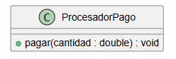
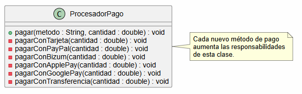
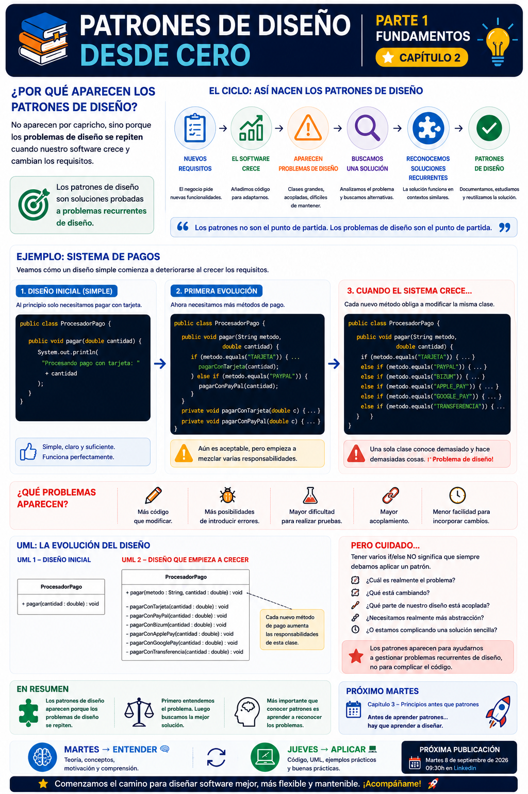

# 📚 Patrones de Diseño desde Cero

> **Aprende a diseñar software mantenible con ejemplos reales.**

# 📖 Capítulo 2 - ¿Por qué aparecen?

> **📚 Patrones de Diseño desde Cero**  
> **📖 Parte I - Fundamentos**

---

## 🧠 Introducción

En el capítulo anterior vimos qué son los patrones de diseño y establecimos una idea fundamental:

> **Los problemas de diseño son el punto de partida. Los patrones son una posible solución.**

Pero esto nos lleva a una nueva pregunta:

> **¿Por qué aparecen los patrones de diseño?**

La respuesta está en la evolución del software.

Una aplicación rara vez permanece exactamente igual desde el momento en que se crea.

Aparecen nuevos requisitos, nuevas funcionalidades, nuevos usuarios y nuevas necesidades.

Y cuando el software crece, también pueden aparecer **problemas de diseño**.

En este capítulo veremos cómo ocurre este proceso y por qué determinadas soluciones terminan apareciendo de forma recurrente.

---

# 🎯 Objetivos de aprendizaje

Al finalizar este capítulo deberías ser capaz de:

- Comprender por qué aparecen los problemas de diseño.
- Entender cómo los cambios en los requisitos afectan al diseño del software.
- Identificar señales de un diseño que empieza a deteriorarse.
- Comprender la relación entre crecimiento del software y complejidad.
- Entender cómo aparecen soluciones recurrentes a problemas similares.
- Comprender por qué los patrones de diseño no aparecen de forma arbitraria.
- Diferenciar entre una evolución natural del software y una aplicación prematura de patrones.

---

# ❌ El problema

Imaginemos una aplicación de comercio electrónico.

Inicialmente solo necesitamos permitir pagos mediante tarjeta.

Una primera implementación podría ser:

```java
public class ProcesadorPago {

    public void pagar(double cantidad) {
        System.out.println(
            "Procesando pago con tarjeta: " + cantidad
        );
    }
}
```

La solución es sencilla.

Y no hay ningún problema con ella.

De hecho, cuando el sistema solamente necesita procesar pagos mediante tarjeta, probablemente sea una solución perfectamente válida.

Pero la aplicación empieza a crecer.

Nuestros usuarios quieren nuevas formas de pago:

- 💳 Tarjeta
- 🅿️ PayPal
- 🏦 Transferencia bancaria
- 📱 Bizum

Podríamos modificar nuestra clase:

```java
public class ProcesadorPago {

    public void pagar(
            String metodo,
            double cantidad) {

        if (metodo.equals("TARJETA")) {
            pagarConTarjeta(cantidad);

        } else if (metodo.equals("PAYPAL")) {
            pagarConPayPal(cantidad);

        } else if (metodo.equals("TRANSFERENCIA")) {
            pagarConTransferencia(cantidad);

        } else if (metodo.equals("BIZUM")) {
            pagarConBizum(cantidad);
        }
    }

    private void pagarConTarjeta(double cantidad) {
        // ...
    }

    private void pagarConPayPal(double cantidad) {
        // ...
    }

    private void pagarConTransferencia(double cantidad) {
        // ...
    }

    private void pagarConBizum(double cantidad) {
        // ...
    }
}
```

La aplicación sigue funcionando.

Pero aparece una nueva necesidad:

> "Tenemos que añadir Apple Pay."

Añadimos otro `if`.

Después:

> "También necesitamos Google Pay."

Otro `if`.

Y posteriormente:

> "Tenemos que cambiar la integración con PayPal."

Ahora tenemos que modificar nuevamente la misma clase.

---

# 💡 Motivación

Aquí empieza a aparecer un problema diferente.

Ya no estamos simplemente añadiendo funcionalidades.

Estamos haciendo que una misma clase conozca cada vez más detalles sobre diferentes formas de pago.

Con el tiempo podemos terminar con algo parecido a:

```text
ProcesadorPago
│
├── Tarjeta
├── PayPal
├── Transferencia
├── Bizum
├── Apple Pay
├── Google Pay
├── ...
└── ...
```

Y cada nuevo método de pago implica modificar `ProcesadorPago`.

Esto puede provocar:

- Mayor complejidad.
- Mayor acoplamiento.
- Más posibilidades de introducir errores.
- Mayor dificultad para realizar pruebas.
- Mayor dificultad para mantener el código.
- Mayor dificultad para incorporar nuevos comportamientos.

El problema no es que tengamos varios métodos de pago.

El problema es que **el diseño empieza a concentrar demasiadas responsabilidades en el mismo lugar**.

---

# 🔄 El software cambia

Una de las principales razones por las que aparecen problemas de diseño es que:

> **El software cambia.**

Los requisitos cambian.

Las tecnologías cambian.

Los usuarios cambian.

Las integraciones cambian.

Y las necesidades del negocio cambian.

Podemos representar esta evolución así:

```text
NUEVOS REQUISITOS
        │
        ▼
NUEVAS FUNCIONALIDADES
        │
        ▼
EL SOFTWARE CRECE
        │
        ▼
AUMENTA LA COMPLEJIDAD
        │
        ▼
APARECEN PROBLEMAS DE DISEÑO
```

Y es precisamente en este punto donde empezamos a buscar soluciones.

---

# 🧩 De los problemas a los patrones

Cuando un problema aparece una única vez, podemos encontrar una solución específica para ese caso.

Pero cuando encontramos problemas similares una y otra vez, empezamos a reconocer determinadas estructuras.

Por ejemplo:

```text
Problema
   │
   ▼
Analizamos el contexto
   │
   ▼
Buscamos una solución
   │
   ▼
La solución funciona
   │
   ▼
Aparece un problema similar
   │
   ▼
Reutilizamos la idea
   │
   ▼
Solución recurrente
   │
   ▼
Patrón de diseño
```

Por eso los patrones no aparecen porque alguien haya decidido crear una colección de soluciones.

Surgen de la **experiencia acumulada resolviendo problemas de diseño recurrentes**.

---

# ☕ Ejemplo en Java

Podemos representar la evolución del ejemplo de pagos.

## Primera versión

```java
public class ProcesadorPago {

    public void pagar(double cantidad) {
        System.out.println(
            "Procesando pago con tarjeta: " + cantidad
        );
    }
}
```

Es sencilla y cumple su objetivo.

---

## Segunda versión

Cuando aparecen diferentes métodos:

```java
public class ProcesadorPago {

    public void pagar(
            String metodo,
            double cantidad) {

        if (metodo.equals("TARJETA")) {
            // Pago con tarjeta
        } else if (metodo.equals("PAYPAL")) {
            // Pago con PayPal
        } else if (metodo.equals("BIZUM")) {
            // Pago con Bizum
        }
    }
}
```

Todavía puede ser una solución aceptable dependiendo del contexto.

Y esto es importante:

> **Tener varios `if` no significa automáticamente que tengamos un mal diseño.**

La cuestión es cuándo esa estructura empieza a dificultar realmente la evolución del sistema.

---

## Tercera versión

Imaginemos que seguimos añadiendo métodos:

```java
public class ProcesadorPago {

    public void pagar(
            String metodo,
            double cantidad) {

        if (metodo.equals("TARJETA")) {
            // ...
        } else if (metodo.equals("PAYPAL")) {
            // ...
        } else if (metodo.equals("BIZUM")) {
            // ...
        } else if (metodo.equals("APPLE_PAY")) {
            // ...
        } else if (metodo.equals("GOOGLE_PAY")) {
            // ...
        } else if (metodo.equals("TRANSFERENCIA")) {
            // ...
        }
    }
}
```

Ahora podemos empezar a preguntarnos:

> **¿Está empezando a aparecer un problema de diseño?**

Esta pregunta es mucho más importante que preguntarnos inmediatamente qué patrón utilizar.

---

# 🔎 ¿Qué está cambiando?

Antes de buscar una solución deberíamos analizar qué parte del sistema cambia.

En nuestro ejemplo:

```text
Método de pago
      │
      ├── Tarjeta
      ├── PayPal
      ├── Bizum
      ├── Apple Pay
      ├── Google Pay
      └── Transferencia
```

El comportamiento relacionado con el pago puede variar.

Eso nos da una pista:

> **Tenemos un comportamiento que puede cambiar independientemente del resto del sistema.**

Esta observación será importante cuando estudiemos determinados patrones más adelante.

Pero todavía no necesitamos ponerle nombre a la solución.

---

# 📊 UML

Podemos representar la evolución del diseño inicial mediante un diagrama sencillo:



La clase inicialmente tiene una única responsabilidad.

Cuando empiezan a aparecer diferentes métodos de pago, el diseño puede evolucionar hacia:



El segundo diseño nos permite visualizar cómo una única clase empieza a concentrar diferentes comportamientos.

Podéis copiar también el código de los archivos ```.puml``` que tenéis en el directorio ```/uml``` y pegarlo en la web de **[PlantUML](https://plantuml.com/es/)** para ver el diagrama en formato <em>**on-line**</em>.

---

# 🔎 Explicación paso a paso

## 1️⃣ Comenzamos con una solución sencilla

La aplicación solamente necesita procesar pagos mediante tarjeta.

No necesitamos abstraer nada.

---

## 2️⃣ Aparece un nuevo requisito

Los usuarios necesitan utilizar PayPal.

Tenemos que modificar nuestro código.

---

## 3️⃣ Aparecen más requisitos

Llegan Bizum, Apple Pay, Google Pay, transferencias, etc.

Cada nueva funcionalidad aumenta la cantidad de código que conoce `ProcesadorPago`.

---

## 4️⃣ Aparecen cambios independientes

Cada método de pago puede tener:

- Diferentes APIs.
- Diferentes reglas.
- Diferentes errores.
- Diferentes proveedores.
- Diferentes procesos de validación.

La clase empieza a conocer demasiados detalles.

---

## 5️⃣ El diseño comienza a deteriorarse

La clase puede terminar creciendo demasiado y convirtiéndose en un punto central de cambios.

Esto aumenta el acoplamiento y dificulta la evolución del sistema.

---

## 6️⃣ Buscamos una solución

Ahora podemos comenzar a plantearnos diferentes alternativas de diseño.

Una de ellas puede consistir en separar los comportamientos variables mediante abstracciones.

Y aquí es donde los patrones de diseño pueden resultar útiles.

---

# ⚠️ Pero cuidado...

No debemos convertir este proceso en una regla automática:

> **"Tengo varios `if`, así que necesito un patrón."**

❌ No necesariamente.

Un código sencillo puede ser la mejor solución.

Debemos valorar:

- El tamaño del sistema.
- La frecuencia de los cambios.
- La complejidad del comportamiento.
- El número de implementaciones.
- El coste de introducir abstracciones.
- La experiencia del equipo.
- Las necesidades reales del proyecto.

La complejidad debe estar justificada por un problema real.

---

# 🧠 Una idea fundamental

Los patrones de diseño aparecen porque los desarrolladores se encuentran con **problemas que se repiten**.

No porque exista una obligación de utilizar patrones.

Podemos resumirlo así:

```text
        CAMBIOS
           │
           ▼
       CRECIMIENTO
           │
           ▼
      COMPLEJIDAD
           │
           ▼
       PROBLEMAS
           │
           ▼
       SOLUCIONES
           │
           ▼
  SOLUCIONES RECURRENTES
           │
           ▼
        PATRONES
```

---

# ✅ Ventajas de reconocer problemas recurrentes

Aprender a reconocer estos problemas nos permite:

- Detectar diseños que empiezan a deteriorarse.
- Analizar mejor las causas de la complejidad.
- Evitar soluciones improvisadas.
- Conocer soluciones que ya han demostrado ser útiles.
- Compartir un vocabulario común con otros desarrolladores.
- Tomar decisiones de diseño más conscientes.

---

# ⚠️ Desventajas de aplicar patrones prematuramente

Aplicar un patrón antes de que exista un problema puede:

- Añadir complejidad innecesaria.
- Aumentar el número de clases.
- Introducir abstracciones innecesarias.
- Hacer más difícil comprender el código.
- Aumentar el tiempo de desarrollo.
- Crear una arquitectura más difícil de mantener.

Por eso:

> **No debemos diseñar pensando en todos los problemas hipotéticos que podrían aparecer algún día.**

---

# 🎯 Casos de uso

Los patrones pueden resultar especialmente útiles cuando:

- El sistema evoluciona constantemente.
- Determinadas responsabilidades cambian con frecuencia.
- Encontramos estructuras de problemas similares.
- Necesitamos reducir el acoplamiento.
- Necesitamos facilitar la extensión del sistema.
- Existe una solución conocida que encaja con nuestro contexto.

---

# 🚫 Cuándo evitarlo

Debemos evitar introducir un patrón cuando:

- El problema todavía no existe.
- La solución actual es sencilla y suficiente.
- El patrón añade más complejidad que beneficios.
- Estamos aplicándolo únicamente porque conocemos su nombre.
- Intentamos anticiparnos a requisitos hipotéticos.
- El tamaño del proyecto no justifica la abstracción.

---

# 🔄 Comparación con el capítulo anterior

En el **Capítulo 1** aprendimos:

> **¿Qué es un patrón de diseño?**

Un **patrón** es una **solución reutilizable a un problema de diseño recurrente**.

En este **capítulo 2** hemos añadido una pieza fundamental:

> **¿Por qué aparecen?**

Porque **determinados problemas de diseño aparecen repetidamente a medida que los sistemas evolucionan**.

Por tanto:

```text
Capítulo 1
¿Qué es?
      │
      ▼
Capítulo 2
¿Por qué aparece?
```

---

# 📌 Resumen

En este capítulo hemos aprendido que:

- El software cambia constantemente.
- Los nuevos requisitos hacen crecer las aplicaciones.
- El crecimiento puede aumentar la complejidad.
- La complejidad puede provocar problemas de diseño.
- Algunos problemas aparecen de forma recurrente.
- Las soluciones a estos problemas también pueden repetirse.
- Cuando reconocemos soluciones reutilizables a problemas recurrentes aparecen los patrones de diseño.
- No debemos aplicar patrones automáticamente.
- El contexto determina si una solución es adecuada.

La idea fundamental es:

> **Los patrones aparecen porque determinados problemas de diseño se repiten.**

---

# 🎓 Conclusiones

Los patrones de diseño no deberían ser nuestra primera reacción ante un problema.

Primero debemos observar cómo evoluciona nuestro software.

Los requisitos cambian.

El sistema crece.

Las responsabilidades aumentan.

Y, en determinadas situaciones, aparecen problemas de diseño que ya hemos visto en otros contextos.

Es entonces cuando conocer soluciones recurrentes puede ayudarnos.

Por eso podemos resumir todo el capítulo en una frase:

> **Primero aparecen los problemas. Después buscamos soluciones. Los patrones nos ayudan cuando esas soluciones son recurrentes y encajan con nuestro contexto.**

---

# 🖼️ Infografía

Aquí os dejo una infografía sobre este **capítulo 2**.




---

**📚 Patrones de Diseño desde Cero**

*Aprende a diseñar software mantenible con ejemplos reales.*