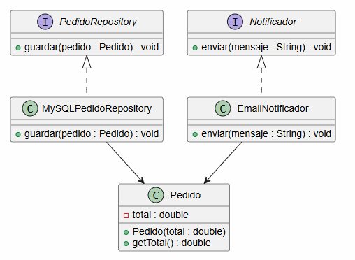
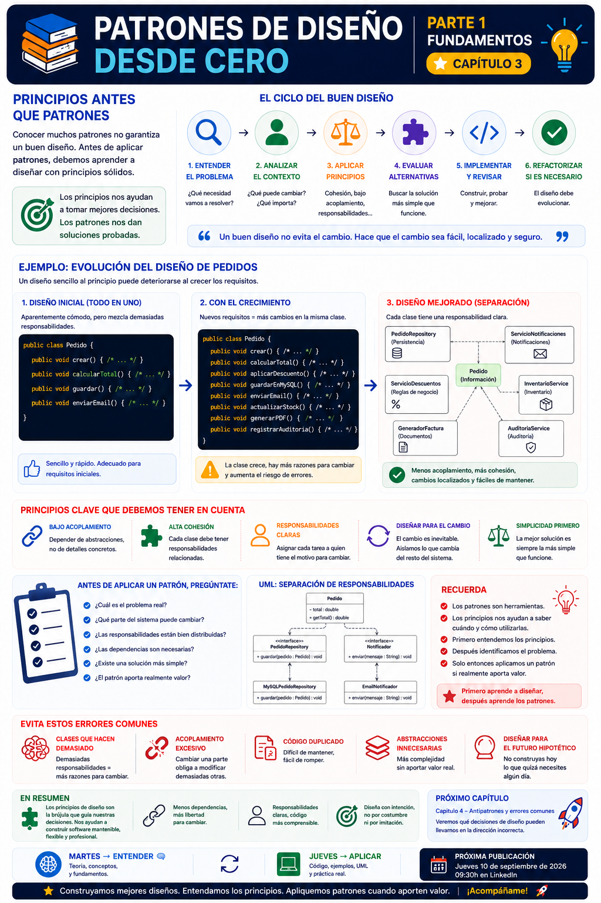

# 📚 Patrones de Diseño desde Cero

> **Aprende a diseñar software mantenible con ejemplos reales.**

# 📖 Capítulo 3 - Principios antes que patrones

> **📚 Patrones de Diseño desde Cero**  
> **📖 Parte I - Fundamentos**

---

## 🧠 Introducción

En los capítulos anteriores hemos establecido dos ideas fundamentales:

> **Los patrones de diseño son soluciones reutilizables a problemas de diseño recurrentes.**

Y:

> **Los patrones aparecen porque determinados problemas de diseño se repiten a medida que el software evoluciona.**

Pero antes de empezar a estudiar patrones concretos necesitamos responder a otra pregunta:

> **¿Cómo sabemos si un diseño es bueno?**

Porque conocer muchos patrones no garantiza que sepamos diseñar software correctamente.

Podemos conocer:

- Singleton.
- Factory Method.
- Builder.
- Adapter.
- Strategy.
- Observer.

Y aun así construir un sistema difícil de mantener.

Por eso existe una idea fundamental que guiará toda esta serie:

> **Primero los principios. Después los patrones.**

Los principios nos ayudan a **razonar sobre el diseño**.

Los patrones nos proporcionan **soluciones conocidas para problemas concretos**.

---

# 🎯 Objetivos de aprendizaje

Al finalizar este capítulo deberías ser capaz de:

- Comprender por qué los principios de diseño deben estudiarse antes que los patrones.
- Identificar algunas características de un buen diseño de software.
- Comprender la importancia del bajo acoplamiento.
- Comprender la importancia de una buena cohesión.
- Entender por qué las responsabilidades deben estar correctamente distribuidas.
- Comprender por qué debemos diseñar pensando en el cambio.
- Reconocer algunas señales de un diseño que empieza a deteriorarse.
- Entender que los patrones deben apoyarse en principios de diseño.
- Comprender que aplicar un patrón no garantiza automáticamente un buen diseño.

---

# ❌ El problema

Imaginemos una aplicación que gestiona pedidos.

Podríamos comenzar con una clase aparentemente sencilla:

```java
public class Pedido {

    public void crear() {
        // Crear pedido
    }

    public void calcularTotal() {
        // Calcular total
    }

    public void guardar() {
        // Guardar en base de datos
    }

    public void enviarEmail() {
        // Enviar email
    }
}
```

A primera vista parece cómoda.

Tenemos todo lo relacionado con el pedido en una única clase.

Pero observemos las responsabilidades que hemos acumulado:

```text
Pedido
 │
 ├── Crear pedido
 ├── Calcular total
 ├── Guardar en base de datos
 └── Enviar email
```

La clase está realizando tareas muy diferentes.

Ahora imaginemos que aparecen nuevos requisitos:

- Cambia la forma de calcular los descuentos.
- Cambia la base de datos.
- Cambia el proveedor de email.
- Aparece una nueva forma de notificación.
- Cambia la estructura del pedido.

Cada uno de estos cambios puede obligarnos a modificar la misma clase.

El problema no es necesariamente que la clase tenga muchos métodos.

El problema es que **tiene demasiadas razones diferentes para cambiar**.

---

# 💡 Motivación

Cuando diseñamos software deberíamos pensar constantemente en una pregunta:

> **¿Qué ocurrirá cuando esto cambie?**

El software está sometido al cambio.

Por eso un buen diseño no intenta eliminar todos los cambios.

Intenta conseguir que los cambios sean:

- Localizados.
- Predecibles.
- Controlables.
- Fáciles de probar.
- Fáciles de mantener.

Podemos pensar en el diseño de esta manera:

```text
                 CAMBIO
                   │
                   ▼
          ¿Qué parte cambia?
                   │
                   ▼
        ¿Está bien aislada?
             │          │
            Sí          No
             │          │
             ▼          ▼
       Cambio local   Más impacto
                         │
                         ▼
                    Más riesgo
```

La calidad del diseño se pone especialmente a prueba cuando necesitamos modificarlo.

---

# 🧩 Principios antes que patrones

Los principios de diseño son **ideas y reglas generales que nos ayudan a tomar mejores decisiones al diseñar software**.

No nos dicen exactamente qué clases debemos crear.

Tampoco nos proporcionan una estructura concreta como hace un patrón.

Nos ayudan a hacernos preguntas como:

- ¿Esta clase tiene demasiadas responsabilidades?
- ¿Existe demasiado acoplamiento?
- ¿Podría cambiar una parte sin afectar a las demás?
- ¿Estamos duplicando lógica?
- ¿Estamos creando abstracciones innecesarias?
- ¿El código es fácil de probar?
- ¿La solución es más compleja de lo necesario?

Estas preguntas deberían aparecer **antes de pensar en un patrón concreto**.

---

# 🔗 Acoplamiento

El **acoplamiento** representa el grado de dependencia entre diferentes partes de un sistema.

Cuando dos componentes están fuertemente acoplados, los cambios realizados en uno pueden afectar fácilmente al otro.

Por ejemplo:

```java
public class ServicioPedidos {

    private final MySQLRepository repository;

    public ServicioPedidos() {
        this.repository = new MySQLRepository();
    }

    public void guardar(Pedido pedido) {
        repository.guardar(pedido);
    }
}
```

`ServicioPedidos` depende directamente de:

```text
MySQLRepository
```

Si mañana cambiamos MySQL por otra tecnología, la clase tendrá que cambiar.

Una alternativa consiste en depender de una abstracción:

```java
public interface PedidoRepository {

    void guardar(Pedido pedido);
}
```

Y crear una implementación:

```java
public class MySQLPedidoRepository
        implements PedidoRepository {

    @Override
    public void guardar(Pedido pedido) {
        // Guardar en MySQL
    }
}
```

Ahora nuestro servicio puede depender de:

```java
public class ServicioPedidos {

    private final PedidoRepository repository;

    public ServicioPedidos(
            PedidoRepository repository) {

        this.repository = repository;
    }

    public void guardar(Pedido pedido) {
        repository.guardar(pedido);
    }
}
```

La idea importante no es memorizar esta implementación.

Es comprender que:

> **Reducir dependencias innecesarias facilita el cambio.**

---

# 🧩 Cohesión

La **cohesión** está relacionada con lo bien que encajan las responsabilidades de una clase o módulo.

Una clase con responsabilidades muy relacionadas suele tener una cohesión mayor.

Una clase que mezcla responsabilidades completamente diferentes puede terminar siendo difícil de comprender y mantener.

Por ejemplo:

```text
Pedido
 │
 ├── Calcular total
 ├── Guardar en base de datos
 ├── Enviar email
 └── Generar PDF
```

Aquí estamos mezclando responsabilidades diferentes.

Podríamos acabar separándolas:

```text
Pedido
 │
 └── Información del pedido

PedidoRepository
 │
 └── Persistencia

ServicioNotificaciones
 │
 └── Notificaciones

GeneradorFactura
 │
 └── Generación de documentos
```

No significa que siempre tengamos que crear una clase para cada método.

Significa que debemos **distribuir las responsabilidades de forma razonable**.

---

# 🎯 Responsabilidades

Una pregunta especialmente útil durante el diseño es:

> **¿Quién debería ser responsable de hacer esto?**

Por ejemplo:

```text
¿Quién calcula el total?
        ↓
¿Quién debería conocer las reglas
de cálculo?
```

Y:

```text
¿Quién guarda el pedido?
        ↓
¿Quién debería conocer los detalles
de persistencia?
```

Y:

```text
¿Quién envía la notificación?
        ↓
¿Quién debería conocer el proveedor
de notificaciones?
```

Estas preguntas nos ayudan a evitar que una única clase termine convirtiéndose en el centro de todo el sistema.

---

# 🔄 Diseñar pensando en el cambio

Una de las ideas más importantes del diseño de software es asumir que:

> **El código va a cambiar.**

No sabemos exactamente cómo cambiará.

Pero podemos identificar qué partes tienen más posibilidades de cambiar.

Por ejemplo:

```text
Reglas de negocio
       │
       ├── Cambian
       │
       ▼
Persistencia
       │
       ├── Puede cambiar
       │
       ▼
Servicios externos
       │
       ├── Pueden cambiar
       │
       ▼
Interfaz de usuario
       │
       └── Puede cambiar
```

Un buen diseño intenta evitar que un cambio localizado obligue a modificar todo el sistema.

---

# ☕ Ejemplo completo en Java

Podemos aplicar estas ideas al ejemplo del pedido.

## ❌ Diseño inicial

```java
public class Pedido {

    public void crear() {
        System.out.println("Creando pedido...");
    }

    public double calcularTotal() {
        return 100.0;
    }

    public void guardar() {
        System.out.println(
            "Guardando pedido en MySQL..."
        );
    }

    public void enviarEmail() {
        System.out.println(
            "Enviando email..."
        );
    }
}
```

La clase concentra diferentes responsabilidades.

---

## ✅ Una posible separación

Podemos comenzar a separar responsabilidades:

```java
public class Pedido {

    private final double total;

    public Pedido(double total) {
        this.total = total;
    }

    public double getTotal() {
        return total;
    }
}
```

Persistencia:

```java
public interface PedidoRepository {

    void guardar(Pedido pedido);
}
```

Implementación:

```java
public class MySQLPedidoRepository
        implements PedidoRepository {

    @Override
    public void guardar(Pedido pedido) {
        System.out.println(
            "Guardando pedido en MySQL..."
        );
    }
}
```

Notificaciones:

```java
public interface Notificador {

    void enviar(String mensaje);
}
```

Implementación:

```java
public class EmailNotificador
        implements Notificador {

    @Override
    public void enviar(String mensaje) {
        System.out.println(
            "Enviando email: " + mensaje
        );
    }
}
```

Ahora cada componente tiene una responsabilidad más concreta.

---

# 📊 UML

El diseño simplificado puede representarse mediante:



Este diseño no pretende ser una arquitectura completa.

Su objetivo es mostrar cómo podemos empezar a separar responsabilidades y dependencias.

---

# 🔎 Explicación paso a paso

## 1️⃣ Identificamos responsabilidades

Observamos qué tareas realiza cada parte del sistema.

---

## 2️⃣ Identificamos posibles cambios

Preguntamos qué partes podrían cambiar independientemente.

---

## 3️⃣ Analizamos las dependencias

Buscamos componentes que dependan directamente de implementaciones concretas.

---

## 4️⃣ Introducimos abstracciones cuando aportan valor

Una interfaz puede ayudarnos a desacoplar componentes.

Pero una abstracción no debe crearse automáticamente.

---

## 5️⃣ Distribuimos responsabilidades

Intentamos que cada componente tenga un propósito claro y razonable.

---

## 6️⃣ Evaluamos la complejidad

Finalmente debemos preguntarnos:

> **¿El nuevo diseño es realmente mejor que el anterior?**

Porque separar clases no siempre significa mejorar el diseño.

---

# ⚠️ Pero cuidado...

Existe otro error frecuente:

> **"Si separar responsabilidades es bueno, cuanto más separadas estén, mejor."**

❌ No necesariamente.

Podemos acabar creando:

```text
ClaseA
   ↓
ClaseB
   ↓
ClaseC
   ↓
ClaseD
   ↓
ClaseE
```

para realizar una operación extremadamente sencilla.

El resultado puede ser un sistema difícil de seguir y mantener.

Por eso debemos buscar un equilibrio entre:

- Simplicidad.
- Cohesión.
- Acoplamiento.
- Extensibilidad.
- Complejidad.

> **El objetivo no es tener muchas clases. El objetivo es tener un diseño que podamos entender y mantener.**

---

# ✅ Buenas prácticas

Antes de aplicar un patrón podemos hacernos algunas preguntas:

### 🔹 1. ¿Cuál es el problema?

No busques primero el patrón.

Busca primero el problema.

### 🔹 2. ¿Qué está cambiando?

Identifica las partes del sistema que evolucionan.

### 🔹 3. ¿Qué depende de qué?

Analiza las dependencias.

### 🔹 4. ¿Las responsabilidades están bien distribuidas?

Comprueba si una clase está haciendo demasiado.

### 🔹 5. ¿Existe una solución más sencilla?

Antes de introducir abstracciones, busca la solución más simple que resuelva el problema.

### 🔹 6. ¿El patrón aporta realmente valor?

Solo después de responder las preguntas anteriores tiene sentido valorar un patrón.

---

# 🚫 Errores frecuentes

## ❌ Utilizar un patrón porque lo conocemos

Conocer una herramienta no significa que debamos utilizarla.

---

## ❌ Confundir abstracción con calidad

Más interfaces y más clases no significan automáticamente un mejor diseño.

---

## ❌ Diseñar para cambios hipotéticos

No debemos construir una arquitectura compleja únicamente pensando:

> "Quizá algún día lo necesitemos."

---

## ❌ Ignorar el acoplamiento

Una clase puede tener pocas líneas y estar fuertemente acoplada a otras partes del sistema.

---

## ❌ Crear clases demasiado grandes

Una clase que concentra demasiadas responsabilidades puede convertirse en un punto de cambio constante.

---

# 🔄 Comparación: principios frente a patrones

| Principios de diseño | Patrones de diseño |
|---|---|
| Son ideas generales | Son soluciones reutilizables |
| Ayudan a razonar | Ayudan a resolver problemas concretos |
| Orientan las decisiones | Proporcionan estructuras conocidas |
| Se aplican de forma transversal | Se aplican según el contexto |
| No proporcionan una estructura fija | Suelen describir estructuras y colaboraciones |

Podemos resumir la relación así:

```text
Principios
    │
    ▼
Decisiones de diseño
    │
    ▼
Problemas concretos
    │
    ▼
Patrones
```

Los patrones no sustituyen a los principios.

Los utilizan como base.

---

# 🧠 Principios que veremos durante la serie

A lo largo de los próximos capítulos iremos profundizando progresivamente en diferentes principios y conceptos relacionados con el diseño de software.

Entre ellos encontraremos ideas como:

- Responsabilidades bien definidas.
- Bajo acoplamiento.
- Alta cohesión.
- Separación de responsabilidades.
- Encapsulación.
- Programar hacia abstracciones.
- Favorecer la composición frente a determinadas formas de herencia.
- Diseñar teniendo en cuenta el cambio.

Estos conceptos nos ayudarán a comprender mucho mejor los patrones que estudiaremos posteriormente.

---

# 📌 Resumen

En este capítulo hemos aprendido que:

- Los principios de diseño deben preceder a los patrones.
- Un buen diseño debe facilitar el cambio.
- El acoplamiento excesivo dificulta la evolución.
- La cohesión ayuda a mantener responsabilidades relacionadas.
- Las responsabilidades deben distribuirse de forma razonable.
- Las abstracciones pueden reducir dependencias, pero no deben introducirse sin necesidad.
- Más clases no significan automáticamente mejor diseño.
- Los patrones no sustituyen a los principios.
- Antes de utilizar un patrón debemos comprender el problema.

Podemos resumir el enfoque de esta serie en:

```text
PRINCIPIOS
     ↓
COMPRENDER EL DISEÑO
     ↓
IDENTIFICAR EL PROBLEMA
     ↓
ANALIZAR EL CONTEXTO
     ↓
VALORAR ALTERNATIVAS
     ↓
APLICAR UN PATRÓN SI APORTA VALOR
```


---

# 🎓 Conclusiones

Aprender patrones de diseño sin comprender los principios que hay detrás puede convertirlos en simples recetas.

Y ese no es el objetivo.

Queremos aprender a diseñar software de forma consciente.

Por eso, antes de preguntarnos:

> **"¿Qué patrón debería utilizar?"**

debemos aprender a preguntarnos:

> **"¿Qué problema tengo?"**

Y después:

> **"¿Qué principios deberían guiar mi solución?"**

Solo entonces podremos valorar si un patrón conocido puede ayudarnos.

Porque:

> **Los patrones son herramientas. Los principios nos ayudan a saber cómo utilizarlas.**

---

# 🖼️ Infografía

Aquí os dejo una infografía sobre este **capítulo 3**.



---

**📚 Patrones de Diseño desde Cero**

*Aprende a diseñar software mantenible con ejemplos reales.*