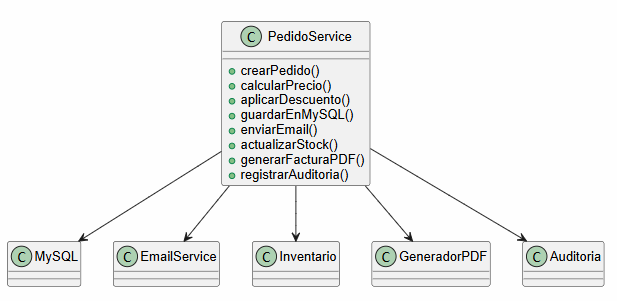
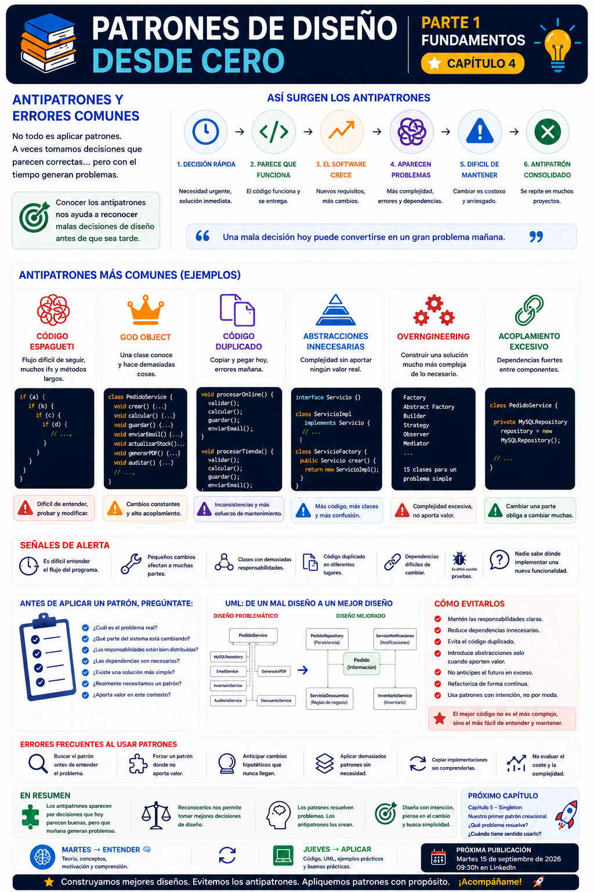

# 📚 Patrones de Diseño desde Cero

> **Aprende a diseñar software mantenible con ejemplos reales.**

# 📖 Capítulo 4 - Antipatrones y errores comunes

> **📚 Patrones de Diseño desde Cero**  
> **📖 Parte I - Fundamentos**

---

## 🧠 Introducción

Hasta ahora hemos construido las bases necesarias para empezar a estudiar patrones de diseño.

En los capítulos anteriores hemos visto:

- Qué son los patrones de diseño.
- Por qué aparecen.
- Qué relación existe entre problemas, soluciones y contexto.
- Por qué debemos conocer los principios de diseño antes de aplicar patrones.

Pero existe otra cuestión que debemos conocer:

> **¿Qué ocurre cuando tomamos malas decisiones de diseño?**

No todos los problemas de diseño terminan convirtiéndose en patrones.

A veces ocurre exactamente lo contrario.

Una solución que inicialmente parece adecuada puede generar problemas cuando el software crece.

Estas soluciones problemáticas pueden llegar a repetirse también en diferentes proyectos.

Es entonces cuando hablamos de **antipatrones**.

---

# 🎯 Objetivos de aprendizaje

Al finalizar este capítulo deberías ser capaz de:

- Comprender qué es un antipatrón.
- Diferenciar un patrón de diseño de un antipatrón.
- Identificar errores habituales de diseño.
- Reconocer señales de un código difícil de mantener.
- Comprender los problemas de utilizar patrones de forma incorrecta.
- Identificar el fenómeno conocido como *overengineering*.
- Comprender los problemas del código excesivamente acoplado.
- Reconocer clases que concentran demasiadas responsabilidades.
- Entender por qué la duplicación de código puede convertirse en un problema.
- Aprender a detectar estos problemas antes de introducir soluciones más complejas.

---

# 🧩 ¿Qué es un antipatrón?

Un **antipatrón** describe una solución o práctica que aparece de forma recurrente y que suele conducir a consecuencias negativas.

Podemos pensar en la diferencia de esta manera:

```text
PATRÓN

Problema recurrente
        │
        ▼
Solución conocida
        │
        ▼
Consecuencias positivas
```

Mientras que:

```text
ANTIPATRÓN

Problema recurrente
        │
        ▼
Solución aparentemente razonable
        │
        ▼
Consecuencias negativas
```

Un antipatrón no significa necesariamente que alguien haya escrito código "mal" de forma consciente.

Muchas veces la solución parecía correcta en el momento en que se tomó la decisión.

El problema aparece cuando analizamos sus consecuencias a largo plazo.

---

# ⚠️ ¿Por qué aparecen los antipatrones?

Los antipatrones pueden aparecer por diferentes motivos:

- Falta de experiencia.
- Presión por entregar funcionalidades rápidamente.
- Falta de planificación.
- Copiar soluciones sin comprenderlas.
- Aplicar patrones de forma incorrecta.
- Intentar anticiparse demasiado al futuro.
- Falta de conocimiento del dominio.
- Acumulación de pequeños cambios.
- Falta de refactorización.
- Decisiones que eran razonables en un contexto que posteriormente cambió.

Esto último es especialmente importante.

> **Una solución que era adecuada ayer puede dejar de serlo mañana.**

---

# 🧟 Código espagueti

Uno de los problemas más conocidos es el llamado **código espagueti**.

Se caracteriza por tener:

- Flujo difícil de seguir.
- Muchas condiciones.
- Dependencias entre diferentes partes del código.
- Métodos excesivamente largos.
- Responsabilidades mezcladas.
- Cambios difíciles de predecir.

Por ejemplo:

```java
public void procesarPedido(Pedido pedido) {

    if (pedido != null) {

        if (pedido.getCliente() != null) {

            if (pedido.getTotal() > 0) {

                if (pedido.getCliente().estaActivo()) {

                    // Calcular descuentos

                    if (pedido.getTotal() > 100) {
                        // Descuento
                    } else {
                        // Sin descuento
                    }

                    // Guardar pedido

                    // Enviar email

                    // Actualizar inventario

                    // Generar factura

                }
            }
        }
    }
}
```

El problema no es simplemente que haya muchos `if`.

El problema es que el método está acumulando diferentes responsabilidades y decisiones.

Con el tiempo, cualquier modificación puede convertirse en una tarea complicada.

---

# 🏢 God Object

Otro problema habitual aparece cuando una única clase termina controlando demasiadas cosas.

Podemos imaginar:

```text
                    ┌──────────────┐
                    │    Pedido    │
                    └──────┬───────┘
                           │
         ┌─────────────────┼─────────────────┐
         │                 │                 │
         ▼                 ▼                 ▼
   Persistencia       Notificaciones     Inventario
         │                 │                 │
         ▼                 ▼                 ▼
      MySQL              Email             Stock
                           │
                           ▼
                         PDF
                           │
                           ▼
                       Auditoría
```

Una clase que conoce y controla prácticamente todo puede convertirse en un **God Object**.

El problema es que cualquier cambio puede terminar afectando a esa clase.

---

# ☕ Ejemplo en Java

Un ejemplo simplificado:

```java
public class PedidoService {

    public void crearPedido() {
        // Crear pedido
    }

    public void calcularPrecio() {
        // Calcular precio
    }

    public void aplicarDescuento() {
        // Aplicar descuento
    }

    public void guardarEnMySQL() {
        // Persistencia
    }

    public void enviarEmail() {
        // Notificación
    }

    public void actualizarStock() {
        // Inventario
    }

    public void generarFacturaPDF() {
        // Facturación
    }

    public void registrarAuditoria() {
        // Auditoría
    }
}
```

Esta clase está acumulando demasiadas responsabilidades.

Cada una de ellas puede cambiar por motivos diferentes.

Por tanto:

```text
PedidoService
     │
     ├── Pedidos
     ├── Precios
     ├── Descuentos
     ├── Persistencia
     ├── Notificaciones
     ├── Inventario
     ├── Facturación
     └── Auditoría
```

El problema no es solamente el tamaño de la clase.

Es la cantidad de **responsabilidades independientes** que contiene.

---

# 🔁 Código duplicado

Otro error frecuente es copiar y pegar código.

Por ejemplo:

```java
public void procesarPedidoOnline(Pedido pedido) {

    validarPedido(pedido);

    calcularTotal(pedido);

    guardarPedido(pedido);

    enviarEmail(pedido);
}
```

Y posteriormente:

```java
public void procesarPedidoPresencial(Pedido pedido) {

    validarPedido(pedido);

    calcularTotal(pedido);

    guardarPedido(pedido);

    enviarEmail(pedido);
}
```

Inicialmente parece una solución rápida.

Pero si la lógica cambia:

```text
Código duplicado
      │
      ▼
Cambiar una parte
      │
      ▼
¿Se modificaron todas?
      │
      ├── Sí
      │
      └── No
           │
           ▼
      Comportamiento
      inconsistente
```

La duplicación puede provocar:

- Errores.
- Inconsistencias.
- Mayor esfuerzo de mantenimiento.
- Dificultad para corregir problemas.

---

# 🧱 Abstracciones innecesarias

No todas las abstracciones mejoran un diseño.

Imaginemos algo tan sencillo como:

```java
public class Calculadora {

    public int sumar(int a, int b) {
        return a + b;
    }
}
```

Podríamos crear:

```java
public interface CalculadoraInterface {
    int sumar(int a, int b);
}
```

Y después:

```java
public class CalculadoraImpl
        implements CalculadoraInterface {

    @Override
    public int sumar(int a, int b) {
        return a + b;
    }
}
```

¿Hemos mejorado el diseño?

Probablemente no.

Hemos añadido:

- Una interfaz.
- Una implementación.
- Más código.
- Más complejidad.

Sin resolver ningún problema real.

Por eso:

> **Una abstracción solamente aporta valor cuando existe una razón para introducirla.**

---

# 🏗️ Overengineering

El *overengineering* aparece cuando construimos una solución mucho más compleja de lo que el problema necesita.

Por ejemplo:

```text
Problema sencillo
       │
       ▼
Solución sencilla
       │
       │
       └───────────────┐
                       ▼
                "Por si acaso..."
                       │
                       ▼
              Más abstracciones
                       │
                       ▼
                   Factory
                       │
                       ▼
                  Builder
                       │
                       ▼
                   Adapter
                       │
                       ▼
                  Observer
                       │
                       ▼
                 15 clases
```

El sistema puede terminar siendo técnicamente sofisticado, pero innecesariamente complicado.

La complejidad no es automáticamente una señal de calidad.

> **Si el problema es sencillo, la solución también debería intentar serlo.**

---

# 🕸️ Acoplamiento excesivo

El acoplamiento aparece cuando diferentes componentes dependen demasiado unos de otros.

Por ejemplo:

```java
public class PedidoService {

    private final MySQLPedidoRepository repository;

    public PedidoService() {
        repository = new MySQLPedidoRepository();
    }
}
```

`PedidoService` está directamente ligado a:

```text
MySQLPedidoRepository
```

Si cambiamos la tecnología de persistencia, tenemos que modificar el servicio.

Esto puede hacer que los cambios se propaguen por diferentes partes del sistema.

---

# 🔒 Dependencias difíciles de cambiar

Un problema relacionado aparece cuando nuestro código depende directamente de detalles concretos.

Por ejemplo:

```java
public class ServicioNotificaciones {

    public void enviar(String mensaje) {

        GmailClient gmail = new GmailClient();

        gmail.send(mensaje);
    }
}
```

Si mañana cambiamos el proveedor:

```text
Gmail
  ↓
SendGrid
  ↓
Amazon SES
  ↓
Otro proveedor
```

nuestro servicio tendrá que cambiar.

La dependencia directa hace que el cambio sea más costoso.

---

# 🧠 Big Ball of Mud

En sistemas que evolucionan durante mucho tiempo puede aparecer un problema todavía mayor.

El código empieza acumulando:

- Dependencias.
- Excepciones.
- Soluciones temporales.
- Código duplicado.
- Abstracciones innecesarias.
- Responsabilidades mezcladas.

Hasta que resulta difícil identificar una estructura clara.

Podemos imaginarlo así:

```text
        ┌───────┐
        │       │
   ┌────┴───┐   │
   │        ├───┼────┐
   └───┬────┘   │    │
       │    ┌───┴────┘
   ┌───▼────┴───┐
   │            │
   └─────┬──────┘
         │
    ┌────▼─────┐
    │          │
    └──────────┘
```

Las dependencias terminan formando una estructura difícil de comprender y modificar.

Este tipo de situación se conoce habitualmente como **Big Ball of Mud**.

---

# ⚠️ Aplicar patrones incorrectamente

También podemos convertir un patrón en un antipatrón si lo utilizamos de forma incorrecta.

Por ejemplo:

> "Necesitamos crear objetos, así que utilizaremos Factory."

o:

> "Necesitamos desacoplar algo, así que utilizaremos Observer."

El problema aparece cuando:

```text
Patrón conocido
      │
      ▼
Buscar un problema
      │
      ▼
Forzar el diseño
      │
      ▼
Más complejidad
```

El orden debería ser exactamente el contrario:

```text
Problema
   │
   ▼
Contexto
   │
   ▼
Alternativas
   │
   ▼
¿Existe un patrón adecuado?
   │
   ▼
Aplicarlo si aporta valor
```

---

# 📊 UML

Podemos representar de forma simplificada el problema de una clase que concentra demasiadas responsabilidades:



El diagrama muestra cómo `PedidoService` se convierte en un punto central de dependencias.

Cuantas más responsabilidades acumula, más componentes dependen de él o son gestionados directamente por él.

---

# 🔎 Señales de alerta

No existe una regla matemática que nos diga cuándo un diseño es malo.

Pero existen señales que deberían hacernos detenernos y analizarlo.

### 🚨 Algunas señales

- Una clase crece continuamente.
- Un cambio sencillo obliga a modificar muchas clases.
- Existen muchos `if` relacionados con diferentes comportamientos.
- El mismo código aparece en diferentes lugares.
- Las pruebas son difíciles de escribir.
- Cambiar una tecnología obliga a modificar muchas partes.
- Nadie sabe exactamente dónde implementar una nueva funcionalidad.
- Existen demasiadas abstracciones.
- Existen demasiadas dependencias.
- El código es difícil de explicar.

Cuando aparecen varias de estas señales simultáneamente, probablemente tenemos un problema de diseño que merece nuestra atención.

---

# 🛠️ ¿Cómo evitar los antipatrones?

No existe una solución universal.

Pero podemos seguir algunas prácticas:

### 1️⃣ Mantener las responsabilidades claras

Preguntarnos:

> **¿Esta clase debería encargarse de esto?**

### 2️⃣ Reducir dependencias innecesarias

Preguntarnos:

> **¿Necesitamos realmente depender de esta implementación concreta?**

### 3️⃣ Evitar duplicación

Si encontramos el mismo comportamiento repetido, debemos analizar si existe una forma mejor de organizarlo.

### 4️⃣ Refactorizar

El código evoluciona.

A veces necesitamos detenernos y mejorar una solución que inicialmente era correcta.

### 5️⃣ Evitar anticiparnos demasiado

No diseñemos para diez posibles problemas cuando solamente tenemos uno.

### 6️⃣ Utilizar patrones con intención

Un patrón debe resolver un problema.

No crear un problema para justificar el patrón.

---

# 🧩 Patrón vs. Antipatrón

| Patrón | Antipatrón |
|---|---|
| Solución reutilizable | Solución problemática recurrente |
| Ayuda a resolver un problema | Suele generar nuevos problemas |
| Aplicado en el contexto adecuado | Puede aparecer por malas decisiones |
| Reduce determinados problemas de diseño | Aumenta complejidad o mantenimiento |
| Requiere analizar el contexto | Puede surgir por falta de análisis |

La diferencia fundamental está en las consecuencias.

---

# 📌 Resumen

En este capítulo hemos aprendido que:

- Un antipatrón describe una solución o práctica que suele producir consecuencias negativas.
- Los antipatrones pueden aparecer por decisiones aparentemente razonables.
- El código espagueti dificulta comprender y modificar el sistema.
- Un God Object concentra demasiadas responsabilidades.
- La duplicación dificulta el mantenimiento.
- Las abstracciones innecesarias aumentan la complejidad.
- El overengineering puede convertir problemas sencillos en soluciones excesivamente complejas.
- El acoplamiento excesivo dificulta los cambios.
- Los sistemas pueden evolucionar hasta convertirse en estructuras difíciles de comprender.
- Un patrón mal aplicado puede terminar generando problemas.
- Reconocer señales de alerta nos permite actuar antes de que el diseño se deteriore demasiado.

---

# 🎓 Conclusiones

Durante esta primera parte hemos construido una base fundamental para comenzar a estudiar patrones de diseño.

Hemos aprendido:

```text
¿Qué son?
    ↓
¿Por qué aparecen?
    ↓
¿Qué principios debemos tener en cuenta?
    ↓
¿Qué errores debemos evitar?
    ↓
¿Estamos preparados para estudiar patrones?
```

La respuesta es:

> **Sí.**

Pero debemos recordar una última idea.

No existe un diseño perfecto.

Todo diseño implica decisiones y compromisos.

Nuestro objetivo como desarrolladores no es eliminar toda la complejidad.

Es **gestionar la complejidad de forma consciente**.

Por eso, cuando encontremos una solución complicada, debemos preguntarnos:

> **¿Qué problema estamos intentando resolver?**

Y cuando conozcamos un patrón:

> **¿Realmente necesitamos utilizarlo?**

---

# 🖼️ Infografía

Aquí os dejo una infografía sobre este **capítulo 4**.



---

**📚 Patrones de Diseño desde Cero**

*Aprende a diseñar software mantenible con ejemplos reales.*