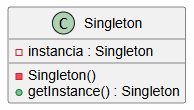
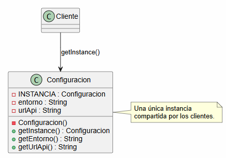
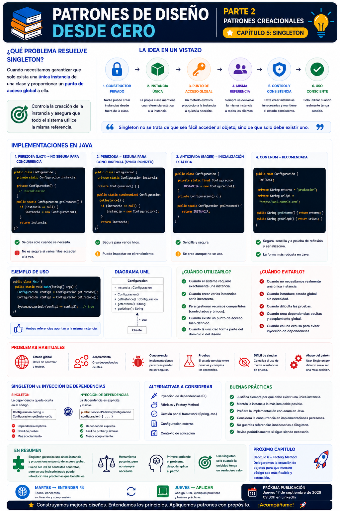

# 📚 Patrones de Diseño desde Cero

> **Aprende a diseñar software mantenible con ejemplos reales.**

# 📖 Capítulo 5 - Singleton

> **📚 Patrones de Diseño desde Cero**  
> **🏗️ Parte II - Patrones Creacionales**

---

## 🧠 Introducción

Hasta este momento hemos trabajado con los fundamentos necesarios para comenzar a estudiar patrones de diseño.

Hemos visto:

- Qué son los patrones de diseño.
- Por qué aparecen.
- Qué principios debemos tener en cuenta.
- Qué errores y antipatrones debemos evitar.

Ahora comienza una nueva etapa de la serie:

# 🏗️ Patrones Creacionales

Los patrones creacionales están relacionados con la **creación de objetos**.

Su objetivo es ayudarnos a controlar, simplificar o desacoplar determinados procesos de creación de instancias.

Y comenzamos con uno de los patrones más conocidos:

> **Singleton**

Probablemente sea también uno de los patrones más utilizados y, al mismo tiempo, uno de los que más controversia genera.

La idea parece sencilla:

> **Garantizar que una clase tenga una única instancia y proporcionar un punto de acceso controlado a ella.**

Pero la verdadera pregunta es:

> **¿Cuándo necesitamos realmente una única instancia?**

---

# 🎯 Objetivos de aprendizaje

Al finalizar este capítulo deberías ser capaz de:

- Comprender qué problema intenta resolver Singleton.
- Entender cómo funciona su estructura.
- Implementar Singleton en Java.
- Comprender el papel del constructor privado.
- Comprender cómo controlar la creación de instancias.
- Diferenciar entre creación *eager* y *lazy*.
- Conocer los problemas de concurrencia de determinadas implementaciones.
- Comprender las ventajas y desventajas del patrón.
- Identificar situaciones en las que Singleton puede resultar adecuado.
- Reconocer situaciones en las que deberíamos evitarlo.
- Comprender por qué Singleton puede introducir un acoplamiento global.
- Comparar Singleton con otras alternativas de diseño.

---

# ❌ El problema

Imaginemos una aplicación que necesita gestionar una configuración global.

Por ejemplo:

```text
Configuración de la aplicación
        │
        ├── URL de la API
        ├── Entorno
        ├── Nivel de logs
        └── Otras opciones
```

Podríamos crear una clase:

```java
public class Configuracion {

    private String entorno;
    private String urlApi;

    public Configuracion(
            String entorno,
            String urlApi) {

        this.entorno = entorno;
        this.urlApi = urlApi;
    }
}
```

Y cada parte de nuestra aplicación podría crear su propia instancia:

```java
Configuracion config1 =
        new Configuracion(
                "produccion",
                "https://api.example.com"
        );

Configuracion config2 =
        new Configuracion(
                "produccion",
                "https://api.example.com"
        );
```

Tenemos dos objetos diferentes:

```text
config1 ───────► Configuracion
                  ↑
config2 ───────► Configuracion
```

En determinados escenarios esto puede ser un problema.

Si la intención del diseño es que exista **una única configuración compartida**, permitir que cualquier parte del sistema cree nuevas instancias rompe esa restricción.

---

# 💡 Motivación

Podemos plantearnos entonces:

> **¿Cómo podemos garantizar que solamente exista una instancia de una determinada clase?**

Necesitamos controlar:

1. La creación del objeto.
2. El número de instancias.
3. El acceso a la instancia existente.

La idea general de Singleton es:

```text
┌──────────────────────────────┐
│          Singleton           │
│                              │
│  - instancia : Singleton     │
│                              │
│  - Singleton()               │
│                              │
│  + getInstance()             │
│                              │
└──────────────────────────────┘
```

El patrón controla la creación de la instancia y proporciona un punto de acceso para obtenerla.

---

# 🧩 La solución

La estructura clásica de Singleton se basa principalmente en tres elementos:

### 🔒 Constructor privado

Evita que otras clases puedan crear directamente nuevas instancias.

```java
private Configuracion() {
}
```

---

### 🧱 Instancia única

La propia clase mantiene una referencia a su instancia.

```java
private static Configuracion instancia;
```

---

### 🚪 Punto de acceso

Proporcionamos un método para obtener la instancia:

```java
public static Configuracion getInstance() {
    return instancia;
}
```

La estructura conceptual es:

```text
             ┌─────────────────┐
             │   Configuracion │
             │                 │
             │ - instancia     │
             │                 │
             │ - constructor() │
             │   privado       │
             │                 │
             │ + getInstance() │
             └────────┬────────┘
                      │
                      ▼
              única instancia
```

---

# ☕ Implementación en Java

Una implementación sencilla sería:

```java
public class Configuracion {

    private static Configuracion instancia;

    private String entorno;
    private String urlApi;

    private Configuracion() {
        this.entorno = "produccion";
        this.urlApi = "https://api.example.com";
    }

    public static Configuracion getInstance() {

        if (instancia == null) {
            instancia = new Configuracion();
        }

        return instancia;
    }

    public String getEntorno() {
        return entorno;
    }

    public String getUrlApi() {
        return urlApi;
    }
}
```

Ahora podemos obtener la instancia:

```java
Configuracion config =
        Configuracion.getInstance();
```

Y volver a obtenerla:

```java
Configuracion otraConfig =
        Configuracion.getInstance();
```

Ambas variables apuntan al mismo objeto:

```java
System.out.println(
        config == otraConfig
);
```

Resultado:

```text
true
```

---

# 🔎 Explicación paso a paso

## 1️⃣ Constructor privado

```java
private Configuracion() {
}
```

El constructor no puede ser utilizado desde fuera de la clase.

Por tanto:

```java
new Configuracion();
```

no está permitido.

---

## 2️⃣ Referencia estática

```java
private static Configuracion instancia;
```

La clase mantiene una referencia a la instancia que debe compartir.

---

## 3️⃣ Comprobamos si existe

```java
if (instancia == null) {
    instancia = new Configuracion();
}
```

La primera llamada crea el objeto.

Las siguientes llamadas reutilizan la instancia existente.

---

## 4️⃣ Devolvemos la instancia

```java
return instancia;
```

Todos los consumidores reciben la misma referencia.

---

# 🔄 Creación perezosa

La implementación anterior utiliza **creación perezosa (*lazy initialization*)**.

La instancia no se crea hasta que alguien solicita:

```java
getInstance()
```

Podemos representarlo así:

```text
Aplicación inicia
       │
       ▼
instancia = null
       │
       ▼
getInstance()
       │
       ▼
¿Existe instancia?
       │
      NO
       │
       ▼
Crear instancia
       │
       ▼
Devolver instancia
```

Una vez creada:

```text
getInstance()
       │
       ▼
¿Existe instancia?
       │
      SÍ
       │
       ▼
Devolver instancia existente
```

---

# ⚡ Creación anticipada

También podemos crear la instancia cuando se carga la clase:

```java
public class Configuracion {

    private static final Configuracion INSTANCIA =
            new Configuracion();

    private Configuracion() {
    }

    public static Configuracion getInstance() {
        return INSTANCIA;
    }
}
```

En este caso la instancia se crea de forma anticipada.

La ventaja es que la implementación es sencilla.

La desventaja es que el objeto se crea aunque posteriormente no lleguemos a utilizarlo.

---

# 🧵 ¿Qué ocurre con varios hilos?

La implementación perezosa anterior tiene un problema potencial.

Imaginemos dos hilos:

```text
Thread 1                 Thread 2
   │                         │
   ▼                         ▼
getInstance()            getInstance()
   │                         │
   ▼                         ▼
instancia == null        instancia == null
   │                         │
   ▼                         ▼
crear objeto             crear objeto
   │                         │
   └──────────┬──────────────┘
              ▼
        Dos instancias
```

En determinadas condiciones de concurrencia, dos hilos podrían intentar crear la instancia simultáneamente.

Por eso, si necesitamos una implementación Singleton segura frente a concurrencia, debemos tener en cuenta este aspecto.

---

# 🛡️ Implementación segura mediante inicialización estática

Una alternativa sencilla en Java consiste en utilizar la inicialización estática:

```java
public class Configuracion {

    private static final Configuracion INSTANCIA =
            new Configuracion();

    private Configuracion() {
    }

    public static Configuracion getInstance() {
        return INSTANCIA;
    }
}
```

La inicialización de campos estáticos de una clase está controlada por el mecanismo de inicialización de clases de Java, por lo que esta forma evita la condición de carrera de la implementación perezosa sencilla.

---

# ☕ Singleton mediante `enum`

Java proporciona además una alternativa especialmente interesante para implementar Singleton:

```java
public enum Configuracion {

    INSTANCE;

    private String entorno = "produccion";
    private String urlApi =
            "https://api.example.com";

    public String getEntorno() {
        return entorno;
    }

    public String getUrlApi() {
        return urlApi;
    }
}
```

Su utilización sería:

```java
Configuracion config =
        Configuracion.INSTANCE;
```

Y:

```java
Configuracion otraConfig =
        Configuracion.INSTANCE;
```

Ambas referencias apuntan a la misma instancia.

```java
System.out.println(
        config == otraConfig
);
```

Resultado:

```text
true
```

Esta opción tiene características importantes proporcionadas por el propio lenguaje y evita varios problemas habituales de las implementaciones manuales.

---

# 📊 UML

La estructura clásica del patrón puede representarse mediante:



Una representación más detallada:



---

# 🏗️ Caso de uso real

Un posible escenario puede ser la gestión centralizada de determinadas configuraciones de una aplicación.

Por ejemplo:

```text
Aplicación
     │
     ├── ServicioUsuarios
     │
     ├── ServicioPedidos
     │
     ├── ServicioPagos
     │
     └── ServicioNotificaciones
              │
              ▼
       Configuración
              │
              ▼
        misma instancia
```

Cada servicio puede acceder a la configuración compartida.

Sin embargo, esto no significa que **toda configuración deba convertirse en Singleton**.

Antes debemos analizar si realmente necesitamos garantizar una única instancia.

---

# 🔎 ¿Cuándo utilizar Singleton?

Singleton puede tener sentido cuando:

- El sistema necesita garantizar una única instancia de un componente.
- La existencia de múltiples instancias sería incorrecta.
- El recurso debe ser compartido de forma controlada.
- La propia naturaleza del componente justifica una única instancia.
- Existe un punto de acceso común claramente definido.

Algunos ejemplos potenciales pueden incluir determinados:

- Gestores de configuración.
- Recursos compartidos.
- Componentes cuya unicidad sea una verdadera restricción del dominio o del sistema.

Pero debemos analizar cada caso individualmente.

---

# 🚫 ¿Cuándo evitar Singleton?

Singleton puede ser una mala elección cuando simplemente queremos:

> **"Que sea fácil acceder al objeto desde cualquier sitio."**

Ese no debería ser el motivo principal.

También deberíamos evitarlo cuando:

- No necesitamos realmente una única instancia.
- Estamos utilizándolo para compartir estado global sin necesidad.
- Dificulta las pruebas.
- Introduce dependencias ocultas.
- Aumenta el acoplamiento.
- Estamos utilizándolo como sustituto de una correcta inyección de dependencias.

---

# ⚠️ El problema del estado global

Una de las principales críticas a Singleton aparece cuando se utiliza como mecanismo para mantener estado global.

Por ejemplo:

```java
public class Sesion {

    private static Sesion instancia;

    private String usuarioActual;

    private Sesion() {
    }

    public static Sesion getInstance() {

        if (instancia == null) {
            instancia = new Sesion();
        }

        return instancia;
    }
}
```

Ahora cualquier parte de la aplicación puede modificar:

```java
Sesion.getInstance()
```

Esto puede hacer que el comportamiento del sistema dependa de un estado compartido difícil de controlar.

El problema ya no es únicamente:

> "Existe una única instancia."

El problema es:

> **"Todo el sistema depende de un estado global."**

---

# 🧪 Problemas en las pruebas

El estado global puede complicar las pruebas.

Imaginemos:

```java
Sesion sesion =
        Sesion.getInstance();

sesion.setUsuario("José");
```

Una prueba puede modificar el estado.

Después otra prueba podría recibir la misma instancia con ese estado:

```text
Prueba A
   │
   ▼
Singleton
usuario = "José"
   │
   ▼
Prueba B
   │
   ▼
Recibe el mismo estado
```

Esto puede provocar:

- Pruebas dependientes entre sí.
- Necesidad de limpiar estados.
- Mayor dificultad para aislar comportamientos.
- Resultados inesperados.

Por eso Singleton debe utilizarse con especial cuidado cuando contiene estado mutable.

---

# 🧩 Singleton y dependencia global

Existe otra cuestión importante.

Si una clase utiliza directamente:

```java
Configuracion.getInstance()
```

está creando una dependencia que no aparece en su constructor.

Por ejemplo:

```java
public class ServicioPedidos {

    public void procesar() {

        Configuracion config =
                Configuracion.getInstance();

        // ...
    }
}
```

La dependencia existe, aunque no sea visible en la firma de la clase.

Una alternativa basada en inyección de dependencias podría ser:

```java
public class ServicioPedidos {

    private final Configuracion configuracion;

    public ServicioPedidos(
            Configuracion configuracion) {

        this.configuracion = configuracion;
    }
}
```

Esto hace que la dependencia sea explícita.

Por tanto:

> **Singleton y gestión de dependencias no son conceptos equivalentes.**

---

# 🧠 Singleton no significa "utilizarlo para todo"

Uno de los errores más frecuentes es pensar:

```text
"Necesito acceder a este objeto
desde muchos lugares."

            ↓

"Entonces será Singleton."
```

Este razonamiento es incorrecto.

El hecho de que un objeto sea accesible desde diferentes partes del sistema **no significa que deba existir una única instancia**.

La pregunta correcta es:

> **¿El dominio o el diseño del sistema requieren realmente una única instancia?**

---

# ✅ Buenas prácticas

## 1️⃣ Justificar la unicidad

Antes de implementar Singleton debemos poder responder:

> **¿Por qué debe existir exactamente una instancia?**

---

## 2️⃣ Evitar estado mutable cuando sea posible

Un Singleton con estado global mutable puede introducir problemas difíciles de detectar.

---

## 3️⃣ Mantener la implementación sencilla

Si podemos utilizar una implementación segura y clara, debemos evitar soluciones innecesariamente complejas.

---

## 4️⃣ Tener en cuenta la concurrencia

Si la aplicación utiliza múltiples hilos, debemos asegurarnos de que la creación de la instancia sea segura.

---

## 5️⃣ Considerar alternativas

Antes de utilizar Singleton debemos valorar:

- Inyección de dependencias.
- Instancias gestionadas por el framework.
- Fábricas.
- Objetos compartidos gestionados explícitamente.
- Configuración externa.

---

# 🚨 Errores frecuentes

## ❌ Convertir cualquier servicio en Singleton

No todos los servicios necesitan una única instancia.

---

## ❌ Utilizar Singleton como variable global

El acceso global puede ocultar dependencias y dificultar el mantenimiento.

---

## ❌ Ignorar la concurrencia

Una implementación perezosa sencilla puede no ser segura en escenarios concurrentes.

---

## ❌ Mantener demasiado estado

Un Singleton con mucho estado mutable puede convertirse en una fuente global de problemas.

---

## ❌ Utilizar Singleton para evitar inyección de dependencias

Que un objeto sea fácil de obtener no significa que sea una buena dependencia.

---

## ❌ Crear un Singleton "por si acaso"

Si actualmente no existe una necesidad real de unicidad, probablemente no necesitemos Singleton.

---

# 🔄 Comparación con otros patrones

| Patrón | Objetivo principal |
|---|---|
| **Singleton** | Garantizar una única instancia |
| **Factory Method** | Delegar la creación de objetos a una estructura extensible |
| **Abstract Factory** | Crear familias de objetos relacionados |
| **Builder** | Construir objetos complejos paso a paso |
| **Prototype** | Crear objetos mediante clonación |

Singleton se diferencia especialmente del resto porque su objetivo principal no es facilitar diferentes formas de creación, sino **controlar la cantidad de instancias existentes**.

---

# 🧠 Singleton vs. inyección de dependencias

Esta comparación es especialmente importante.

### Singleton

El consumidor obtiene directamente la instancia:

```java
Configuracion.getInstance();
```

La dependencia queda oculta dentro del código.

### Inyección de dependencias

La dependencia se proporciona desde fuera:

```java
public ServicioPedidos(
        Configuracion configuracion) {

    this.configuracion = configuracion;
}
```

La dependencia queda explícita.

Podemos representarlo:

```text
Singleton

Servicio
    │
    └──────► Configuracion.getInstance()


Inyección de dependencias

Configuracion
      │
      ▼
Servicio
```

La segunda opción suele facilitar el aislamiento y las pruebas.

Esto no significa que Singleton sea siempre incorrecto.

Significa que **no debemos utilizarlo simplemente para evitar gestionar correctamente las dependencias**.

---

# 🧪 Ejemplo completo

Una implementación sencilla y segura mediante inicialización estática:

```java
public class Configuracion {

    private static final Configuracion INSTANCIA =
            new Configuracion();

    private String entorno;
    private String urlApi;

    private Configuracion() {
        entorno = "produccion";
        urlApi = "https://api.example.com";
    }

    public static Configuracion getInstance() {
        return INSTANCIA;
    }

    public String getEntorno() {
        return entorno;
    }

    public String getUrlApi() {
        return urlApi;
    }
}
```

Uso:

```java
public class Main {

    public static void main(String[] args) {

        Configuracion config1 =
                Configuracion.getInstance();

        Configuracion config2 =
                Configuracion.getInstance();

        System.out.println(
                config1 == config2
        );
    }
}
```

Resultado:

```text
true
```

---

# 📌 Resumen

En este capítulo hemos aprendido que:

- Singleton es un patrón creacional.
- Su objetivo es garantizar que exista una única instancia de una clase.
- Proporciona un punto de acceso a esa instancia.
- Su constructor suele ser privado.
- La instancia puede crearse de forma anticipada o perezosa.
- Las implementaciones perezosas deben tener en cuenta la concurrencia.
- Java proporciona diferentes mecanismos para implementar Singleton.
- `enum` es una alternativa especialmente interesante en Java.
- Singleton puede facilitar el acceso compartido.
- También puede introducir estado global y dependencias ocultas.
- Puede dificultar las pruebas cuando mantiene estado mutable.
- No debe utilizarse simplemente porque una instancia sea accesible desde muchos lugares.
- Antes de utilizarlo debemos justificar por qué necesitamos exactamente una instancia.

La pregunta fundamental no es:

> **"¿Puedo convertir esta clase en Singleton?"**

Sino:

> **"¿Existe una razón real para que esta clase tenga una única instancia?"**

---

# 🎓 Conclusiones

Singleton es probablemente uno de los patrones más fáciles de explicar y uno de los más fáciles de utilizar incorrectamente.

Su implementación puede ser muy sencilla.

Lo difícil es decidir:

> **¿Realmente lo necesitamos?**

Si el sistema necesita garantizar que solamente exista una instancia, Singleton puede ser una solución válida.

Pero si simplemente queremos disponer de un objeto global y acceder a él cómodamente desde cualquier lugar, probablemente estamos utilizando el patrón para resolver un problema diferente.

Y aquí recuperamos una de las ideas fundamentales de esta serie:

> **Primero identificamos el problema. Después analizamos el contexto. Finalmente decidimos si un patrón aporta valor.**

Singleton no es una excepción.

Es otra herramienta de diseño.

Y como cualquier herramienta:

> **Lo importante no es saber utilizarla. Lo importante es saber cuándo utilizarla.**

---

# 🖼️ Infografía

Aquí os dejo una infografía sobre este **capítulo 5**.



---

**📚 Patrones de Diseño desde Cero**

*Aprende a diseñar software mantenible con ejemplos reales.*