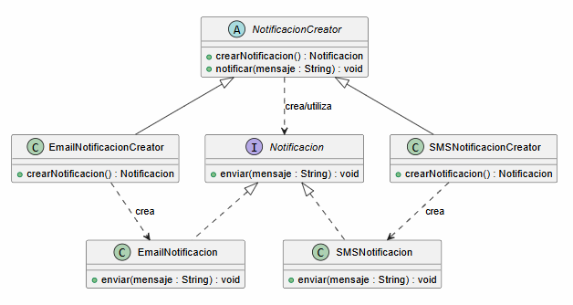
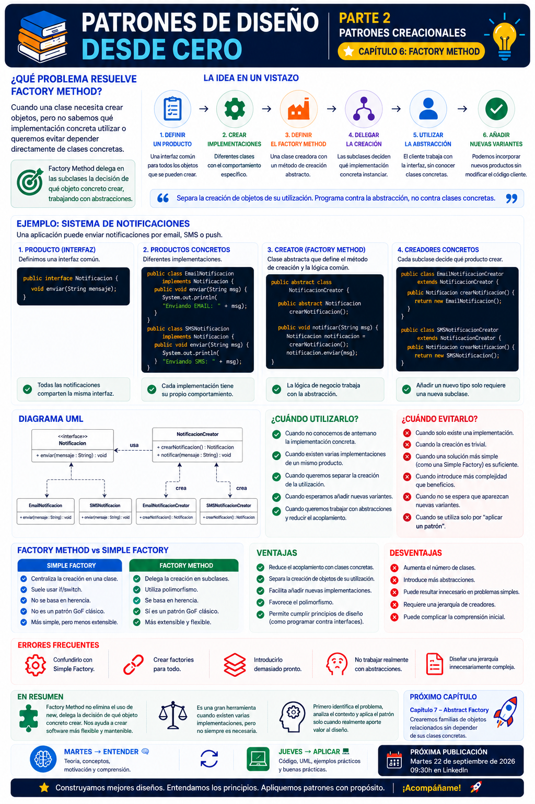

# 📚 Patrones de Diseño desde Cero

> **Aprende a diseñar software mantenible con ejemplos reales.**

# 📖 Capítulo 6 - Factory Method

> **📚 Patrones de Diseño desde Cero**  
> **🏗️ Parte II - Patrones Creacionales**

---

## 🧠 Introducción

En el capítulo anterior comenzamos nuestro recorrido por los patrones creacionales estudiando **Singleton**.

Singleton respondía a una pregunta muy concreta:

> **¿Cómo podemos garantizar que una clase tenga una única instancia?**

Ahora vamos a enfrentarnos a otro problema relacionado con la creación de objetos.

Imaginemos una aplicación que necesita enviar diferentes tipos de notificaciones:

- 📧 Email
- 📱 SMS
- 🔔 Push

En algún momento tendremos que crear esos objetos.

Podríamos hacerlo directamente:

```java
EmailNotificacion notificacion =
        new EmailNotificacion();
```

Pero cuando nuestro sistema crece y aparecen diferentes implementaciones, la creación directa mediante `new` puede hacer que nuestro código dependa demasiado de clases concretas.

Aquí aparece una nueva pregunta:

> **¿Podemos separar el código que utiliza un objeto del código que decide qué objeto concreto crear?**

Para resolver este tipo de problema podemos utilizar:

# 🏭 Factory Method

Factory Method nos permite definir un método para crear objetos, dejando que las subclases decidan qué implementación concreta debe instanciarse.

---

# 🎯 Objetivos de aprendizaje

Al finalizar este capítulo deberías ser capaz de:

- Comprender qué problema intenta resolver Factory Method.
- Entender por qué la creación directa de objetos puede generar acoplamiento.
- Diferenciar entre una abstracción y sus implementaciones concretas.
- Comprender la estructura del patrón Factory Method.
- Identificar los participantes del patrón.
- Implementar Factory Method en Java.
- Comprender el papel del `Product`, `ConcreteProduct`, `Creator` y `ConcreteCreator`.
- Diferenciar Factory Method de una Simple Factory.
- Identificar sus ventajas y desventajas.
- Saber cuándo tiene sentido utilizarlo.
- Reconocer cuándo Factory Method añade complejidad innecesaria.
- Compararlo con otros patrones creacionales.

---

# ❌ El problema

Imaginemos que estamos desarrollando un sistema de notificaciones.

Inicialmente nuestra aplicación solamente permite enviar emails:

```java
public class ServicioNotificaciones {

    public void notificar(String mensaje) {

        EmailNotificacion notificacion =
                new EmailNotificacion();

        notificacion.enviar(mensaje);
    }
}
```

Y nuestra clase:

```java
public class EmailNotificacion {

    public void enviar(String mensaje) {
        System.out.println(
            "Enviando EMAIL: " + mensaje
        );
    }
}
```

Funciona perfectamente.

Pero aparece un nuevo requisito:

> **Ahora también necesitamos enviar notificaciones mediante SMS.**

Podríamos modificar nuestro servicio:

```java
public void notificar(
        String tipo,
        String mensaje) {

    if (tipo.equals("EMAIL")) {

        EmailNotificacion notificacion =
                new EmailNotificacion();

        notificacion.enviar(mensaje);

    } else if (tipo.equals("SMS")) {

        SMSNotificacion notificacion =
                new SMSNotificacion();

        notificacion.enviar(mensaje);
    }
}
```

Después aparece:

```text
PUSH
```

Más tarde:

```text
WHATSAPP
```

Y quizá en el futuro:

```text
TELEGRAM
```

Nuestro código empieza a conocer cada vez más clases concretas:

```text
ServicioNotificaciones
        │
        ├── EmailNotificacion
        ├── SMSNotificacion
        ├── PushNotificacion
        ├── WhatsAppNotificacion
        └── ...
```

Cada nuevo tipo puede obligarnos a modificar el código encargado de decidir qué objeto crear.

---

# 💡 Motivación

El problema no está en utilizar `new`.

Crear objetos con:

```java
new EmailNotificacion();
```

es completamente normal.

El problema aparece cuando el código de alto nivel queda demasiado ligado a las **clases concretas que debe instanciar**.

Tenemos dos responsabilidades mezcladas:

```text
¿QUÉ HACER CON EL OBJETO?
           +
¿QUÉ OBJETO CONCRETO CREAR?
```

Factory Method intenta separar ambas decisiones.

Queremos que el código pueda trabajar con una abstracción:

```text
Notificacion
```

sin necesitar conocer continuamente:

```text
EmailNotificacion
SMSNotificacion
PushNotificacion
...
```

La idea fundamental será:

> **Programar utilizando una abstracción y delegar la decisión sobre qué objeto concreto crear.**

---

# 🧩 La solución

Comenzamos definiendo un producto común:

```java
public interface Notificacion {

    void enviar(String mensaje);
}
```

Después creamos diferentes productos concretos:

```java
public class EmailNotificacion
        implements Notificacion {

    @Override
    public void enviar(String mensaje) {
        System.out.println(
            "Enviando EMAIL: " + mensaje
        );
    }
}
```

```java
public class SMSNotificacion
        implements Notificacion {

    @Override
    public void enviar(String mensaje) {
        System.out.println(
            "Enviando SMS: " + mensaje
        );
    }
}
```

Ahora necesitamos delegar la creación.

Creamos un `Creator`:

```java
public abstract class NotificacionCreator {

    public abstract Notificacion crearNotificacion();

    public void notificar(String mensaje) {

        Notificacion notificacion =
                crearNotificacion();

        notificacion.enviar(mensaje);
    }
}
```

Y diferentes creadores concretos:

```java
public class EmailNotificacionCreator
        extends NotificacionCreator {

    @Override
    public Notificacion crearNotificacion() {
        return new EmailNotificacion();
    }
}
```

```java
public class SMSNotificacionCreator
        extends NotificacionCreator {

    @Override
    public Notificacion crearNotificacion() {
        return new SMSNotificacion();
    }
}
```

Ahora la lógica general de `NotificacionCreator` trabaja con:

```text
Notificacion
```

y cada subclase decide qué implementación concreta crear.

---

# 🏭 ¿Dónde está Factory Method?

Esta pregunta es muy importante.

El Factory Method es:

```java
public abstract Notificacion crearNotificacion();
```

Las subclases proporcionan su implementación:

```java
@Override
public Notificacion crearNotificacion() {
    return new EmailNotificacion();
}
```

o:

```java
@Override
public Notificacion crearNotificacion() {
    return new SMSNotificacion();
}
```

Por tanto:

```text
Creator
   │
   │ define
   ▼
factoryMethod()
   │
   │ sobrescrito por
   ▼
ConcreteCreator
   │
   ▼
ConcreteProduct
```

La creación del producto concreto queda delegada en las subclases.

---

# 🧱 Participantes del patrón

Factory Method suele estar formado por cuatro participantes principales.

## 1️⃣ Product

Define la interfaz común de los objetos creados.

En nuestro ejemplo:

```java
public interface Notificacion {

    void enviar(String mensaje);
}
```

---

## 2️⃣ Concrete Product

Implementa el producto.

Por ejemplo:

```text
EmailNotificacion
SMSNotificacion
```

Ambos implementan:

```text
Notificacion
```

---

## 3️⃣ Creator

Declara el Factory Method.

```java
public abstract class NotificacionCreator {

    public abstract Notificacion crearNotificacion();
}
```

También puede contener lógica que utilice el producto creado:

```java
public void notificar(String mensaje) {

    Notificacion notificacion =
            crearNotificacion();

    notificacion.enviar(mensaje);
}
```

---

## 4️⃣ Concrete Creator

Sobrescribe el Factory Method y decide qué producto concreto crear.

```java
public class EmailNotificacionCreator
        extends NotificacionCreator {

    @Override
    public Notificacion crearNotificacion() {
        return new EmailNotificacion();
    }
}
```

---

# 📊 UML

La estructura de nuestro ejemplo puede representarse mediante:



Conceptualmente:

```text
                   PRODUCT
                      │
                 Notificacion
                  ▲        ▲
                  │        │
             Email        SMS
          Notificacion  Notificacion


                   CREATOR
                      │
           NotificacionCreator
                      ▲
              ┌───────┴───────┐
              │               │
        EmailCreator      SMSCreator
              │               │
              ▼               ▼
           Email             SMS
```

---

# ☕ Implementación completa en Java

## Product

```java
public interface Notificacion {

    void enviar(String mensaje);
}
```

---

## Concrete Product — Email

```java
public class EmailNotificacion
        implements Notificacion {

    @Override
    public void enviar(String mensaje) {

        System.out.println(
            "📧 Enviando EMAIL: " + mensaje
        );
    }
}
```

---

## Concrete Product — SMS

```java
public class SMSNotificacion
        implements Notificacion {

    @Override
    public void enviar(String mensaje) {

        System.out.println(
            "📱 Enviando SMS: " + mensaje
        );
    }
}
```

---

## Creator

```java
public abstract class NotificacionCreator {

    public abstract Notificacion crearNotificacion();

    public void notificar(String mensaje) {

        Notificacion notificacion =
                crearNotificacion();

        notificacion.enviar(mensaje);
    }
}
```

---

## Concrete Creator - Email

```java
public class EmailNotificacionCreator
        extends NotificacionCreator {

    @Override
    public Notificacion crearNotificacion() {

        return new EmailNotificacion();
    }
}
```

---

## Concrete Creator - SMS

```java
public class SMSNotificacionCreator
        extends NotificacionCreator {

    @Override
    public Notificacion crearNotificacion() {

        return new SMSNotificacion();
    }
}
```

---

## Cliente

```java
public class Main {

    public static void main(String[] args) {

        NotificacionCreator creatorEmail =
                new EmailNotificacionCreator();

        creatorEmail.notificar(
                "Tu pedido ha sido enviado"
        );

        NotificacionCreator creatorSMS =
                new SMSNotificacionCreator();

        creatorSMS.notificar(
                "Tu código de verificación es 1234"
        );
    }
}
```

Salida:

```text
📧 Enviando EMAIL: Tu pedido ha sido enviado
📱 Enviando SMS: Tu código de verificación es 1234
```

---

# 🔎 Explicación paso a paso

## 1️⃣ Definimos qué pueden hacer los productos

Todos los tipos de notificación implementan:

```java
Notificacion
```

Por tanto, todos proporcionan:

```java
enviar(...)
```

---

## 2️⃣ Creamos diferentes implementaciones

Tenemos:

```text
EmailNotificacion
SMSNotificacion
```

Cada una implementa el comportamiento de forma diferente.

---

## 3️⃣ Definimos el Factory Method

El creador declara:

```java
public abstract Notificacion crearNotificacion();
```

Pero no decide qué implementación concreta devolver.

---

## 4️⃣ Las subclases toman la decisión

```java
EmailNotificacionCreator
```

crea:

```java
EmailNotificacion
```

Mientras:

```java
SMSNotificacionCreator
```

crea:

```java
SMSNotificacion
```

---

## 5️⃣ El Creator utiliza la abstracción

La lógica:

```java
public void notificar(String mensaje)
```

no necesita saber si está trabajando con:

```text
Email
SMS
Push
...
```

Solamente conoce:

```text
Notificacion
```

---

## 6️⃣ Separamos creación y utilización

El resultado conceptual es:

```text
UTILIZAR EL OBJETO
        │
        ▼
   Notificacion
        ▲
        │
────────────────────
        │
        ▼
CREAR EL OBJETO CONCRETO
        │
        ▼
   Factory Method
```

Esta separación es la idea fundamental del patrón.

---

# 🔄 ¿Qué ocurre si añadimos Push?

Imaginemos que aparece un nuevo requisito:

> **Necesitamos enviar notificaciones Push.**

Creamos un nuevo producto:

```java
public class PushNotificacion
        implements Notificacion {

    @Override
    public void enviar(String mensaje) {

        System.out.println(
            "🔔 Enviando PUSH: " + mensaje
        );
    }
}
```

Y su creador:

```java
public class PushNotificacionCreator
        extends NotificacionCreator {

    @Override
    public Notificacion crearNotificacion() {

        return new PushNotificacion();
    }
}
```

La lógica general de:

```java
NotificacionCreator
```

no necesita modificarse.

Hemos añadido una nueva variante mediante nuevas implementaciones.

---

# 🏗️ Caso de uso real

Factory Method puede resultar útil cuando una aplicación trabaja con diferentes implementaciones de un mismo concepto.

Por ejemplo:

```text
Sistema de exportación
        │
        ├── PDF
        ├── CSV
        └── Excel
```

Podríamos tener:

```text
Documento
   ▲
   │
   ├── DocumentoPDF
   ├── DocumentoCSV
   └── DocumentoExcel
```

Y diferentes creadores:

```text
DocumentoCreator
        ▲
        │
 ┌──────┼────────┐
 │      │        │
PDF    CSV     Excel
Creator Creator Creator
```

La lógica que trabaja con `Documento` puede permanecer desacoplada de determinadas clases concretas.

---

# ⚠️ Factory Method NO es eliminar `new`

Existe una confusión frecuente:

> **"Factory Method sirve para evitar utilizar `new`."**

❌ No.

Los objetos siguen teniendo que crearse.

En algún lugar tendremos:

```java
return new EmailNotificacion();
```

Factory Method no elimina la creación.

Lo que hace es **encapsular y delegar la decisión sobre qué clase concreta crear**.

La pregunta no es:

> "¿Cómo evitamos `new`?"

Sino:

> **"¿Quién debería decidir qué objeto concreto crear?"**

---

# ⚠️ Factory Method NO es cualquier clase Factory

Otra confusión muy habitual consiste en crear:

```java
public class NotificacionFactory {

    public static Notificacion crear(String tipo) {

        return switch (tipo) {

            case "EMAIL" ->
                    new EmailNotificacion();

            case "SMS" ->
                    new SMSNotificacion();

            default ->
                    throw new IllegalArgumentException();
        };
    }
}
```

Esta solución puede ser perfectamente válida.

Pero conceptualmente suele conocerse como:

> **Simple Factory**

No es la estructura clásica de Factory Method.

En Factory Method la creación se delega normalmente mediante **herencia y sobrescritura de un método de creación**:

```text
Creator
   ▲
   │
ConcreteCreator
```

Esta diferencia es importante para comprender correctamente el patrón.

---

# 🆚 Simple Factory vs. Factory Method

| Simple Factory | Factory Method |
|---|---|
| Centraliza la creación | Delega la creación |
| Suele utilizar una clase Factory | Utiliza Creator y ConcreteCreator |
| Puede utilizar `if` o `switch` | Utiliza polimorfismo |
| No es uno de los patrones GoF clásicos | Sí es un patrón GoF |
| Suele ser más sencilla | Introduce una estructura más extensible |

Esto no significa que Factory Method sea siempre mejor.

Si una Simple Factory resuelve perfectamente nuestro problema:

> **Probablemente no necesitemos una solución más compleja.**

---

# ✅ Ventajas

## 🔹 Reduce el acoplamiento con productos concretos

El código puede trabajar principalmente con:

```java
Notificacion
```

en lugar de depender de todas sus implementaciones.

---

## 🔹 Separa creación y utilización

La lógica de negocio no tiene que encargarse necesariamente de decidir cómo construir cada producto.

---

## 🔹 Facilita añadir nuevas variantes

Podemos introducir:

```text
PushNotificacion
WhatsAppNotificacion
TelegramNotificacion
```

mediante nuevos productos y creadores.

---

## 🔹 Favorece el polimorfismo

Los diferentes objetos pueden utilizarse mediante una interfaz común.

---

## 🔹 Centraliza determinadas decisiones de creación

Cada creador concreto conoce cómo construir su producto correspondiente.

---

# ❌ Desventajas

## 🔸 Aumenta el número de clases

Por cada nuevo producto podemos terminar necesitando también un nuevo creador.

Por ejemplo:

```text
EmailNotificacion
EmailNotificacionCreator

SMSNotificacion
SMSNotificacionCreator

PushNotificacion
PushNotificacionCreator
```

---

## 🔸 Introduce más abstracciones

Para problemas sencillos puede ser innecesario.

---

## 🔸 Puede complicar la navegación del código

Para comprender qué objeto se crea debemos conocer la jerarquía de creadores.

---

## 🔸 Puede convertirse en overengineering

Si solamente tenemos:

```text
1 producto
1 implementación
0 previsión real de variación
```

Factory Method probablemente no aporte suficiente valor.

---

# 🎯 ¿Cuándo utilizar Factory Method?

Factory Method puede resultar adecuado cuando:

- No conocemos de antemano la clase concreta que necesitaremos crear.
- Existen varias implementaciones de un mismo producto.
- Queremos separar la lógica de creación de la lógica que utiliza los objetos.
- Esperamos incorporar nuevas variantes.
- Las subclases deben decidir qué objeto concreto utilizar.
- Queremos trabajar principalmente mediante abstracciones.
- La creación de objetos forma parte de un comportamiento que puede variar.

---

# 🚫 ¿Cuándo evitarlo?

Probablemente deberíamos evitarlo cuando:

- Solamente existe una implementación.
- La creación del objeto es trivial.
- No existe un problema real de acoplamiento.
- Una Simple Factory sería suficiente.
- Introduce más complejidad que beneficios.
- Estamos intentando utilizarlo únicamente porque hemos aprendido el patrón.

Por ejemplo:

```java
Usuario usuario = new Usuario();
```

no necesita automáticamente:

```text
UsuarioCreator
        ↓
UsuarioConcreteCreator
        ↓
Usuario
```

La solución sencilla sigue siendo una solución válida.

---

# 🚨 Errores frecuentes

## ❌ Crear factories para absolutamente todo

No toda llamada a `new` representa un problema de diseño.

---

## ❌ Confundir Factory Method con Simple Factory

Una clase con:

```java
crear(String tipo)
```

y un gran `switch` no representa necesariamente Factory Method.

---

## ❌ Introducir el patrón demasiado pronto

No debemos diseñar una jerarquía completa pensando únicamente:

> "Quizá algún día tengamos más implementaciones."

---

## ❌ Exponer demasiadas clases concretas

Si todo el sistema continúa dependiendo directamente de:

```text
EmailNotificacion
SMSNotificacion
PushNotificacion
```

estamos perdiendo parte del beneficio de trabajar mediante la abstracción.

---

## ❌ Crear una jerarquía difícil de entender

Un patrón debería ayudarnos a gestionar complejidad.

No convertirse en una fuente adicional de complejidad.

---

# 🧠 Principios relacionados

Factory Method nos permite observar varios de los conceptos estudiados en la Parte I.

### 🔗 Bajo acoplamiento

El código cliente puede depender de:

```text
Notificacion
```

en lugar de múltiples productos concretos.

---

### 🧩 Programar hacia abstracciones

Trabajamos con:

```java
Notificacion
```

en lugar de basar toda nuestra lógica en:

```java
EmailNotificacion
```

---

### 🔄 Encapsular lo que cambia

Si el tipo de objeto que debemos crear puede variar, podemos aislar esa decisión.

---

### ➕ Extensibilidad

Podemos incorporar nuevas variantes mediante nuevos productos y creadores sin tener que modificar necesariamente la lógica general del creador.

---

# 🔄 Comparación con Singleton

En el capítulo anterior estudiamos Singleton.

Aunque ambos son patrones creacionales, resuelven problemas completamente diferentes.

| Singleton | Factory Method |
|---|---|
| Controla el número de instancias | Delega qué objeto concreto crear |
| Busca una única instancia | Permite diferentes productos |
| Centraliza el acceso a una instancia | Separa creación y utilización |
| Constructor normalmente privado | Utiliza polimorfismo entre creadores |
| `getInstance()` | Factory Method sobrescrito |

Podemos resumirlo:

```text
SINGLETON

¿Cuántas instancias?
        │
        ▼
       UNA


FACTORY METHOD

¿Qué implementación creo?
        │
        ▼
LO DECIDE EL CREADOR CONCRETO
```

---

# 🔜 Comparación con Abstract Factory

En el siguiente capítulo estudiaremos **Abstract Factory**.

Aunque sus nombres son parecidos, no resuelven exactamente el mismo problema.

Factory Method se centra en:

> **Delegar la creación de un producto.**

Abstract Factory se centrará en:

> **Crear familias de objetos relacionados sin depender de sus clases concretas.**

Lo veremos con detalle en el próximo capítulo.

---

# 📌 Resumen

En este capítulo hemos aprendido que:

- Factory Method pertenece a los patrones creacionales.
- Su objetivo es separar la utilización de objetos de determinadas decisiones sobre su creación.
- Define un método de creación que las subclases pueden sobrescribir.
- `Product` define la abstracción común.
- `ConcreteProduct` representa las implementaciones concretas.
- `Creator` declara el Factory Method.
- `ConcreteCreator` decide qué producto concreto crear.
- Factory Method utiliza polimorfismo para delegar la creación.
- No pretende eliminar el operador `new`.
- Factory Method y Simple Factory no son lo mismo.
- Puede reducir el acoplamiento con clases concretas.
- Facilita incorporar nuevas variantes en determinados diseños.
- También aumenta el número de clases y abstracciones.
- No debemos utilizarlo cuando una solución más sencilla es suficiente.

La pregunta fundamental de Factory Method es:

> **¿Quién debería decidir qué objeto concreto crear?**

---

# 🎓 Conclusiones

Factory Method nos enseña una idea muy importante sobre diseño de software:

> **Crear un objeto también es una decisión de diseño.**

Cuando nuestro código crea directamente una clase concreta:

```java
new EmailNotificacion();
```

también está estableciendo una dependencia hacia ella.

Eso no es necesariamente malo.

Pero cuando las implementaciones empiezan a variar y esa decisión de creación se repite o dificulta la evolución del sistema, podemos plantearnos separar responsabilidades.

Factory Method nos permite hacerlo delegando la creación mediante polimorfismo.

Pero debemos recordar lo aprendido durante toda la serie:

> **No toda creación necesita una Factory.**

Primero:

```text
IDENTIFICAMOS EL PROBLEMA
           ↓
ANALIZAMOS EL CONTEXTO
           ↓
VALORAMOS LA SOLUCIÓN MÁS SIMPLE
           ↓
¿FACTORY METHOD APORTA VALOR?
```

Porque conocer Factory Method no significa buscar lugares donde aplicarlo.

Significa saber reconocer cuándo el problema de creación que resuelve aparece realmente en nuestro diseño.

---

# 🖼️ Infografía

Aquí os dejo una infografía sobre este **capítulo 6**.



---

**📚 Patrones de Diseño desde Cero**

*Aprende a diseñar software mantenible con ejemplos reales.*