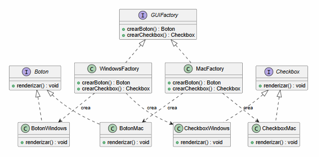
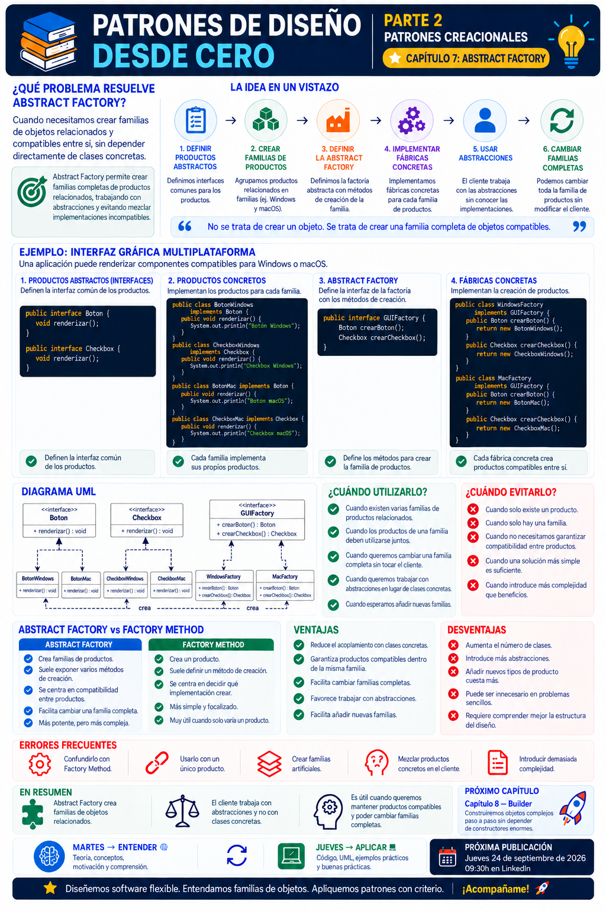

# 📚 Patrones de Diseño desde Cero

> **Aprende a diseñar software mantenible con ejemplos reales.**

# 📖 Capítulo 7 - Abstract Factory

> **📚 Patrones de Diseño desde Cero**  
> **🏗️ Parte II — Patrones Creacionales**

---

## 🧠 Introducción

Continuamos nuestro recorrido por los **patrones creacionales**.

Hasta ahora hemos estudiado dos problemas diferentes relacionados con la creación de objetos:

### 🧩 Singleton

Nos preguntábamos:

> **¿Cómo podemos garantizar que exista una única instancia de una clase?**

### 🏭 Factory Method

La pregunta cambió:

> **¿Quién debería decidir qué objeto concreto crear?**

Ahora vamos a dar un paso más.

Imaginemos una aplicación que puede utilizar diferentes interfaces gráficas dependiendo del sistema operativo.

Para **Windows** necesitamos:

- Botones Windows.
- Checkboxes Windows.

Para **macOS** necesitamos:

- Botones macOS.
- Checkboxes macOS.

El problema ya no consiste únicamente en decidir qué objeto crear.

Ahora necesitamos asegurarnos de que los objetos creados **pertenecen a la misma familia y son compatibles entre sí**.

La pregunta será:

> **¿Cómo podemos crear familias de objetos relacionados sin depender directamente de sus clases concretas?**

Para resolver este problema podemos utilizar:

# 🏭 Abstract Factory

Abstract Factory proporciona una interfaz para crear **familias de objetos relacionados o compatibles** sin especificar directamente sus clases concretas.

---

# 🎯 Objetivos de aprendizaje

Al finalizar este capítulo deberías ser capaz de:

- Comprender qué problema intenta resolver Abstract Factory.
- Entender qué significa una familia de productos relacionados.
- Identificar los participantes del patrón.
- Comprender el papel de `AbstractFactory`.
- Comprender el papel de las fábricas concretas.
- Diferenciar productos abstractos y productos concretos.
- Implementar Abstract Factory en Java.
- Crear familias completas de objetos compatibles.
- Evitar que el cliente dependa directamente de clases concretas.
- Comprender las ventajas y desventajas del patrón.
- Saber cuándo utilizarlo y cuándo evitarlo.
- Diferenciar Abstract Factory de Factory Method.
- Comprender qué ocurre al añadir nuevas familias o nuevos tipos de productos.

---

# ❌ El problema

Imaginemos que desarrollamos una aplicación de escritorio compatible con:

```text
Windows
macOS
```

Nuestra interfaz utiliza dos componentes:

```text
Botón
Checkbox
```

Por tanto tenemos cuatro clases concretas:

```text
BotonWindows
CheckboxWindows

BotonMac
CheckboxMac
```

Una primera solución podría comprobar el sistema operativo directamente:

```java
public class Aplicacion {

    public void crearInterfaz(String sistema) {

        if (sistema.equals("WINDOWS")) {

            BotonWindows boton =
                    new BotonWindows();

            CheckboxWindows checkbox =
                    new CheckboxWindows();

        } else if (sistema.equals("MAC")) {

            BotonMac boton =
                    new BotonMac();

            CheckboxMac checkbox =
                    new CheckboxMac();
        }
    }
}
```

Funciona.

Pero nuestra aplicación conoce directamente todas las clases concretas:

```text
Aplicacion
    │
    ├── BotonWindows
    ├── CheckboxWindows
    ├── BotonMac
    └── CheckboxMac
```

Ahora imaginemos que añadimos:

```text
Linux
```

Necesitaremos:

```text
BotonLinux
CheckboxLinux
```

Y tendremos que modificar nuevamente el código encargado de seleccionar las implementaciones.

---

# ⚠️ Aparece otro problema

Existe además un problema más sutil.

Nuestros componentes forman **familias**.

Tenemos:

```text
FAMILIA WINDOWS
│
├── BotonWindows
└── CheckboxWindows
```

Y:

```text
FAMILIA macOS
│
├── BotonMac
└── CheckboxMac
```

No queremos terminar accidentalmente con:

```text
BotonWindows
     +
CheckboxMac
```

Queremos garantizar que los componentes utilizados sean compatibles entre sí.

Por tanto, necesitamos controlar no solamente:

> **qué objeto creamos**

sino:

> **qué familia completa de objetos estamos creando.**

---

# 💡 Motivación

Podemos representar el problema mediante una matriz:

| | Botón | Checkbox |
|---|---|---|
| **Windows** | `BotonWindows` | `CheckboxWindows` |
| **macOS** | `BotonMac` | `CheckboxMac` |

Tenemos dos dimensiones:

```text
TIPOS DE PRODUCTO
        │
        ├── Botón
        └── Checkbox

FAMILIAS
        │
        ├── Windows
        └── macOS
```

Queremos que nuestro código cliente trabaje únicamente con:

```text
Boton
Checkbox
```

sin necesitar conocer:

```text
BotonWindows
BotonMac
CheckboxWindows
CheckboxMac
```

Y necesitamos un mecanismo que nos permita seleccionar una **familia completa**.

Aquí aparece Abstract Factory.

---

# 🧩 La solución

Comenzamos definiendo nuestros productos abstractos.

## Producto abstracto - Botón

```java
public interface Boton {

    void renderizar();
}
```

## Producto abstracto - Checkbox

```java
public interface Checkbox {

    void renderizar();
}
```

Ahora implementamos las diferentes familias.

---

# 🪟 Familia Windows

```java
public class BotonWindows
        implements Boton {

    @Override
    public void renderizar() {

        System.out.println(
            "Renderizando botón Windows"
        );
    }
}
```

```java
public class CheckboxWindows
        implements Checkbox {

    @Override
    public void renderizar() {

        System.out.println(
            "Renderizando checkbox Windows"
        );
    }
}
```

---

# 🍎 Familia macOS

```java
public class BotonMac
        implements Boton {

    @Override
    public void renderizar() {

        System.out.println(
            "Renderizando botón macOS"
        );
    }
}
```

```java
public class CheckboxMac
        implements Checkbox {

    @Override
    public void renderizar() {

        System.out.println(
            "Renderizando checkbox macOS"
        );
    }
}
```

Ahora necesitamos crear las familias sin que el cliente conozca sus clases concretas.

---

# 🏭 Abstract Factory

Definimos una interfaz que declara cómo crear cada tipo de producto:

```java
public interface GUIFactory {

    Boton crearBoton();

    Checkbox crearCheckbox();
}
```

Esta es nuestra **Abstract Factory**.

No sabe cómo se construye un botón concreto.

Tampoco sabe cómo se construye un checkbox concreto.

Solamente define:

> **Qué productos debe ser capaz de crear una familia.**

---

# 🪟 Fábrica concreta - Windows

```java
public class WindowsFactory
        implements GUIFactory {

    @Override
    public Boton crearBoton() {

        return new BotonWindows();
    }

    @Override
    public Checkbox crearCheckbox() {

        return new CheckboxWindows();
    }
}
```

Esta fábrica crea exclusivamente productos de la familia Windows.

```text
WindowsFactory
      │
      ├── BotonWindows
      └── CheckboxWindows
```

---

# 🍎 Fábrica concreta - macOS

```java
public class MacFactory
        implements GUIFactory {

    @Override
    public Boton crearBoton() {

        return new BotonMac();
    }

    @Override
    public Checkbox crearCheckbox() {

        return new CheckboxMac();
    }
}
```

Esta fábrica crea exclusivamente:

```text
MacFactory
    │
    ├── BotonMac
    └── CheckboxMac
```

De esta manera mantenemos la coherencia entre los productos de cada familia.

---

# 📊 UML

La estructura completa puede representarse mediante:



Podemos simplificarlo conceptualmente:

```text
                       GUIFactory
                           ▲
                    ┌──────┴──────┐
                    │             │
             WindowsFactory   MacFactory
                    │             │
              ┌─────┴─────┐ ┌─────┴─────┐
              │           │ │           │
              ▼           ▼ ▼           ▼
           Botón       Checkbox       Botón
          Windows      Windows        macOS
                                   Checkbox
                                     macOS
```

Cada fábrica concreta crea una **familia completa de productos compatibles**.

---

# ☕ Implementación completa en Java

## Boton.java

```java
public interface Boton {

    void renderizar();
}
```

---

## Checkbox.java

```java
public interface Checkbox {

    void renderizar();
}
```

---

## BotonWindows.java

```java
public class BotonWindows
        implements Boton {

    @Override
    public void renderizar() {

        System.out.println(
            "🪟 Botón Windows"
        );
    }
}
```

---

## CheckboxWindows.java

```java
public class CheckboxWindows
        implements Checkbox {

    @Override
    public void renderizar() {

        System.out.println(
            "🪟 Checkbox Windows"
        );
    }
}
```

---

## BotonMac.java

```java
public class BotonMac
        implements Boton {

    @Override
    public void renderizar() {

        System.out.println(
            "🍎 Botón macOS"
        );
    }
}
```

---

## CheckboxMac.java

```java
public class CheckboxMac
        implements Checkbox {

    @Override
    public void renderizar() {

        System.out.println(
            "🍎 Checkbox macOS"
        );
    }
}
```

---

## GUIFactory.java

```java
public interface GUIFactory {

    Boton crearBoton();

    Checkbox crearCheckbox();
}
```

---

## WindowsFactory.java

```java
public class WindowsFactory
        implements GUIFactory {

    @Override
    public Boton crearBoton() {

        return new BotonWindows();
    }

    @Override
    public Checkbox crearCheckbox() {

        return new CheckboxWindows();
    }
}
```

---

## MacFactory.java

```java
public class MacFactory
        implements GUIFactory {

    @Override
    public Boton crearBoton() {

        return new BotonMac();
    }

    @Override
    public Checkbox crearCheckbox() {

        return new CheckboxMac();
    }
}
```

---

# 🖥️ Aplicación cliente

Ahora podemos crear una aplicación que solamente dependa de las abstracciones:

```java
public class Aplicacion {

    private final Boton boton;
    private final Checkbox checkbox;

    public Aplicacion(
            GUIFactory factory) {

        this.boton =
                factory.crearBoton();

        this.checkbox =
                factory.crearCheckbox();
    }

    public void renderizar() {

        boton.renderizar();
        checkbox.renderizar();
    }
}
```

Observa algo muy importante.

`Aplicacion` no conoce:

```text
BotonWindows
BotonMac
CheckboxWindows
CheckboxMac
```

Solamente conoce:

```text
GUIFactory
Boton
Checkbox
```

---

# 🚀 Cliente

Podemos decidir qué familia utilizar desde el punto de configuración de la aplicación:

```java
public class Main {

    public static void main(String[] args) {

        GUIFactory factory =
                new WindowsFactory();

        Aplicacion aplicacion =
                new Aplicacion(factory);

        aplicacion.renderizar();
    }
}
```

Resultado:

```text
🪟 Botón Windows
🪟 Checkbox Windows
```

Si queremos utilizar macOS:

```java
GUIFactory factory =
        new MacFactory();
```

El resto del código permanece igual.

Resultado:

```text
🍎 Botón macOS
🍎 Checkbox macOS
```

---

# 🔎 Explicación paso a paso

## 1️⃣ Identificamos diferentes tipos de productos

Nuestra interfaz necesita:

```text
Botón
Checkbox
```

Estos son nuestros **productos abstractos**.

---

## 2️⃣ Identificamos las familias

Tenemos:

```text
Windows
macOS
```

Cada familia proporciona una implementación de cada producto.

---

## 3️⃣ Creamos las abstracciones

Definimos:

```java
Boton
Checkbox
```

El cliente trabajará con estas interfaces.

---

## 4️⃣ Creamos los productos concretos

Implementamos:

```text
BotonWindows
CheckboxWindows

BotonMac
CheckboxMac
```

---

## 5️⃣ Definimos la fábrica abstracta

```java
GUIFactory
```

declara:

```java
crearBoton()
crearCheckbox()
```

---

## 6️⃣ Creamos una fábrica por familia

```text
WindowsFactory
MacFactory
```

Cada una sabe crear los productos correspondientes a su familia.

---

## 7️⃣ Inyectamos la fábrica

La aplicación recibe:

```java
GUIFactory
```

y no necesita conocer la implementación concreta.

---

## 8️⃣ Creamos productos compatibles

Si utilizamos:

```java
WindowsFactory
```

obtenemos:

```text
BotonWindows
CheckboxWindows
```

Si utilizamos:

```java
MacFactory
```

obtenemos:

```text
BotonMac
CheckboxMac
```

La familia permanece consistente.

---

# ➕ Añadir una nueva familia

Imaginemos que queremos soportar:

```text
Linux
```

Necesitamos crear:

```java
public class BotonLinux
        implements Boton {

    @Override
    public void renderizar() {

        System.out.println(
            "🐧 Botón Linux"
        );
    }
}
```

```java
public class CheckboxLinux
        implements Checkbox {

    @Override
    public void renderizar() {

        System.out.println(
            "🐧 Checkbox Linux"
        );
    }
}
```

Y su fábrica:

```java
public class LinuxFactory
        implements GUIFactory {

    @Override
    public Boton crearBoton() {

        return new BotonLinux();
    }

    @Override
    public Checkbox crearCheckbox() {

        return new CheckboxLinux();
    }
}
```

Ahora podemos utilizar:

```java
GUIFactory factory =
        new LinuxFactory();
```

La clase `Aplicacion` no necesita modificarse.

---

# ⚠️ ¿Y si añadimos un nuevo tipo de producto?

Aquí encontramos una de las principales limitaciones de Abstract Factory.

Imaginemos que nuestra interfaz gráfica ahora necesita también:

```text
Menu
```

Tenemos que modificar:

```java
public interface GUIFactory {

    Boton crearBoton();

    Checkbox crearCheckbox();

    Menu crearMenu();
}
```

Ahora **todas las fábricas concretas** tendrán que implementar el nuevo método:

```text
WindowsFactory
MacFactory
LinuxFactory
```

Y necesitaremos:

```text
MenuWindows
MenuMac
MenuLinux
```

Por tanto, Abstract Factory suele facilitar mucho:

> **Añadir nuevas familias.**

Pero puede resultar más costoso:

> **Añadir nuevos tipos de productos a todas las familias existentes.**

Esta diferencia es fundamental para comprender el patrón.

---

# 🏗️ Caso de uso real

Abstract Factory resulta especialmente útil cuando tenemos varias familias de componentes que deben mantenerse compatibles.

Por ejemplo:

```text
Proveedor AWS
│
├── StorageAWS
├── QueueAWS
└── DatabaseAWS
```

Frente a:

```text
Proveedor Azure
│
├── StorageAzure
├── QueueAzure
└── DatabaseAzure
```

Podríamos trabajar con abstracciones:

```text
Storage
Queue
Database
```

Y seleccionar:

```text
AWSFactory
```

o:

```text
AzureFactory
```

El resto de la aplicación podría trabajar con los productos abstractos sin depender directamente de cada implementación concreta.

---

# 🎯 ¿Cuándo utilizar Abstract Factory?

Abstract Factory puede resultar adecuado cuando:

- Tenemos diferentes **familias de objetos relacionados**.
- Los productos de una familia deben utilizarse conjuntamente.
- Queremos evitar mezclar productos incompatibles.
- El cliente no debería depender de clases concretas.
- Queremos cambiar una familia completa de implementaciones.
- Esperamos añadir nuevas familias.
- La creación de los productos debe estar centralizada y ser coherente.

---

# 🚫 ¿Cuándo evitarlo?

Probablemente no necesitemos Abstract Factory cuando:

- Solo tenemos un tipo de producto.
- Solo existe una familia.
- Los productos no están relacionados.
- No necesitamos garantizar compatibilidad.
- La creación de objetos es sencilla.
- Una Factory Method o Simple Factory resolvería el problema.
- La estructura introduce más complejidad que beneficios.

Por ejemplo, si solamente tenemos:

```text
BotonWindows
BotonMac
```

pero ningún otro producto relacionado, probablemente no necesitamos construir una Abstract Factory completa.

---

# ✅ Ventajas

## 🔹 Aísla las clases concretas

El cliente puede trabajar con:

```text
GUIFactory
Boton
Checkbox
```

sin conocer las implementaciones específicas.

---

## 🔹 Garantiza familias coherentes

Una fábrica concreta produce componentes pertenecientes a la misma familia.

---

## 🔹 Facilita cambiar familias completas

Podemos sustituir:

```java
new WindowsFactory()
```

por:

```java
new MacFactory()
```

sin modificar la lógica principal.

---

## 🔹 Facilita añadir nuevas familias

Podemos incorporar:

```text
LinuxFactory
```

sin modificar el cliente que trabaja con `GUIFactory`.

---

## 🔹 Favorece el desacoplamiento

El cliente depende de abstracciones en lugar de productos concretos.

---

# ❌ Desventajas

## 🔸 Aumenta el número de clases

Dos familias y dos productos ya implican:

```text
2 interfaces de producto
4 productos concretos
1 fábrica abstracta
2 fábricas concretas
```

A medida que el sistema crece, la estructura también lo hace.

---

## 🔸 Añadir nuevos tipos de producto es costoso

Si añadimos:

```text
Menu
```

debemos modificar todas las fábricas.

---

## 🔸 Puede resultar excesivo para problemas sencillos

Si no existen familias reales de objetos, probablemente estamos introduciendo una abstracción innecesaria.

---

## 🔸 Requiere comprender varias capas de abstracción

El patrón introduce:

```text
Productos abstractos
Productos concretos
Fábrica abstracta
Fábricas concretas
Cliente
```

Esto puede aumentar la curva de aprendizaje.

---

# 🚨 Errores frecuentes

## ❌ Utilizar Abstract Factory con un único producto

Si solamente necesitamos crear diferentes implementaciones de un objeto, Factory Method o incluso una solución más sencilla puede ser suficiente.

---

## ❌ Crear familias artificiales

No debemos agrupar objetos únicamente para justificar el patrón.

Las familias deberían tener una relación real.

---

## ❌ Mezclar productos concretos en el cliente

Esto:

```java
Boton boton =
        factory.crearBoton();

Checkbox checkbox =
        new CheckboxWindows();
```

rompe parte del objetivo del patrón.

---

## ❌ Introducir demasiada complejidad

No necesitamos:

```text
AbstractFactory
ConcreteFactory
AbstractProduct
ConcreteProduct
```

para cualquier creación de objetos.

---

## ❌ Confundir Abstract Factory con Factory Method

Sus nombres son similares, pero la intención es diferente.

Y esta diferencia merece especial atención.

---

# 🆚 Factory Method vs. Abstract Factory

Esta es probablemente la comparación más importante del capítulo.

| Factory Method | Abstract Factory |
|---|---|
| Se centra en un producto | Se centra en familias de productos |
| Delega qué objeto concreto crear | Crea objetos relacionados |
| Suele apoyarse en herencia | Suele apoyarse en composición |
| Un Factory Method crea un producto | Una fábrica expone varios métodos de creación |
| `crearNotificacion()` | `crearBoton()`, `crearCheckbox()` |
| Los creadores concretos deciden el producto | Cada fábrica representa una familia |

Podemos visualizarlo:

```text
FACTORY METHOD

        Notificacion
             ▲
        ┌────┴────┐
      Email      SMS

Pregunta:

¿Qué implementación
concreta creo?
```

Frente a:

```text
ABSTRACT FACTORY

              FAMILIA
                 │
        ┌────────┴────────┐
        │                 │
     Windows            macOS
        │                 │
   ┌────┴────┐       ┌────┴────┐
   │         │       │         │
 Botón    Checkbox  Botón    Checkbox

Pregunta:

¿Qué familia completa
de productos creo?
```

---

# 🧠 Abstract Factory puede utilizar Factory Methods

Existe además una relación interesante entre ambos patrones.

Una Abstract Factory declara diferentes métodos de creación:

```java
Boton crearBoton();

Checkbox crearCheckbox();
```

Cada uno de estos métodos puede considerarse conceptualmente una operación de fábrica.

Por eso los patrones creacionales no son compartimentos completamente aislados.

En diseños reales pueden colaborar entre sí.

Lo importante sigue siendo comprender:

> **qué problema está resolviendo cada uno.**

---

# 🔄 Comparación con los patrones anteriores

| Patrón | Pregunta principal |
|---|---|
| **Singleton** | ¿Cómo garantizo una única instancia? |
| **Factory Method** | ¿Quién decide qué objeto concreto crear? |
| **Abstract Factory** | ¿Cómo creo familias de objetos relacionados? |

Nuestro recorrido empieza a mostrar diferentes dimensiones de la creación:

```text
CREACIÓN DE OBJETOS
        │
        ├── Cantidad
        │      ↓
        │   Singleton
        │
        ├── Tipo concreto
        │      ↓
        │ Factory Method
        │
        └── Familia
               ↓
        Abstract Factory
```

---

# 🧠 Principios relacionados

Abstract Factory refleja varios principios que ya hemos estudiado.

## 🔗 Bajo acoplamiento

El cliente no necesita conocer las implementaciones concretas.

---

## 🧩 Programar hacia abstracciones

Trabajamos con:

```text
GUIFactory
Boton
Checkbox
```

en lugar de:

```text
WindowsFactory
BotonWindows
CheckboxWindows
```

dentro de nuestra lógica principal.

---

## 📦 Encapsular lo que cambia

La familia utilizada puede cambiar sin afectar necesariamente al código cliente.

---

## 🧱 Separación de responsabilidades

La aplicación utiliza los componentes.

La fábrica se responsabiliza de crearlos.

---

# 📌 Resumen

En este capítulo hemos aprendido que:

- Abstract Factory pertenece a los patrones creacionales.
- Su objetivo es crear familias de objetos relacionados o compatibles.
- El cliente trabaja con productos abstractos.
- Las fábricas concretas crean productos pertenecientes a una familia determinada.
- Podemos cambiar una familia completa sustituyendo la fábrica utilizada.
- El patrón ayuda a evitar dependencias directas con clases concretas.
- Facilita añadir nuevas familias.
- Añadir nuevos tipos de productos puede requerir modificar todas las fábricas.
- Factory Method y Abstract Factory resuelven problemas diferentes.
- Abstract Factory introduce más clases y abstracciones.
- No debemos utilizarlo si no existen verdaderas familias de productos.
- Una solución más sencilla sigue siendo preferible cuando resuelve correctamente el problema.

La pregunta fundamental de Abstract Factory es:

> **¿Necesitamos crear familias completas de objetos relacionados sin depender de sus implementaciones concretas?**

---

# 🎓 Conclusiones

Abstract Factory amplía una idea que comenzamos a estudiar con Factory Method.

Ya no estamos pensando únicamente en:

> **¿Qué objeto concreto debo crear?**

Ahora tenemos que mantener la coherencia entre **varios objetos relacionados**.

Una fábrica Windows crea:

```text
BotonWindows
CheckboxWindows
```

Una fábrica macOS crea:

```text
BotonMac
CheckboxMac
```

Y nuestro cliente solamente necesita conocer:

```text
GUIFactory
Boton
Checkbox
```

Esto nos permite cambiar familias completas sin acoplar la lógica principal a todas las implementaciones.

Pero tiene un coste.

Más interfaces.

Más clases.

Más estructura.

Por eso, como siempre:

```text
PROBLEMA
   ↓
CONTEXTO
   ↓
ALTERNATIVAS
   ↓
SOLUCIÓN MÁS SIMPLE
   ↓
¿ABSTRACT FACTORY APORTA VALOR?
```

No utilizamos Abstract Factory porque nuestro proyecto tenga muchos objetos.

Lo utilizamos cuando existe una necesidad real de **crear familias coherentes de objetos relacionados**.

> **Los patrones no están para añadir arquitectura. Están para ayudarnos a gestionar problemas de diseño.**

---

# 🖼️ Infografía

Aquí os dejo una infografía sobre este **capítulo 6**.



---

**📚 Patrones de Diseño desde Cero**

*Aprende a diseñar software mantenible con ejemplos reales.*