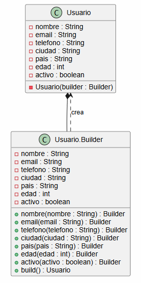
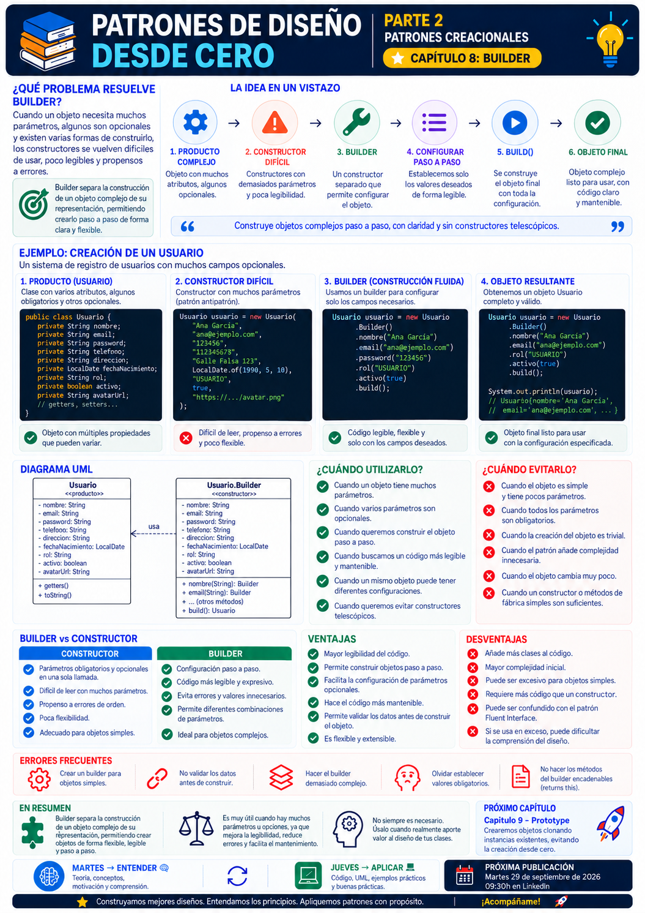

# 📚 Patrones de Diseño desde Cero

> **Aprende a diseñar software mantenible con ejemplos reales.**

# 📖 Capítulo 8 - Builder

> **📚 Patrones de Diseño desde Cero**  
> **🏗️ Parte II - Patrones Creacionales**

---

## 🧠 Introducción

Continuamos nuestro recorrido por los **patrones creacionales**.

Hasta ahora hemos estudiado diferentes problemas relacionados con la creación de objetos:

### 🧩 Singleton

> **¿Cómo garantizamos que exista una única instancia?**

### 🏭 Factory Method

> **¿Quién debería decidir qué objeto concreto crear?**

### 🏭 Abstract Factory

> **¿Cómo podemos crear familias completas de objetos relacionados?**

Ahora vamos a enfrentarnos a un problema diferente.

Imaginemos que necesitamos crear un objeto con muchos datos:

```text
Usuario
│
├── nombre
├── email
├── telefono
├── direccion
├── ciudad
├── pais
├── edad
└── activo
```

Podríamos utilizar un constructor:

```java
Usuario usuario = new Usuario(
        "José",
        "jose@email.com",
        "600000000",
        "Calle Mayor 1",
        "Palma",
        "España",
        44,
        true
);
```

Funciona.

Pero...

> **¿Es fácil saber qué significa cada parámetro?**

¿Y qué ocurre si algunos son opcionales?

¿Y si el objeto puede tener diferentes configuraciones?

¿Y si queremos construirlo paso a paso?

Aquí aparece **Builder**.

---

# 🎯 Objetivos de aprendizaje

Al finalizar este capítulo deberías ser capaz de:

- Comprender qué problema intenta resolver Builder.
- Identificar los problemas de los constructores con muchos parámetros.
- Comprender qué significa construir un objeto paso a paso.
- Separar el proceso de construcción del objeto resultante.
- Implementar Builder en Java.
- Utilizar una API fluida para construir objetos.
- Comprender cómo trabajar con atributos obligatorios y opcionales.
- Crear objetos inmutables mediante Builder.
- Comprender el papel opcional del `Director`.
- Diferenciar Builder de Factory Method y Abstract Factory.
- Conocer las ventajas y desventajas del patrón.
- Saber cuándo Builder aporta valor.
- Reconocer cuándo introduce complejidad innecesaria.

---

# ❌ El problema

Imaginemos una clase `Usuario`:

```java
public class Usuario {

    private String nombre;
    private String email;
    private String telefono;
    private String direccion;
    private String ciudad;
    private String pais;
    private int edad;
    private boolean activo;
}
```

Podríamos crear un constructor:

```java
public Usuario(
        String nombre,
        String email,
        String telefono,
        String direccion,
        String ciudad,
        String pais,
        int edad,
        boolean activo) {

    this.nombre = nombre;
    this.email = email;
    this.telefono = telefono;
    this.direccion = direccion;
    this.ciudad = ciudad;
    this.pais = pais;
    this.edad = edad;
    this.activo = activo;
}
```

Y utilizarlo:

```java
Usuario usuario = new Usuario(
        "José",
        "jose@email.com",
        "600000000",
        "Calle Mayor 1",
        "Palma",
        "España",
        44,
        true
);
```

La primera dificultad aparece inmediatamente:

```text
"José"
"jose@email.com"
"600000000"
"Calle Mayor 1"
"Palma"
"España"
44
true
```

No resulta evidente qué representa cada valor sin consultar el constructor.

---

# 🧱 Constructor telescópico

El problema puede aumentar si algunos parámetros son opcionales.

Podríamos empezar creando varios constructores:

```java
public Usuario(
        String nombre,
        String email) {
    // ...
}
```

Después:

```java
public Usuario(
        String nombre,
        String email,
        String telefono) {
    // ...
}
```

Después:

```java
public Usuario(
        String nombre,
        String email,
        String telefono,
        String direccion) {
    // ...
}
```

Y así sucesivamente.

Terminamos con algo parecido a:

```text
Usuario(nombre, email)

Usuario(nombre, email, telefono)

Usuario(nombre, email, telefono, direccion)

Usuario(nombre, email, telefono, direccion, ciudad)

Usuario(nombre, email, telefono, direccion, ciudad, pais)

...
```

Este problema se conoce habitualmente como:

> **Telescoping Constructor**

o constructor telescópico.

Cuantos más parámetros aparecen, más difícil resulta mantener y utilizar correctamente los constructores.

---

# ⚠️ Otro problema: argumentos difíciles de interpretar

Observa:

```java
new Usuario(
    "José",
    "jose@email.com",
    null,
    null,
    "Palma",
    "España",
    44,
    true
);
```

¿Qué significan los dos `null`?

Sin consultar la definición del constructor resulta difícil saberlo.

Además podemos cometer errores como:

```java
new Usuario(
    "José",
    "jose@email.com",
    "Palma",
    "600000000",
    "España",
    "Calle Mayor 1",
    44,
    true
);
```

El compilador podría aceptar determinados errores si los parámetros tienen tipos compatibles.

Pero semánticamente los valores estarían en posiciones incorrectas.

---

# 💡 Motivación

Queremos poder construir objetos de una forma más expresiva.

En lugar de:

```java
Usuario usuario = new Usuario(
        "José",
        "jose@email.com",
        null,
        null,
        "Palma",
        "España",
        44,
        true
);
```

nos gustaría escribir algo parecido a:

```java
Usuario usuario = new Usuario.Builder()
        .nombre("José")
        .email("jose@email.com")
        .ciudad("Palma")
        .pais("España")
        .edad(44)
        .activo(true)
        .build();
```

Ahora cada valor indica claramente qué representa.

Además:

- podemos omitir parámetros opcionales;
- podemos validar antes de crear el objeto;
- podemos mantener el objeto final inmutable;
- la construcción resulta más legible.

Aquí aparece el patrón **Builder**.

---

# 🧩 La solución

Builder separa:

> **la construcción de un objeto complejo**

de:

> **su representación final**

En lugar de intentar crear el objeto completo de una sola vez, vamos configurándolo paso a paso.

Podemos visualizarlo:

```text
Builder
   │
   ├── nombre(...)
   ├── email(...)
   ├── telefono(...)
   ├── direccion(...)
   ├── ciudad(...)
   ├── pais(...)
   ├── edad(...)
   ├── activo(...)
   │
   └── build()
          │
          ▼
       Usuario
```

Cada paso configura una parte del objeto.

Finalmente:

```java
build()
```

crea el objeto definitivo.

---

# ☕ Implementación en Java

Podemos implementar `Builder` dentro de la propia clase `Usuario`.

```java
public class Usuario {

    private final String nombre;
    private final String email;
    private final String telefono;
    private final String direccion;
    private final String ciudad;
    private final String pais;
    private final int edad;
    private final boolean activo;

    private Usuario(Builder builder) {

        this.nombre = builder.nombre;
        this.email = builder.email;
        this.telefono = builder.telefono;
        this.direccion = builder.direccion;
        this.ciudad = builder.ciudad;
        this.pais = builder.pais;
        this.edad = builder.edad;
        this.activo = builder.activo;
    }

    public static class Builder {

        private String nombre;
        private String email;
        private String telefono;
        private String direccion;
        private String ciudad;
        private String pais;
        private int edad;
        private boolean activo;

        public Builder nombre(String nombre) {
            this.nombre = nombre;
            return this;
        }

        public Builder email(String email) {
            this.email = email;
            return this;
        }

        public Builder telefono(String telefono) {
            this.telefono = telefono;
            return this;
        }

        public Builder direccion(String direccion) {
            this.direccion = direccion;
            return this;
        }

        public Builder ciudad(String ciudad) {
            this.ciudad = ciudad;
            return this;
        }

        public Builder pais(String pais) {
            this.pais = pais;
            return this;
        }

        public Builder edad(int edad) {
            this.edad = edad;
            return this;
        }

        public Builder activo(boolean activo) {
            this.activo = activo;
            return this;
        }

        public Usuario build() {

            return new Usuario(this);
        }
    }
}
```

Ahora podemos crear un usuario:

```java
Usuario usuario =
        new Usuario.Builder()
                .nombre("José")
                .email("jose@email.com")
                .ciudad("Palma")
                .pais("España")
                .edad(44)
                .activo(true)
                .build();
```

---

# 🔎 Explicación paso a paso

## 1️⃣ El objeto final tiene constructor privado

```java
private Usuario(Builder builder) {
    // ...
}
```

El cliente no crea directamente `Usuario`.

La construcción se realiza a través del `Builder`.

---

## 2️⃣ El Builder mantiene temporalmente los datos

```java
private String nombre;
private String email;
private String telefono;
```

Estos valores se van configurando durante el proceso de construcción.

---

## 3️⃣ Cada método configura una propiedad

Por ejemplo:

```java
public Builder nombre(String nombre) {

    this.nombre = nombre;

    return this;
}
```

---

## 4️⃣ Devolvemos `this`

Esto permite encadenar llamadas:

```java
.nombre("José")
.email("jose@email.com")
.ciudad("Palma")
```

Esta técnica permite construir una **API fluida**.

---

## 5️⃣ `build()` crea el objeto

```java
public Usuario build() {

    return new Usuario(this);
}
```

Este es el último paso del proceso.

---

# 🔗 API fluida

Una de las características más visibles de Builder es la posibilidad de escribir:

```java
Usuario usuario =
        new Usuario.Builder()
                .nombre("José")
                .email("jose@email.com")
                .telefono("600000000")
                .ciudad("Palma")
                .pais("España")
                .edad(44)
                .activo(true)
                .build();
```

La lectura es mucho más expresiva que:

```java
new Usuario(
        "José",
        "jose@email.com",
        "600000000",
        null,
        "Palma",
        "España",
        44,
        true
);
```

Podemos leer la construcción casi como una descripción del objeto.

---

# 🔒 Builder e inmutabilidad

Builder resulta especialmente útil para construir objetos inmutables.

Nuestro objeto puede declarar:

```java
private final String nombre;
private final String email;
```

y no exponer setters.

Por ejemplo:

```java
public class Usuario {

    private final String nombre;
    private final String email;

    private Usuario(Builder builder) {

        this.nombre = builder.nombre;
        this.email = builder.email;
    }

    public String getNombre() {
        return nombre;
    }

    public String getEmail() {
        return email;
    }
}
```

Una vez construido:

```java
Usuario usuario = ...
```

su estado puede permanecer estable.

Esto puede facilitar:

- razonamiento sobre el código;
- seguridad frente a modificaciones accidentales;
- uso concurrente en determinados escenarios;
- mantenimiento.

---

# ✅ Parámetros obligatorios

También podemos exigir determinados parámetros desde el constructor del Builder.

Por ejemplo:

```java
public static class Builder {

    private final String nombre;
    private final String email;

    private String telefono;
    private String ciudad;
    private String pais;

    public Builder(
            String nombre,
            String email) {

        this.nombre = nombre;
        this.email = email;
    }
}
```

Entonces la creación sería:

```java
Usuario usuario =
        new Usuario.Builder(
                "José",
                "jose@email.com"
        )
        .ciudad("Palma")
        .pais("España")
        .build();
```

Ahora:

```text
nombre
email
```

son obligatorios.

Mientras que:

```text
telefono
ciudad
pais
```

pueden ser opcionales.

---

# 🛡️ Validación durante la construcción

También podemos utilizar `build()` para validar el objeto.

```java
public Usuario build() {

    if (nombre == null || nombre.isBlank()) {

        throw new IllegalStateException(
                "El nombre es obligatorio"
        );
    }

    if (email == null || email.isBlank()) {

        throw new IllegalStateException(
                "El email es obligatorio"
        );
    }

    if (edad < 0) {

        throw new IllegalStateException(
                "La edad no puede ser negativa"
        );
    }

    return new Usuario(this);
}
```

De esta manera podemos impedir que se creen objetos en estados inválidos.

---

# 📊 UML

Una representación simplificada puede ser:



Conceptualmente:

```text
Cliente
   │
   ▼
Builder
   │
   ├── paso 1
   ├── paso 2
   ├── paso 3
   ├── ...
   │
   ▼
 build()
   │
   ▼
Producto final
```

---

# 🏗️ Builder clásico

La versión que hemos visto es muy habitual en Java.

Sin embargo, la estructura clásica del patrón Builder puede incluir más participantes:

```text
Director
   │
   ▼
Builder
   │
   ▼
ConcreteBuilder
   │
   ▼
Producto
```

Los participantes serían:

### Product

El objeto que queremos construir.

### Builder

Define los pasos necesarios para construirlo.

### ConcreteBuilder

Implementa dichos pasos.

### Director

Define un orden concreto de construcción.

---

# 🎬 El papel del Director

El `Director` no siempre es necesario.

Puede utilizarse cuando existen procesos de construcción predefinidos.

Imaginemos que construimos un ordenador:

```text
Ordenador
│
├── CPU
├── RAM
├── almacenamiento
├── GPU
└── sistema operativo
```

Podríamos tener:

```java
public class DirectorOrdenador {

    public void construirGaming(
            OrdenadorBuilder builder) {

        builder.cpu("Intel Core i9");
        builder.ram(32);
        builder.gpu("RTX");
        builder.almacenamiento(2000);
    }

    public void construirOficina(
            OrdenadorBuilder builder) {

        builder.cpu("Intel Core i5");
        builder.ram(16);
        builder.almacenamiento(512);
    }
}
```

Entonces el Director reutiliza secuencias conocidas de construcción.

---

# 🖥️ Ejemplo de uso real

Builder puede resultar especialmente interesante para construir objetos como:

```text
Petición HTTP
Configuración
Usuario
Pedido
Consulta SQL
Documento
Ordenador
Vehículo
```

Por ejemplo:

```java
PeticionHttp request =
        new PeticionHttp.Builder()
                .url("https://api.example.com")
                .metodo("POST")
                .header(
                    "Authorization",
                    "Bearer token"
                )
                .timeout(5000)
                .build();
```

La construcción resulta mucho más legible que un constructor con numerosos parámetros.

---

# 🎯 ¿Cuándo utilizar Builder?

Builder puede resultar adecuado cuando:

- El objeto tiene muchos parámetros.
- Existen muchos parámetros opcionales.
- Queremos evitar constructores telescópicos.
- La construcción tiene varios pasos.
- Queremos una API más legible.
- Necesitamos validar antes de crear el objeto.
- Queremos construir objetos inmutables.
- Existen diferentes configuraciones posibles del mismo producto.
- Queremos reutilizar procesos de construcción.

---

# 🚫 ¿Cuándo evitarlo?

Probablemente no necesitamos Builder cuando:

- El objeto tiene pocos parámetros.
- Todos los parámetros son obligatorios y claros.
- La construcción es trivial.
- No existen configuraciones alternativas.
- Introduce más código que beneficios.

Por ejemplo:

```java
public class Punto {

    private final int x;
    private final int y;

    public Punto(int x, int y) {

        this.x = x;
        this.y = y;
    }
}
```

Crear:

```java
new Punto(10, 20);
```

es perfectamente comprensible.

Introducir:

```text
PuntoBuilder
```

probablemente no aportaría suficiente valor.

---

# ✅ Ventajas

## 🔹 Mayor legibilidad

Esto:

```java
new Usuario.Builder()
    .nombre("José")
    .email("jose@email.com")
    .edad(44)
    .build();
```

es más explícito que:

```java
new Usuario(
    "José",
    "jose@email.com",
    null,
    null,
    null,
    null,
    44,
    false
);
```

---

## 🔹 Manejo sencillo de parámetros opcionales

Solo configuramos aquello que necesitamos.

---

## 🔹 Evita constructores telescópicos

No necesitamos crear múltiples sobrecargas.

---

## 🔹 Facilita objetos inmutables

El Builder configura el estado antes de crear el objeto final.

---

## 🔹 Permite validación

`build()` puede comprobar que el objeto sea válido.

---

## 🔹 Permite diferentes configuraciones

Podemos construir diferentes variantes utilizando el mismo proceso.

---

# ❌ Desventajas

## 🔸 Aumenta la cantidad de código

Necesitamos:

- la clase producto;
- el Builder;
- métodos de configuración;
- lógica de construcción.

---

## 🔸 Duplica parcialmente propiedades

El Builder suele mantener temporalmente los mismos atributos que el producto.

---

## 🔸 Puede resultar excesivo

Para objetos sencillos puede ser puro *overengineering*.

---

## 🔸 Requiere mantener Builder y Product sincronizados

Si añadimos nuevos atributos al producto, es posible que también tengamos que actualizar el Builder.

---

# ⚠️ Builder no significa solamente API fluida

Existe una confusión habitual:

> **"Si los métodos se pueden encadenar, estamos utilizando Builder."**

No necesariamente.

Por ejemplo:

```java
usuario
    .setNombre("José")
    .setEmail("jose@email.com");
```

puede ser simplemente una API fluida sobre un objeto mutable.

Builder implica una intención más específica:

> **Separar y controlar el proceso de construcción de un objeto.**

Normalmente el producto final se obtiene al ejecutar:

```java
build()
```

---

# ⚠️ Builder tampoco sustituye a todos los constructores

No debemos interpretar:

> "Los constructores son malos."

❌ No.

Un constructor como:

```java
new Punto(10, 20);
```

es sencillo y perfectamente válido.

Builder resulta interesante cuando el proceso de construcción empieza a ser difícil de utilizar o mantener.

---

# 🚨 Errores frecuentes

## ❌ Utilizar Builder para objetos triviales

No necesitamos un patrón para cada objeto.

---

## ❌ Permitir construir estados inválidos

Si:

```java
nombre
email
```

son obligatorios, `build()` debería garantizarlo.

---

## ❌ Crear un Builder mutable reutilizable sin cuidado

Podemos construir accidentalmente diferentes objetos arrastrando estado anterior.

---

## ❌ Duplicar lógica de negocio

El Builder debería centrarse en la construcción.

No debería convertirse en otra clase que contenga toda la lógica del dominio.

---

## ❌ Añadir métodos sin criterio

Un Builder con decenas de configuraciones confusas también puede resultar difícil de mantener.

---

# 🧠 Buenas prácticas

## 1️⃣ Utiliza nombres descriptivos

```java
.telefono(...)
```

es mejor que:

```java
.valor3(...)
```

---

## 2️⃣ Identifica atributos obligatorios

Podemos exigirlos al crear el Builder.

---

## 3️⃣ Valida antes de construir

Evita devolver objetos inconsistentes.

---

## 4️⃣ Considera la inmutabilidad

Builder combina especialmente bien con objetos inmutables.

---

## 5️⃣ Mantén `build()` como punto final claro

El cliente debería saber cuándo termina la construcción.

---

## 6️⃣ Utiliza Director solo si aporta valor

No necesitamos añadirlo únicamente porque aparezca en la estructura clásica del patrón.

---

# 🆚 Builder vs. constructor

| Constructor | Builder |
|---|---|
| Ideal para pocos parámetros | Útil con muchos parámetros |
| Compacto | Más expresivo |
| Puede volverse difícil de leer | Los parámetros tienen nombre |
| Manejo incómodo de opcionales | Opcionales sencillos |
| Menos código | Más infraestructura |
| Excelente para objetos simples | Adecuado para construcciones complejas |

La pregunta no es:

> **"¿Builder es mejor que un constructor?"**

La pregunta correcta es:

> **"¿La construcción de este objeto es suficientemente compleja como para justificar Builder?"**

---

# 🆚 Builder vs. Factory Method

| Factory Method | Builder |
|---|---|
| Decide qué producto concreto crear | Construye un producto paso a paso |
| Se centra en polimorfismo de creación | Se centra en el proceso de construcción |
| Normalmente devuelve el objeto directamente | Puede requerir varios pasos |
| Diferentes productos | Diferentes configuraciones o construcciones |

Podemos resumirlo:

```text
FACTORY METHOD

¿Qué objeto creo?
       │
       ▼
    Producto
```

Frente a:

```text
BUILDER

¿Cómo construyo
este objeto complejo?
       │
       ▼
Paso → Paso → Paso → build()
```

---

# 🆚 Builder vs. Abstract Factory

| Abstract Factory | Builder |
|---|---|
| Crea familias de objetos | Construye un objeto complejo |
| Diferentes productos relacionados | Diferentes configuraciones |
| Varios métodos de creación | Secuencia de construcción |
| Se centra en compatibilidad | Se centra en construcción gradual |

Abstract Factory responde:

> **¿Qué familia completa debo crear?**

Builder responde:

> **¿Cómo construyo este objeto paso a paso?**

---

# 🔄 Comparación con los patrones anteriores

| Patrón | Pregunta principal |
|---|---|
| **Singleton** | ¿Cómo garantizo una única instancia? |
| **Factory Method** | ¿Quién decide qué producto concreto crear? |
| **Abstract Factory** | ¿Cómo creo familias de productos relacionados? |
| **Builder** | ¿Cómo construyo un objeto complejo paso a paso? |

Nuestro recorrido queda:

```text
CREACIÓN DE OBJETOS
        │
        ├── Cantidad
        │      ↓
        │   Singleton
        │
        ├── Tipo concreto
        │      ↓
        │ Factory Method
        │
        ├── Familia
        │      ↓
        │ Abstract Factory
        │
        └── Construcción
               ↓
            Builder
```

---

# 🧠 Principios relacionados

Builder conecta con varios principios estudiados anteriormente.

## 🧩 Separación de responsabilidades

El objeto representa su estado.

El Builder gestiona su construcción.

---

## 🎯 Claridad

Los parámetros tienen nombres explícitos.

---

## 🔒 Encapsulación

La creación del objeto puede quedar controlada.

---

## ✅ Estados válidos

El Builder puede impedir construir objetos inconsistentes.

---

## 🧱 Simplicidad para el cliente

La complejidad de construcción queda encapsulada detrás de una API clara.

---

# 📌 Resumen

En este capítulo hemos aprendido que:

- Builder pertenece a los patrones creacionales.
- Permite construir objetos complejos paso a paso.
- Ayuda a evitar constructores telescópicos.
- Mejora la legibilidad cuando existen muchos parámetros.
- Facilita trabajar con atributos opcionales.
- Puede ayudar a construir objetos inmutables.
- `build()` representa normalmente el final del proceso de construcción.
- El Builder puede realizar validaciones antes de crear el producto.
- Una API fluida no implica automáticamente el patrón Builder.
- El `Director` es opcional y solo debe utilizarse cuando aporta valor.
- Builder aumenta la cantidad de código.
- No está justificado para objetos triviales.
- Debemos utilizarlo cuando la complejidad del proceso de construcción lo requiera.

La pregunta fundamental de Builder es:

> **¿La construcción de este objeto se ha vuelto suficientemente compleja como para necesitar un proceso paso a paso?**

---

# 🎓 Conclusiones

Builder resuelve un problema muy distinto al de los patrones creacionales anteriores.

No nos preguntamos:

> **¿Cuántas instancias deben existir?**

Ni:

> **¿Qué implementación concreta debemos crear?**

Ni:

> **¿Qué familia de objetos debemos utilizar?**

Ahora preguntamos:

> **¿Cómo construimos correctamente un objeto complejo?**

Cuando un constructor empieza a parecerse a:

```java
new Objeto(
    valor1,
    valor2,
    null,
    true,
    null,
    valor6,
    0,
    false,
    ...
);
```

tenemos una señal de que merece la pena analizar alternativas.

Builder puede ofrecernos:

```java
new Objeto.Builder()
    .propiedad1(valor1)
    .propiedad2(valor2)
    .opcion(true)
    .build();
```

Pero, como siempre, esto tiene un coste.

Más código.

Más estructura.

Más elementos que mantener.

Por eso seguimos aplicando nuestra metodología:

```text
PROBLEMA
   ↓
CONTEXTO
   ↓
ALTERNATIVAS
   ↓
SOLUCIÓN MÁS SIMPLE
   ↓
¿BUILDER APORTA VALOR?
```

No utilizamos Builder porque un objeto tenga un constructor.

Lo utilizamos cuando **el proceso de construcción se ha convertido realmente en un problema de diseño**.

> **Un buen patrón no hace el diseño más sofisticado. Hace más manejable una complejidad que ya existe.**

---

# 🖼️ Infografía

Aquí os dejo una infografía sobre este **capítulo 8**.



---

**📚 Patrones de Diseño desde Cero**

*Aprende a diseñar software mantenible con ejemplos reales.*