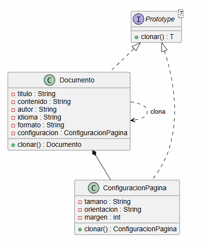
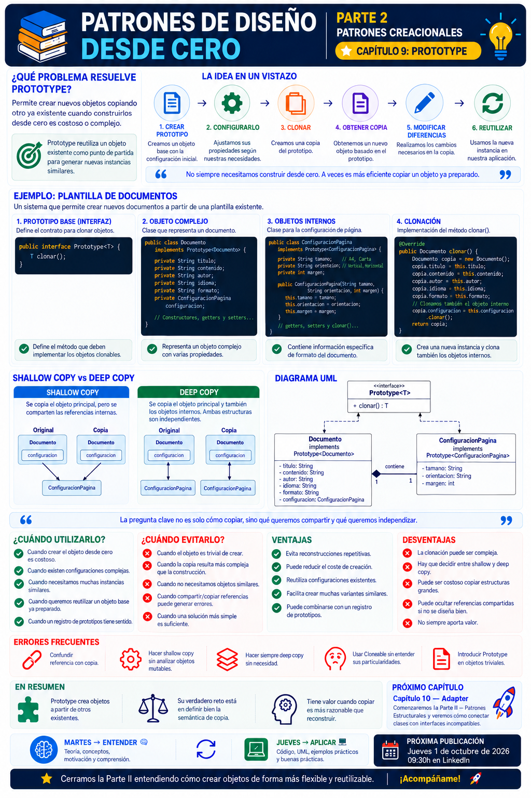

# 📚 Patrones de Diseño desde Cero

> **Aprende a diseñar software mantenible con ejemplos reales.**

# 📖 Capítulo 9 - Prototype

> **📚 Patrones de Diseño desde Cero**  
> **🏗️ Parte II - Patrones Creacionales**

---

## 🧠 Introducción

Llegamos al último patrón de la **Parte II - Patrones Creacionales**.

Hasta ahora hemos estudiado diferentes problemas relacionados con la creación de objetos:

### 🧩 Singleton

> **¿Cómo garantizamos que exista una única instancia?**

### 🏭 Factory Method

> **¿Quién debería decidir qué objeto concreto crear?**

### 🏭 Abstract Factory

> **¿Cómo podemos crear familias de objetos relacionados?**

### 🧱 Builder

> **¿Cómo podemos construir objetos complejos paso a paso?**

Ahora vamos a enfrentarnos a un problema diferente.

Imaginemos que tenemos un objeto cuya creación requiere:

- Muchos atributos.
- Configuración previa.
- Cálculos costosos.
- Datos obtenidos desde una base de datos.
- Recursos externos.
- Un estado inicial complejo.

Y después necesitamos crear otro objeto **muy parecido**.

Podríamos volver a construirlo completamente desde cero.

Pero...

> **¿Y si ya tenemos un objeto correctamente configurado que podemos utilizar como punto de partida?**

Aquí aparece el patrón:

# 🧬 Prototype

Prototype permite crear nuevos objetos **copiando o clonando una instancia existente**.

En lugar de preguntar:

> **¿Cómo construyo este objeto desde cero?**

nos preguntamos:

> **¿Puedo crear el nuevo objeto a partir de otro que ya existe?**

---

# 🎯 Objetivos de aprendizaje

Al finalizar este capítulo deberías ser capaz de:

- Comprender qué problema intenta resolver Prototype.
- Entender qué significa clonar un objeto.
- Comprender cuándo copiar un objeto puede ser preferible a crearlo desde cero.
- Implementar Prototype en Java.
- Diseñar una interfaz de clonación explícita.
- Comprender la diferencia entre copia superficial y copia profunda.
- Identificar problemas relacionados con objetos mutables.
- Comprender las particularidades de `Cloneable` en Java.
- Conocer alternativas como constructores de copia.
- Identificar las ventajas y desventajas del patrón.
- Saber cuándo utilizar Prototype.
- Reconocer cuándo introducirlo sería innecesario.
- Compararlo con Builder, Factory Method y otros patrones creacionales.

---

# ❌ El problema

Imaginemos una aplicación que permite diseñar documentos.

Tenemos una clase:

```java
public class Documento {

    private String titulo;
    private String contenido;
    private String autor;
    private String idioma;
    private String formato;
    private ConfiguracionPagina configuracion;
}
```

Supongamos que configurar un documento requiere bastantes pasos:

```java
Documento documento = new Documento();

documento.setTitulo(
        "Informe mensual"
);

documento.setAutor(
        "Departamento de Ingeniería"
);

documento.setIdioma(
        "es"
);

documento.setFormato(
        "PDF"
);

documento.setConfiguracion(
        new ConfiguracionPagina(
                "A4",
                "vertical",
                20
        )
);
```

Ahora necesitamos crear otro documento prácticamente igual:

```text
Mismo autor
Mismo idioma
Mismo formato
Misma configuración
```

pero con:

```text
Otro título
Otro contenido
```

Podríamos repetir todo el proceso:

```java
Documento copia = new Documento();

copia.setAutor(
        "Departamento de Ingeniería"
);

copia.setIdioma(
        "es"
);

copia.setFormato(
        "PDF"
);

copia.setConfiguracion(
        new ConfiguracionPagina(
                "A4",
                "vertical",
                20
        )
);
```

Funciona.

Pero estamos repitiendo información y lógica de configuración.

---

# 💡 Motivación

El problema puede ser todavía mayor si construir el objeto requiere operaciones costosas.

Por ejemplo:

```text
Crear objeto
    │
    ├── Consultar base de datos
    ├── Cargar configuración
    ├── Leer fichero
    ├── Calcular valores
    ├── Inicializar recursos
    └── Configurar estado
```

Si después necesitamos diez objetos prácticamente iguales:

```text
Objeto base
   │
   ├── copia 1
   ├── copia 2
   ├── copia 3
   ├── copia 4
   └── ...
```

puede resultar más eficiente partir de una instancia existente.

Prototype propone precisamente eso:

> **Utilizar un objeto existente como prototipo para crear nuevos objetos.**

---

# 🧩 La solución

La idea conceptual es muy sencilla:

```text
        PROTOTIPO
            │
            │ clonar()
            ▼
         COPIA
```

El objeto conoce cómo generar una copia de sí mismo.

Podemos definir una interfaz:

```java
public interface Prototype<T> {

    T clonar();
}
```

Y hacer que nuestros objetos implementen esa operación:

```java
public class Documento
        implements Prototype<Documento> {

    @Override
    public Documento clonar() {
        // Crear copia
    }
}
```

Entonces:

```java
Documento copia =
        original.clonar();
```

Tenemos un nuevo objeto creado a partir del original.

---

# ☕ Implementación en Java

Vamos a utilizar una implementación explícita para que el funcionamiento sea fácil de comprender.

## Prototype.java

```java
public interface Prototype<T> {

    T clonar();
}
```

---

# 📄 ConfiguracionPagina.java

```java
public class ConfiguracionPagina
        implements Prototype<ConfiguracionPagina> {

    private String tamano;
    private String orientacion;
    private int margen;

    public ConfiguracionPagina(
            String tamano,
            String orientacion,
            int margen) {

        this.tamano = tamano;
        this.orientacion = orientacion;
        this.margen = margen;
    }

    @Override
    public ConfiguracionPagina clonar() {

        return new ConfiguracionPagina(
                tamano,
                orientacion,
                margen
        );
    }

    public String getTamano() {
        return tamano;
    }

    public String getOrientacion() {
        return orientacion;
    }

    public int getMargen() {
        return margen;
    }
}
```

---

# 📄 Documento.java

```java
public class Documento
        implements Prototype<Documento> {

    private String titulo;
    private String contenido;
    private String autor;
    private String idioma;
    private String formato;

    private ConfiguracionPagina configuracion;

    public Documento(
            String titulo,
            String contenido,
            String autor,
            String idioma,
            String formato,
            ConfiguracionPagina configuracion) {

        this.titulo = titulo;
        this.contenido = contenido;
        this.autor = autor;
        this.idioma = idioma;
        this.formato = formato;
        this.configuracion = configuracion;
    }

    @Override
    public Documento clonar() {

        return new Documento(
                titulo,
                contenido,
                autor,
                idioma,
                formato,
                configuracion.clonar()
        );
    }

    public void setTitulo(String titulo) {
        this.titulo = titulo;
    }

    public void setContenido(String contenido) {
        this.contenido = contenido;
    }

    public String getTitulo() {
        return titulo;
    }

    public String getContenido() {
        return contenido;
    }

    public ConfiguracionPagina getConfiguracion() {
        return configuracion;
    }
}
```

---

# 🚀 Utilización

Creamos el prototipo original:

```java
ConfiguracionPagina configuracion =
        new ConfiguracionPagina(
                "A4",
                "vertical",
                20
        );

Documento original =
        new Documento(
                "Plantilla de informe",
                "Contenido base",
                "Departamento de Ingeniería",
                "es",
                "PDF",
                configuracion
        );
```

Ahora podemos clonarlo:

```java
Documento copia =
        original.clonar();
```

Y modificar únicamente aquello que necesitamos:

```java
copia.setTitulo(
        "Informe septiembre"
);

copia.setContenido(
        "Contenido del informe de septiembre"
);
```

El resto de la configuración ya estaba disponible en el prototipo.

---

# 🔎 Explicación paso a paso

## 1️⃣ Creamos un objeto completo

Primero construimos:

```text
Documento original
```

con toda su configuración.

---

## 2️⃣ El objeto implementa Prototype

```java
implements Prototype<Documento>
```

Esto indica que sabe crear una copia de sí mismo.

---

## 3️⃣ Llamamos a `clonar()`

```java
Documento copia =
        original.clonar();
```

---

## 4️⃣ Se crea una nueva instancia

La copia no es la misma referencia:

```java
original == copia
```

debería devolver:

```text
false
```

Tenemos dos objetos independientes.

---

## 5️⃣ Conservamos la configuración inicial

La nueva instancia parte del mismo estado que el prototipo.

---

## 6️⃣ Modificamos solamente lo necesario

```java
copia.setTitulo(
        "Nuevo informe"
);
```

No necesitamos volver a configurar todo el objeto.

---

# 📊 UML

Una representación sencilla del patrón sería:



Conceptualmente:

```text
           Prototype
               ▲
               │
           Documento
               │
            clonar()
               │
               ▼
        Nuevo Documento
```

---

# 🧠 Copiar no siempre es tan sencillo

Hasta ahora parece muy fácil:

```text
Objeto
   ↓
clonar()
   ↓
Copia
```

Pero aparece una cuestión fundamental.

¿Qué ocurre cuando el objeto contiene referencias a otros objetos?

Por ejemplo:

```java
Documento
    │
    └── ConfiguracionPagina
```

Aquí debemos decidir cómo queremos copiar esas referencias.

Y aparecen dos conceptos muy importantes:

> **Shallow Copy**

y

> **Deep Copy**

---

# 🪶 Shallow Copy - copia superficial

Una copia superficial crea un nuevo objeto principal, pero puede mantener referencias compartidas hacia objetos internos.

Imaginemos:

```text
Documento original
       │
       └─────────────┐
                     ▼
             ConfiguracionPagina
                     ▲
       ┌─────────────┘
       │
Documento copia
```

Ambos documentos utilizan:

> **la misma instancia de `ConfiguracionPagina`.**

Podríamos implementar:

```java
@Override
public Documento clonar() {

    return new Documento(
            titulo,
            contenido,
            autor,
            idioma,
            formato,
            configuracion
    );
}
```

Observa:

```java
configuracion
```

se copia como referencia.

No estamos creando otra `ConfiguracionPagina`.

---

# ⚠️ El problema de la copia superficial

Si `ConfiguracionPagina` es mutable, podemos tener un comportamiento inesperado.

Imaginemos:

```java
original.getConfiguracion()
        .setMargen(50);
```

Si original y copia comparten la misma configuración:

```text
Original ─────┐
              ▼
        Configuracion
              ▲
Copia ────────┘
```

el cambio será visible desde ambos objetos.

Eso puede ser correcto...

o puede ser exactamente lo que queríamos evitar.

Depende del contexto.

---

# 🌳 Deep Copy - copia profunda

Una copia profunda crea también nuevas instancias de los objetos internos.

```text
Documento original
       │
       ▼
ConfiguracionPagina A


Documento copia
       │
       ▼
ConfiguracionPagina B
```

Ahora ambas estructuras son independientes.

Por eso nuestro ejemplo utiliza:

```java
configuracion.clonar()
```

en lugar de:

```java
configuracion
```

---

# ☕ Ejemplo de Deep Copy

```java
@Override
public Documento clonar() {

    return new Documento(
            titulo,
            contenido,
            autor,
            idioma,
            formato,
            configuracion.clonar()
    );
}
```

La copia recibe:

```text
una nueva ConfiguracionPagina
```

en lugar de compartir la original.

---

# 🆚 Shallow Copy vs. Deep Copy

| Shallow Copy | Deep Copy |
|---|---|
| Copia el objeto principal | Copia toda la estructura necesaria |
| Puede compartir referencias | Crea referencias independientes |
| Más sencilla | Más compleja |
| Generalmente más barata | Puede tener mayor coste |
| Puede compartir estado mutable | Evita determinados efectos compartidos |
| Adecuada cuando compartir es correcto | Adecuada cuando necesitamos independencia |

La pregunta fundamental es:

> **¿Queremos compartir los objetos internos o necesitamos copias independientes?**

---

# ⚠️ Prototype y `Cloneable` en Java

Java dispone de:

```java
Cloneable
```

y del método:

```java
Object.clone()
```

Podríamos encontrar implementaciones como:

```java
public class Documento
        implements Cloneable {

    @Override
    public Documento clone() {

        try {

            return (Documento) super.clone();

        } catch (CloneNotSupportedException e) {

            throw new AssertionError();
        }
    }
}
```

Pero este mecanismo tiene varias particularidades.

Entre otras cosas:

- `Cloneable` no declara el método `clone()`.
- `Object.clone()` tiene una semántica particular.
- La copia producida inicialmente es superficial.
- El tratamiento de objetos internos puede requerir código adicional.
- Puede resultar menos explícito que otras alternativas.

Por eso, para aprender Prototype, en esta serie utilizamos:

```java
clonar()
```

de forma explícita.

La intención del patrón es más importante que utilizar necesariamente `Cloneable`.

---

# 🧱 Constructor de copia

Otra alternativa en Java es utilizar un constructor de copia.

Por ejemplo:

```java
public Documento(
        Documento original) {

    this.titulo =
            original.titulo;

    this.contenido =
            original.contenido;

    this.autor =
            original.autor;

    this.idioma =
            original.idioma;

    this.formato =
            original.formato;

    this.configuracion =
            original.configuracion.clonar();
}
```

Entonces:

```java
Documento copia =
        new Documento(original);
```

Esto puede resultar muy claro.

---

# 🆚 Prototype vs. constructor de copia

| Prototype | Constructor de copia |
|---|---|
| El objeto expone una operación de clonación | El constructor recibe otro objeto |
| Puede utilizar polimorfismo | Normalmente conocemos la clase concreta |
| Útil con jerarquías de objetos | Muy explícito y sencillo |
| Encapsula la lógica de clonación | Encapsula igualmente la copia |
| Puede formar parte de una interfaz común | No requiere interfaz Prototype |

No siempre necesitamos una interfaz `Prototype`.

La decisión depende del problema.

---

# 🏗️ Caso de uso real

Prototype puede ser interesante cuando tenemos objetos previamente configurados.

Por ejemplo, un editor gráfico.

Podríamos tener un objeto:

```text
Botón estándar
│
├── ancho = 120
├── alto = 40
├── color = azul
├── fuente = Inter
├── borde = 8
└── sombra = activada
```

En lugar de reconstruirlo continuamente:

```java
Boton botonNuevo =
        botonPrototipo.clonar();
```

Y modificar:

```java
botonNuevo.setTexto(
        "Guardar"
);
```

El objeto parte de una configuración conocida.

---

# 🗂️ Registro de prototipos

En algunos diseños podemos mantener una colección de objetos preparados.

Por ejemplo:

```text
Prototype Registry

"documento-informe"
        ↓
Documento configurado

"documento-factura"
        ↓
Documento configurado

"documento-carta"
        ↓
Documento configurado
```

Podemos crear:

```java
public class RegistroPrototipos {

    private final Map<String, Documento> prototipos =
            new HashMap<>();

    public void registrar(
            String nombre,
            Documento documento) {

        prototipos.put(
                nombre,
                documento
        );
    }

    public Documento crear(
            String nombre) {

        Documento prototipo =
                prototipos.get(nombre);

        if (prototipo == null) {

            throw new IllegalArgumentException(
                    "Prototipo no encontrado"
            );
        }

        return prototipo.clonar();
    }
}
```

Entonces:

```java
Documento informe =
        registro.crear(
                "documento-informe"
        );
```

El cliente ni siquiera necesita saber cómo configurar el objeto original.

---

# 🎯 ¿Cuándo utilizar Prototype?

Prototype puede resultar adecuado cuando:

- Crear un objeto desde cero es costoso.
- Los objetos requieren configuraciones complejas.
- Necesitamos muchas instancias similares.
- Disponemos de objetos base configurados.
- Queremos evitar repetir procesos de inicialización.
- Las clases concretas no deberían condicionar al cliente.
- Necesitamos crear objetos dinámicamente a partir de modelos existentes.
- Queremos mantener un catálogo de configuraciones predefinidas.

---

# 🚫 ¿Cuándo evitarlo?

Probablemente no necesitamos Prototype cuando:

- Crear el objeto es trivial.
- El objeto tiene pocos atributos.
- La copia resulta más compleja que la construcción.
- El objeto contiene muchas relaciones difíciles de clonar.
- No necesitamos crear objetos similares.
- Un constructor normal es suficientemente claro.
- Builder resuelve mejor el problema.

Por ejemplo:

```java
new Punto(10, 20);
```

no necesita:

```java
Punto prototipo =
        new Punto(10, 20);

Punto otro =
        prototipo.clonar();
```

La solución directa es mucho más clara.

---

# ✅ Ventajas

## 🔹 Evita reconstrucciones repetitivas

Podemos reutilizar una configuración existente.

---

## 🔹 Puede reducir el coste de creación

Si configurar el objeto es caro, copiarlo puede ser más eficiente.

---

## 🔹 Permite crear objetos dinámicamente

Podemos crear nuevas instancias sin conocer necesariamente todos los detalles de construcción.

---

## 🔹 Reduce lógica de inicialización duplicada

La configuración inicial reside en el prototipo.

---

## 🔹 Facilita configuraciones predefinidas

Podemos mantener distintos prototipos preparados.

---

## 🔹 Puede utilizarse mediante polimorfismo

Diferentes clases pueden implementar la misma operación:

```java
clonar()
```

---

# ❌ Desventajas

## 🔸 La clonación puede ser compleja

Especialmente cuando existen objetos internos.

---

## 🔸 Shallow vs. Deep Copy puede generar errores

Compartir accidentalmente referencias mutables puede producir comportamientos inesperados.

---

## 🔸 Puede resultar difícil con estructuras recursivas

Por ejemplo:

```text
Objeto
   ↓
Objeto hijo
   ↓
Objeto hijo
   ↓
Objeto padre
```

Las relaciones complejas requieren especial cuidado.

---

## 🔸 Puede duplicar objetos pesados

Una copia profunda puede resultar costosa en memoria y tiempo.

---

## 🔸 Puede ocultar la complejidad real

Clonar parece sencillo, pero necesitamos comprender exactamente qué estamos copiando.

---

# ⚠️ Prototype no significa simplemente copiar propiedades

Podemos hacer:

```java
nuevo.setNombre(
        original.getNombre()
);
```

pero eso no implica necesariamente estar aplicando Prototype.

El patrón introduce una responsabilidad clara:

> **El objeto o una abstracción asociada sabe cómo generar una copia válida de sí mismo.**

---

# ⚠️ Clonar no significa compartir

Una confusión especialmente peligrosa es pensar que:

```java
Documento copia =
        original;
```

crea una copia.

❌ No.

Esto solamente crea otra referencia al mismo objeto:

```text
original ────┐
             ▼
          Documento
             ▲
copia ───────┘
```

En cambio:

```java
Documento copia =
        original.clonar();
```

debe producir una nueva instancia:

```text
original
   │
   ▼
Documento A


copia
   │
   ▼
Documento B
```

---

# 🚨 Errores frecuentes

## ❌ Confundir referencia con copia

```java
copia = original;
```

no clona nada.

---

## ❌ Hacer shallow copy sin analizar objetos internos

Podemos terminar compartiendo estado mutable accidentalmente.

---

## ❌ Hacer siempre deep copy

Una copia profunda también puede ser innecesaria o costosa.

No debemos aplicarla automáticamente.

---

## ❌ Utilizar `Cloneable` sin comprender su comportamiento

El mecanismo de Java tiene particularidades que debemos conocer.

---

## ❌ Clonar objetos con estados inválidos

El prototipo también debe representar un estado correcto.

---

## ❌ Utilizar Prototype para objetos triviales

No necesitamos un patrón cuando la construcción directa ya es sencilla.

---

# 🧠 Buenas prácticas

## 1️⃣ Define claramente la semántica de copia

Documenta si:

```java
clonar()
```

produce:

- copia superficial;
- copia profunda;
- o una combinación controlada.

---

## 2️⃣ Ten especial cuidado con objetos mutables

Las referencias compartidas pueden provocar efectos secundarios.

---

## 3️⃣ Mantén los prototipos válidos

No clones objetos que estén en estados inconsistentes.

---

## 4️⃣ Considera objetos inmutables

Los objetos inmutables reducen muchos problemas relacionados con referencias compartidas.

---

## 5️⃣ Valora constructores de copia

En Java pueden ser una alternativa sencilla y explícita.

---

## 6️⃣ No clones por costumbre

Primero debemos justificar por qué copiar resulta mejor que construir.

---

# 🆚 Prototype vs. Builder

Ambos patrones pueden intervenir en la creación de objetos complejos, pero resuelven problemas diferentes.

| Builder | Prototype |
|---|---|
| Construye desde cero | Parte de un objeto existente |
| Construcción paso a paso | Clonación |
| Configura propiedades progresivamente | Copia un estado existente |
| Útil con muchos parámetros | Útil con objetos similares |
| `build()` finaliza la construcción | `clonar()` crea la copia |

Podemos resumirlo:

```text
BUILDER

Nada
  ↓
Paso
  ↓
Paso
  ↓
Paso
  ↓
Objeto
```

Frente a:

```text
PROTOTYPE

Objeto existente
       ↓
    clonar()
       ↓
Nuevo objeto
```

---

# 🆚 Prototype vs. Factory Method

| Factory Method | Prototype |
|---|---|
| Decide qué clase concreta crear | Copia un objeto existente |
| Utiliza creadores | Utiliza prototipos |
| La creación suele llamar a un constructor | La creación parte de otro objeto |
| Selecciona una implementación | Replica una configuración |

Factory Method responde:

> **¿Qué producto concreto debo crear?**

Prototype responde:

> **¿Puedo crear este objeto copiando otro que ya existe?**

---

# 🆚 Prototype vs. Abstract Factory

Abstract Factory crea:

> **familias de objetos relacionados.**

Prototype crea:

> **copias de objetos existentes.**

En determinados sistemas podrían incluso colaborar.

Una fábrica podría mantener prototipos y clonarlos cuando necesita producir objetos.

Los patrones no son piezas aisladas.

Pueden combinarse si el diseño realmente lo necesita.

---

# 🔄 Comparación con los patrones creacionales

| Patrón | Pregunta principal |
|---|---|
| **Singleton** | ¿Cómo garantizo una única instancia? |
| **Factory Method** | ¿Quién decide qué objeto concreto crear? |
| **Abstract Factory** | ¿Cómo creo familias de objetos relacionados? |
| **Builder** | ¿Cómo construyo un objeto complejo paso a paso? |
| **Prototype** | ¿Cómo creo un objeto a partir de otro existente? |

Nuestro recorrido completo por los patrones creacionales queda:

```text
CREACIÓN DE OBJETOS
        │
        ├── Cantidad
        │      ↓
        │   Singleton
        │
        ├── Tipo concreto
        │      ↓
        │ Factory Method
        │
        ├── Familia
        │      ↓
        │ Abstract Factory
        │
        ├── Construcción
        │      ↓
        │   Builder
        │
        └── Copia
               ↓
           Prototype
```

---

# 🧠 Principios relacionados

Prototype conecta con varios de los principios que hemos estudiado.

## 🔒 Encapsulación

El objeto puede encapsular cómo debe copiarse correctamente.

---

## 🧩 Separación de responsabilidades

El cliente no necesita conocer todos los detalles de reconstrucción.

---

## 🔗 Bajo acoplamiento

Podemos trabajar mediante una abstracción `Prototype`.

---

## ♻️ Reutilización

Reutilizamos una configuración existente como punto de partida.

---

## 🎯 Simplicidad

Si copiar es más sencillo que reconstruir, Prototype puede reducir lógica repetida.

Pero si no lo es:

> **no deberíamos utilizarlo.**

---

# 📌 Resumen

En este capítulo hemos aprendido que:

- Prototype pertenece a los patrones creacionales.
- Permite crear nuevos objetos a partir de instancias existentes.
- El objeto existente actúa como prototipo.
- La clonación puede evitar procesos de creación repetitivos o costosos.
- Una copia debe ser una nueva instancia.
- Asignar otra referencia no significa copiar un objeto.
- Shallow Copy comparte determinadas referencias internas.
- Deep Copy crea copias independientes de los objetos necesarios.
- Ninguna de las dos estrategias es siempre mejor.
- Debemos elegir la semántica de copia según el contexto.
- Java dispone de `Cloneable`, pero no es la única forma de implementar Prototype.
- Un método explícito `clonar()` puede ser más didáctico y claro.
- Los constructores de copia son otra alternativa válida.
- Prototype puede combinarse con un registro de prototipos.
- No debemos utilizarlo cuando crear el objeto directamente es más sencillo.

La pregunta fundamental de Prototype es:

> **¿Tiene sentido crear este objeto reutilizando el estado de otro que ya existe?**

---

# 🎓 Conclusiones

Prototype cierra nuestro recorrido por los patrones creacionales planteando una estrategia distinta.

Hasta ahora siempre partíamos de la idea de:

> **crear un objeto nuevo.**

Prototype cambia la perspectiva:

> **Ya tengo un objeto. ¿Puedo utilizarlo como modelo para crear el siguiente?**

Esto puede ser especialmente útil cuando:

```text
crear desde cero
        ↓
es complejo o costoso
```

mientras que:

```text
clonar
   ↓
modificar pequeñas diferencias
```

resulta mucho más sencillo.

Pero la clonación introduce nuevas decisiones.

¿Qué compartimos?

¿Qué copiamos?

¿Necesitamos una copia superficial?

¿Necesitamos una copia profunda?

¿Existen objetos mutables?

¿Es realmente más sencillo que reconstruir?

Por eso volvemos a nuestra metodología:

```text
PROBLEMA
   ↓
CONTEXTO
   ↓
ALTERNATIVAS
   ↓
SOLUCIÓN MÁS SIMPLE
   ↓
¿PROTOTYPE APORTA VALOR?
```

Prototype no consiste simplemente en saber implementar:

```java
clone()
```

Consiste en reconocer cuándo **crear a partir de un objeto existente** es una mejor estrategia que volver a construir todo desde cero.

> **El patrón no es la clonación. El patrón es la decisión de diseño que hace que esa clonación tenga sentido.**

---

# 🏗️ FIN DE LA PARTE II - PATRONES CREACIONALES

Con Prototype completamos los cinco patrones creacionales:

```text
5. Singleton
      ↓
Controlar una única instancia

6. Factory Method
      ↓
Delegar qué producto crear

7. Abstract Factory
      ↓
Crear familias de productos relacionados

8. Builder
      ↓
Construir objetos complejos paso a paso

9. Prototype
      ↓
Crear objetos copiando otros existentes
```

Cada uno responde a un problema diferente relacionado con la creación.

Y esto es importante:

> **No existe un patrón creacional "mejor". Existe un patrón adecuado —o ninguno— según el problema que tengamos.**

---

# 🧱 PRÓXIMA PARTE - PATRONES ESTRUCTURALES

En el próximo capítulo comenzaremos una nueva etapa:

## 🧱 Parte III - Patrones Estructurales

### 📖 Capítulo 10 - Adapter

Hasta ahora nos hemos centrado en:

> **cómo crear objetos.**

A partir de Adapter empezaremos a preguntarnos:

> **¿Cómo hacemos que clases y objetos con interfaces incompatibles puedan colaborar?**

Entraremos así en los patrones que nos ayudan a organizar y conectar las diferentes piezas de nuestro software.

---

# 🖼️ Infografía

Aquí os dejo una infografía sobre este **capítulo 9**.



---

**📚 Patrones de Diseño desde Cero**

*Aprende a diseñar software mantenible con ejemplos reales.*