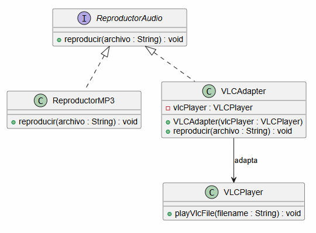
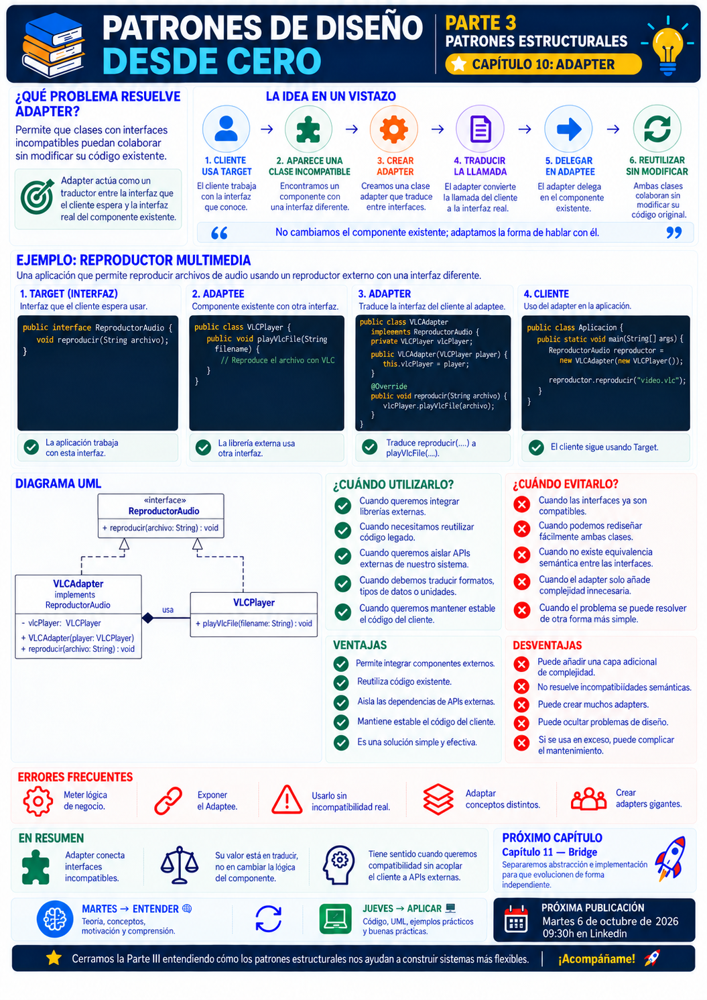

# 📚 Patrones de Diseño desde Cero

> **Aprende a diseñar software mantenible con ejemplos reales.**

# 📖 Capítulo 10 - Adapter

> **📚 Patrones de Diseño desde Cero**  
> **🧱 Parte III - Patrones Estructurales**

---

## 🧠 Introducción

Con **Prototype** cerramos la Parte II dedicada a los patrones creacionales.

Hasta ahora nos hemos preguntado:

- ¿Cómo garantizar una única instancia?
- ¿Quién decide qué objeto crear?
- ¿Cómo crear familias de objetos?
- ¿Cómo construir objetos complejos?
- ¿Cómo crear objetos a partir de otros existentes?

Ahora cambia la pregunta.

Entramos en:

# 🧱 Patrones Estructurales

Los patrones estructurales se centran en:

> **cómo organizar, combinar y relacionar clases y objetos para construir estructuras más flexibles.**

Y comenzamos con uno de los patrones más fáciles de reconocer en proyectos reales:

# 🔌 Adapter

Imaginemos que nuestra aplicación trabaja con una interfaz:

```java
public interface ReproductorAudio {

    void reproducir(String archivo);
}
```

Pero necesitamos integrar una librería externa cuya API es completamente diferente:

```java
public class VLCPlayer {

    public void playVlcFile(String filename) {
        // ...
    }
}
```

Nuestra aplicación espera:

```text
reproducir(...)
```

La librería externa ofrece:

```text
playVlcFile(...)
```

Ambos componentes podrían realizar tareas compatibles.

Pero no hablan el mismo idioma.

La pregunta será:

> **¿Cómo conseguimos que dos interfaces incompatibles puedan colaborar sin modificar las clases existentes?**

Aquí aparece **Adapter**.

---

# 🎯 Objetivos de aprendizaje

Al finalizar este capítulo deberías ser capaz de:

- Comprender qué problema intenta resolver Adapter.
- Identificar interfaces incompatibles.
- Comprender el papel de `Target`, `Adapter` y `Adaptee`.
- Implementar Adapter en Java.
- Integrar código legado o librerías externas.
- Comprender cómo Adapter traduce una interfaz en otra.
- Diferenciar adaptación de interfaz y modificación de comportamiento.
- Reconocer Adapter por composición.
- Comprender la variante basada en herencia.
- Identificar sus ventajas y desventajas.
- Saber cuándo utilizarlo y cuándo evitarlo.
- Diferenciar Adapter de Decorator, Facade, Bridge y Proxy.
- Reconocer errores frecuentes al aplicar el patrón.

---

# ❌ El problema

Imaginemos una aplicación de reproducción multimedia.

Nuestra aplicación trabaja con esta interfaz:

```java
public interface ReproductorAudio {

    void reproducir(String archivo);
}
```

Tenemos una implementación para MP3:

```java
public class ReproductorMP3
        implements ReproductorAudio {

    @Override
    public void reproducir(String archivo) {

        System.out.println(
            "Reproduciendo MP3: " + archivo
        );
    }
}
```

El cliente puede utilizarla:

```java
ReproductorAudio reproductor =
        new ReproductorMP3();

reproductor.reproducir(
        "cancion.mp3"
);
```

Hasta aquí todo funciona.

Pero ahora necesitamos reproducir archivos VLC mediante una librería externa.

La librería proporciona:

```java
public class VLCPlayer {

    public void playVlcFile(String filename) {

        System.out.println(
            "Reproduciendo VLC: " + filename
        );
    }
}
```

El problema es evidente.

Nuestra aplicación espera:

```java
reproducir(String archivo)
```

pero la librería ofrece:

```java
playVlcFile(String filename)
```

No podemos utilizar directamente:

```java
ReproductorAudio reproductor =
        new VLCPlayer();
```

porque `VLCPlayer` no implementa nuestra interfaz.

---

# 💡 Motivación

Podríamos modificar `VLCPlayer`.

Pero imaginemos que:

- pertenece a una librería externa;
- no tenemos acceso al código fuente;
- no queremos modificarla;
- múltiples sistemas dependen de ella;
- queremos mantener nuestro código desacoplado de esa API.

Tampoco queremos cambiar toda nuestra aplicación para adaptarla a:

```java
playVlcFile(...)
```

Porque ya tenemos una interfaz estable:

```java
ReproductorAudio
```

Necesitamos una pieza intermedia.

Algo que reciba:

```text
reproducir(...)
```

y lo traduzca a:

```text
playVlcFile(...)
```

Ese componente será nuestro:

> **Adapter**

---

# 🧩 La solución

Adapter actúa como un traductor entre dos interfaces incompatibles.

Conceptualmente:

```text
CLIENTE
   │
   ▼
TARGET
   │
   ▼
ADAPTER
   │
   ▼
ADAPTEE
```

En nuestro ejemplo:

```text
Cliente
   │
   ▼
ReproductorAudio
   │
   ▼
VLCAdapter
   │
   ▼
VLCPlayer
```

El cliente sigue trabajando con:

```java
ReproductorAudio
```

mientras el Adapter se encarga de traducir la llamada.

---

# 🧱 Participantes del patrón

Adapter suele tener varios participantes principales.

## 1️⃣ Client

Es el código que necesita utilizar una determinada interfaz.

En nuestro ejemplo:

```text
Aplicación
```

---

## 2️⃣ Target

Es la interfaz que el cliente espera.

```java
public interface ReproductorAudio {

    void reproducir(String archivo);
}
```

---

## 3️⃣ Adaptee

Es la clase existente cuya interfaz no es compatible.

```java
public class VLCPlayer {

    public void playVlcFile(String filename) {
        // ...
    }
}
```

---

## 4️⃣ Adapter

Implementa la interfaz esperada por el cliente y delega en el `Adaptee`.

```java
public class VLCAdapter
        implements ReproductorAudio {

    private final VLCPlayer vlcPlayer;

    public VLCAdapter(
            VLCPlayer vlcPlayer) {

        this.vlcPlayer = vlcPlayer;
    }

    @Override
    public void reproducir(String archivo) {

        vlcPlayer.playVlcFile(archivo);
    }
}
```

El Adapter convierte:

```text
reproducir(...)
```

en:

```text
playVlcFile(...)
```

---

# ☕ Implementación completa en Java

## Target - ReproductorAudio.java

```java
public interface ReproductorAudio {

    void reproducir(String archivo);
}
```

---

## Implementación nativa - ReproductorMP3.java

```java
public class ReproductorMP3
        implements ReproductorAudio {

    @Override
    public void reproducir(String archivo) {

        System.out.println(
            "🎵 Reproduciendo MP3: " + archivo
        );
    }
}
```

---

## Adaptee - VLCPlayer.java

```java
public class VLCPlayer {

    public void playVlcFile(
            String filename) {

        System.out.println(
            "🎬 Reproduciendo VLC: "
            + filename
        );
    }
}
```

---

## Adapter - VLCAdapter.java

```java
public class VLCAdapter
        implements ReproductorAudio {

    private final VLCPlayer vlcPlayer;

    public VLCAdapter(
            VLCPlayer vlcPlayer) {

        this.vlcPlayer = vlcPlayer;
    }

    @Override
    public void reproducir(
            String archivo) {

        vlcPlayer.playVlcFile(
                archivo
        );
    }
}
```

---

## Cliente - Main.java

```java
public class Main {

    public static void main(String[] args) {

        ReproductorAudio mp3 =
                new ReproductorMP3();

        mp3.reproducir(
                "cancion.mp3"
        );

        VLCPlayer vlcPlayer =
                new VLCPlayer();

        ReproductorAudio vlc =
                new VLCAdapter(
                        vlcPlayer
                );

        vlc.reproducir(
                "video.vlc"
        );
    }
}
```

Salida:

```text
🎵 Reproduciendo MP3: cancion.mp3
🎬 Reproduciendo VLC: video.vlc
```

---

# 🔎 Explicación paso a paso

## 1️⃣ El cliente conoce una interfaz

Nuestra aplicación trabaja con:

```java
ReproductorAudio
```

El cliente no necesita conocer detalles específicos de cada reproductor.

---

## 2️⃣ Aparece una clase incompatible

Tenemos:

```java
VLCPlayer
```

pero no implementa:

```java
ReproductorAudio
```

---

## 3️⃣ Creamos un Adapter

```java
VLCAdapter
```

implementa:

```java
ReproductorAudio
```

---

## 4️⃣ El Adapter contiene el objeto incompatible

```java
private final VLCPlayer vlcPlayer;
```

Esto nos permite reutilizar la implementación existente.

---

## 5️⃣ Traducimos la llamada

El cliente llama:

```java
reproducir(...)
```

El Adapter ejecuta:

```java
playVlcFile(...)
```

---

## 6️⃣ El cliente no cambia

Para el cliente:

```java
ReproductorAudio
```

sigue siendo la interfaz utilizada.

No necesita saber que internamente existe un Adapter.

---

# 📊 UML

La estructura del patrón puede representarse así:



Conceptualmente:

```text
            TARGET
       ReproductorAudio
          ▲          ▲
          │          │
          │       VLCAdapter
          │          │
          │          ▼
 ReproductorMP3   VLCPlayer
                  ADAPTEE
```

---

# 🔄 ¿Qué está ocurriendo realmente?

Adapter no sustituye la funcionalidad existente.

La reutiliza.

Tenemos:

```text
INTERFAZ ESPERADA
        │
        ▼
      Adapter
        │
        ▼
INTERFAZ EXISTENTE
```

El Adapter actúa como una capa de traducción.

Por eso también podemos pensar en él como:

> **un traductor entre dos componentes.**

---

# 🌍 Analogía del mundo real

Imaginemos que viajamos desde España a un país con otro tipo de enchufe.

Nuestro dispositivo tiene:

```text
Enchufe europeo
```

La pared utiliza:

```text
Otro estándar
```

No cambiamos:

- el dispositivo;
- la instalación eléctrica.

Utilizamos:

> **un adaptador.**

```text
Dispositivo
   │
   ▼
Adaptador
   │
   ▼
Enchufe incompatible
```

La idea es exactamente la misma.

---

# 🏗️ Adapter por composición

La implementación que hemos utilizado emplea **composición**:

```java
public class VLCAdapter
        implements ReproductorAudio {

    private final VLCPlayer vlcPlayer;
}
```

El Adapter **contiene** el objeto adaptado.

Esto proporciona bastante flexibilidad.

Podemos cambiar el objeto adaptado y mantener responsabilidades separadas.

Conceptualmente:

```text
Adapter
   │
   HAS-A
   ▼
Adaptee
```

Esta suele ser una opción muy natural en Java.

---

# 🧬 Adapter mediante herencia

También podemos encontrar una variante basada en herencia.

Por ejemplo:

```java
public class VLCAdapter
        extends VLCPlayer
        implements ReproductorAudio {

    @Override
    public void reproducir(
            String archivo) {

        playVlcFile(archivo);
    }
}
```

Aquí:

```text
VLCAdapter
    │
    IS-A
    ▼
VLCPlayer
```

Esta aproximación puede funcionar en determinados casos, pero genera un acoplamiento mayor con la implementación adaptada.

La composición suele ofrecer más flexibilidad.

---

# 🆚 Object Adapter vs. Class Adapter

Podemos resumir ambas variantes:

| Object Adapter | Class Adapter |
|---|---|
| Utiliza composición | Utiliza herencia |
| Contiene el Adaptee | Hereda del Adaptee |
| Más flexible | Más acoplado |
| Puede adaptarse en runtime | Relación fijada por herencia |
| Muy habitual en Java | Depende de las limitaciones del lenguaje |

En Java, la variante por composición suele ser especialmente común.

---

# 🏗️ Caso de uso real

Uno de los escenarios más habituales para Adapter es integrar una API externa.

Imaginemos que nuestra aplicación define:

```java
public interface ServicioPago {

    void pagar(double cantidad);
}
```

Pero un proveedor externo ofrece:

```java
public class StripeClient {

    public void makePayment(
            long centimos) {

        // ...
    }
}
```

Las interfaces son diferentes.

Nuestra aplicación utiliza:

```text
double euros
```

Stripe espera:

```text
long céntimos
```

Podemos crear:

```java
public class StripeAdapter
        implements ServicioPago {

    private final StripeClient stripe;

    public StripeAdapter(
            StripeClient stripe) {

        this.stripe = stripe;
    }

    @Override
    public void pagar(
            double cantidad) {

        long centimos =
                Math.round(
                        cantidad * 100
                );

        stripe.makePayment(
                centimos
        );
    }
}
```

Ahora el Adapter no solo traduce el nombre del método.

También transforma los datos.

---

# 🔄 Adapter puede transformar datos

Adapter no se limita a:

```text
método A → método B
```

También puede transformar:

- parámetros;
- unidades;
- formatos;
- tipos;
- estructuras;
- respuestas;
- excepciones.

Por ejemplo:

```text
EUR
 ↓
Adapter
 ↓
Céntimos
```

o:

```text
JSON externo
     ↓
   Adapter
     ↓
Objeto de dominio
```

Lo importante es que el cliente pueda continuar utilizando la interfaz que espera.

---

# 🎯 ¿Cuándo utilizar Adapter?

Adapter puede resultar adecuado cuando:

- Necesitamos utilizar una clase existente con una interfaz incompatible.
- Integramos librerías externas.
- Trabajamos con código legado.
- No podemos modificar la clase existente.
- No queremos modificar la interfaz del cliente.
- Necesitamos traducir formatos o tipos.
- Queremos aislar una dependencia externa.
- Estamos migrando de una API a otra.
- Necesitamos compatibilidad entre componentes.

---

# 🚫 ¿Cuándo evitarlo?

Probablemente no necesitamos Adapter cuando:

- Las interfaces ya son compatibles.
- Podemos modificar directamente ambas clases de forma sencilla.
- El Adapter solo añade una capa innecesaria.
- No existe un problema real de incompatibilidad.
- Estamos utilizando Adapter para ocultar un diseño mal planteado.
- La traducción introduce demasiada lógica de negocio.

Si tenemos:

```java
servicio.procesar();
```

y podemos cambiar fácilmente el servicio para que implemente la interfaz correcta, quizá no necesitamos un Adapter.

---

# ✅ Ventajas

## 🔹 Permite reutilizar código existente

No necesitamos modificar la clase adaptada.

---

## 🔹 Reduce el acoplamiento con APIs externas

El resto de la aplicación puede depender de una interfaz propia.

---

## 🔹 Facilita integraciones

Podemos conectar sistemas diseñados independientemente.

---

## 🔹 Aísla cambios externos

Si la API externa cambia, podemos concentrar el impacto en el Adapter.

---

## 🔹 Mantiene estable al cliente

El cliente continúa utilizando su interfaz habitual.

---

## 🔹 Permite transformar datos

Podemos adaptar:

```text
formatos
unidades
tipos
llamadas
```

además de métodos.

---

# ❌ Desventajas

## 🔸 Añade una nueva capa

Tenemos otra clase que comprender y mantener.

---

## 🔸 Puede aumentar el número de clases

Cada integración incompatible puede necesitar su propio Adapter.

---

## 🔸 Puede esconder una API problemática

Si acumulamos muchos Adapters quizá exista un problema arquitectónico más profundo.

---

## 🔸 Puede terminar conteniendo demasiada lógica

Un Adapter debería traducir interfaces.

No convertirse en un enorme servicio de negocio.

---

## 🔸 Algunas adaptaciones pueden resultar complejas

Especialmente si ambas APIs representan conceptos muy diferentes.

---

# ⚠️ Adapter no cambia la intención

Adapter hace compatibles interfaces.

No debería modificar completamente la intención del comportamiento.

Por ejemplo:

```text
Cliente espera → guardar()
API ofrece     → persist()
```

puede ser una adaptación razonable.

Pero si:

```text
Cliente espera → calcularFactura()
API ofrece     → enviarEmail()
```

probablemente no estamos adaptando la misma responsabilidad.

Estamos intentando conectar conceptos diferentes.

---

# ⚠️ Adapter no es un parche para cualquier incompatibilidad

Existe el riesgo de pensar:

> **"Estas clases no encajan. Hagamos un Adapter."**

Antes debemos preguntarnos:

- ¿Representan realmente el mismo concepto?
- ¿La incompatibilidad es solo de interfaz?
- ¿La adaptación tiene sentido semántico?
- ¿Estamos ocultando un problema de diseño?

El patrón debe resolver una incompatibilidad real.

No disimular una arquitectura incoherente.

---

# 🚨 Errores frecuentes

## ❌ Introducir lógica de negocio en el Adapter

El Adapter debe centrarse principalmente en traducir.

---

## ❌ Acoplar toda la aplicación a la API externa

Precisamente queremos evitar:

```java
new StripeClient()
```

repartido por todo el sistema.

---

## ❌ Crear Adapters innecesarios

Si las interfaces ya son compatibles, probablemente no necesitamos nada.

---

## ❌ Utilizar Adapter para responsabilidades distintas

La adaptación debe mantener una equivalencia conceptual razonable.

---

## ❌ Exponer el Adaptee al cliente

Si el cliente termina utilizando directamente:

```java
VLCPlayer
```

además del Adapter, estamos perdiendo parte del aislamiento.

---

## ❌ Convertir el Adapter en un God Object

No debería terminar adaptando diez APIs completamente diferentes.

---

# 🧠 Buenas prácticas

## 1️⃣ Define tu propia interfaz estable

Por ejemplo:

```java
ServicioPago
```

en lugar de hacer depender todo el dominio directamente de una API externa.

---

## 2️⃣ Mantén el Adapter pequeño

Debe ser fácil entender:

```text
Entrada
  ↓
Transformación
  ↓
Delegación
```

---

## 3️⃣ Utiliza composición cuando aporte flexibilidad

En Java suele ser una opción especialmente adecuada.

---

## 4️⃣ Encapsula las peculiaridades externas

Por ejemplo:

```text
nombres de métodos
tipos de datos
unidades
excepciones
```

---

## 5️⃣ Evita filtrar detalles externos

El resto del sistema no debería necesitar conocer cómo funciona internamente el proveedor adaptado.

---

## 6️⃣ Prueba la traducción

Los tests del Adapter son especialmente importantes cuando transforma datos.

---

# 🆚 Adapter vs. Decorator

Aunque ambos patrones pueden envolver otro objeto, su intención es diferente.

| Adapter | Decorator |
|---|---|
| Cambia la interfaz | Mantiene la interfaz |
| Busca compatibilidad | Añade comportamiento |
| Traduce llamadas | Extiende responsabilidades |
| Cliente espera otra interfaz | Cliente trabaja con la misma interfaz |

Conceptualmente:

```text
ADAPTER

Interfaz A
   ↓
Adapter
   ↓
Interfaz B
```

Mientras que:

```text
DECORATOR

Interfaz A
   ↓
Decorator
   ↓
Interfaz A
   +
Nuevo comportamiento
```

Estudiaremos Decorator más adelante.

---

# 🆚 Adapter vs. Facade

| Adapter | Facade |
|---|---|
| Hace compatible una interfaz | Simplifica una interfaz compleja |
| Suele adaptar un componente | Puede representar un subsistema entero |
| Traduce | Simplifica |
| Cliente espera una interfaz concreta | Cliente recibe una interfaz más sencilla |

Facade no pretende necesariamente resolver incompatibilidades.

Pretende:

> **ofrecer una entrada simplificada a un sistema complejo.**

---

# 🆚 Adapter vs. Proxy

| Adapter | Proxy |
|---|---|
| Cambia la interfaz | Mantiene normalmente la misma interfaz |
| Traduce llamadas | Controla el acceso |
| Busca compatibilidad | Añade intermediación |
| Integra componentes incompatibles | Puede gestionar seguridad, caché, acceso remoto... |

Proxy aparecerá también durante esta Parte III.

---

# 🆚 Adapter vs. Bridge

Adapter suele aplicarse cuando:

> **ya tenemos dos componentes incompatibles.**

Bridge suele utilizarse para:

> **diseñar desde el principio dos dimensiones que deben evolucionar independientemente.**

Podemos simplificarlo:

```text
ADAPTER
↓
Hacer compatibles
cosas existentes
```

```text
BRIDGE
↓
Separar dimensiones
desde el diseño
```

Bridge será precisamente el siguiente patrón de la serie.

---

# 🔄 Comparación con los patrones anteriores

Hasta ahora habíamos estudiado patrones creacionales.

| Patrón | Pregunta |
|---|---|
| Singleton | ¿Cuántas instancias? |
| Factory Method | ¿Qué producto crear? |
| Abstract Factory | ¿Qué familia crear? |
| Builder | ¿Cómo construir? |
| Prototype | ¿Cómo copiar? |

Con Adapter cambia la dimensión:

```text
CREACIONALES
     ↓
¿Cómo creo objetos?


ESTRUCTURALES
     ↓
¿Cómo conecto y organizo objetos?
```

Y nuestra primera pregunta estructural es:

> **¿Cómo hago colaborar dos interfaces incompatibles?**

---

# 🧠 Principios relacionados

Adapter conecta muy bien con varios principios vistos durante la serie.

## 🔗 Bajo acoplamiento

El dominio puede depender de su propia interfaz y no directamente de una API externa.

---

## 🧩 Separación de responsabilidades

El Adapter se encarga de traducir.

El cliente se encarga de utilizar la abstracción.

---

## 🔒 Encapsulación

Los detalles específicos de integración quedan escondidos.

---

## 🧱 Programar hacia abstracciones

El cliente utiliza:

```java
ReproductorAudio
```

en lugar de:

```java
VLCPlayer
```

---

## 🔄 Diseñar para el cambio

Si el proveedor externo cambia, podemos limitar el impacto al Adapter.

---

# 📌 Resumen

En este capítulo hemos aprendido que:

- Adapter pertenece a los patrones estructurales.
- Permite que interfaces incompatibles puedan colaborar.
- El cliente trabaja con una interfaz esperada denominada `Target`.
- La clase existente incompatible actúa como `Adaptee`.
- El `Adapter` traduce entre ambas interfaces.
- La implementación puede utilizar composición o herencia.
- La composición suele ofrecer mayor flexibilidad.
- Adapter puede transformar métodos, datos, formatos, unidades y excepciones.
- Resulta especialmente útil para integrar APIs externas y código legado.
- Permite aislar dependencias externas.
- No debe introducir demasiada lógica de negocio.
- No todas las incompatibilidades justifican un Adapter.
- Adapter no es lo mismo que Decorator, Facade, Proxy o Bridge.
- La intención del patrón es conseguir **compatibilidad**, no simplemente envolver objetos.

La pregunta fundamental de Adapter es:

> **¿Necesitamos hacer colaborar dos componentes que representan conceptos compatibles, pero utilizan interfaces diferentes?**

---

# 🎓 Conclusiones

Adapter abre una nueva etapa de la serie.

Durante los patrones creacionales nos centramos en:

> **cómo nacen los objetos.**

Ahora empezamos a estudiar:

> **cómo se relacionan entre ellos.**

Adapter aparece cuando tenemos una situación muy habitual:

```text
Componente A
    │
    │ espera una interfaz
    │
    X  incompatibilidad
    │
    │ ofrece otra interfaz
    ▼
Componente B
```

En lugar de modificar ambos extremos, podemos introducir:

```text
Componente A
    │
    ▼
 Adapter
    │
    ▼
Componente B
```

El Adapter permite que cada componente mantenga su interfaz.

Pero seguimos aplicando la misma filosofía de toda la serie:

```text
PROBLEMA
   ↓
CONTEXTO
   ↓
ALTERNATIVAS
   ↓
SOLUCIÓN MÁS SIMPLE
   ↓
¿ADAPTER APORTA VALOR?
```

No utilizamos Adapter simplemente porque dos métodos tengan nombres diferentes.

Lo utilizamos cuando existe una **incompatibilidad real entre interfaces que queremos hacer colaborar sin acoplar innecesariamente nuestros componentes**.

> **Un buen Adapter no cambia lo que hace un componente. Cambia la forma en que podemos hablar con él.**

---

# 🖼️ Infografía

Aquí os dejo una infografía sobre este **capítulo 10**.



---

**📚 Patrones de Diseño desde Cero**

*Aprende a diseñar software mantenible con ejemplos reales.*