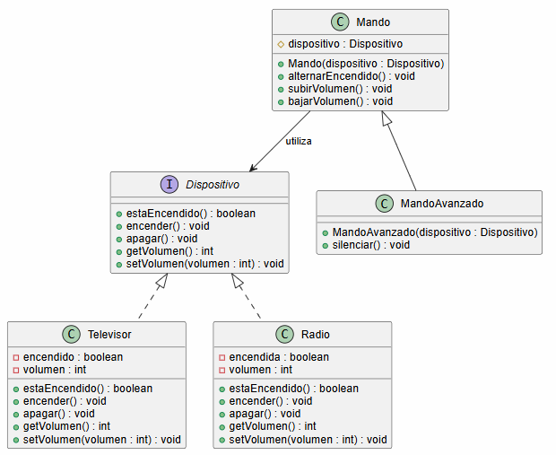
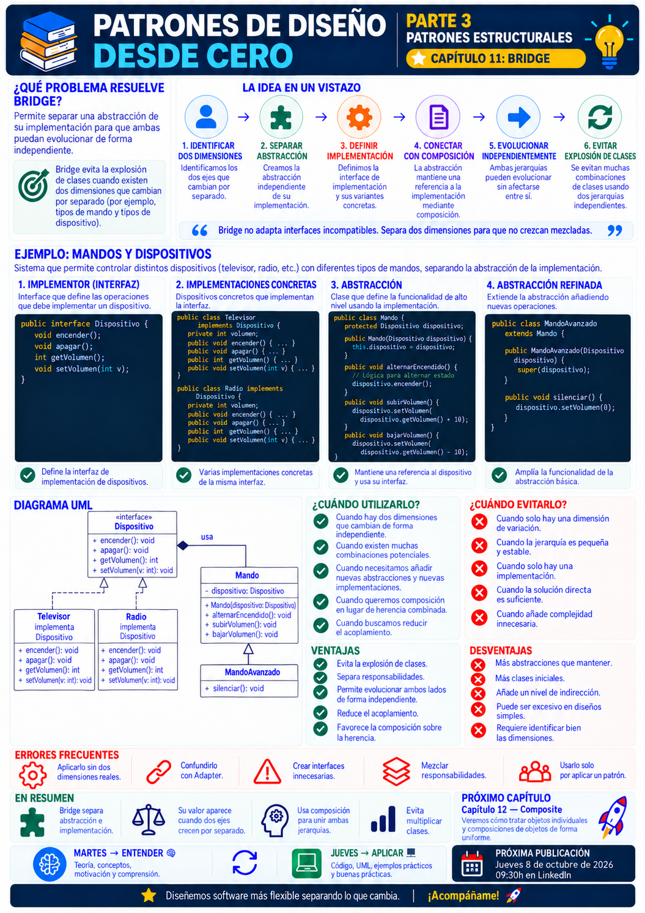

# 📚 Patrones de Diseño desde Cero

> **Aprende a diseñar software mantenible con ejemplos reales.**

# 📖 Capítulo 11 - Bridge

> **📚 Patrones de Diseño desde Cero**  
> **🧱 Parte III - Patrones Estructurales**

---

## 🧠 Introducción

En el capítulo anterior comenzamos la **Parte III - Patrones Estructurales** estudiando **Adapter**.

Adapter respondía a una pregunta muy concreta:

> **¿Cómo podemos conseguir que dos interfaces incompatibles colaboren?**

Ahora vamos a enfrentarnos a otro problema.

Imaginemos que tenemos diferentes dispositivos:

```text
Televisor
Radio
```

Y diferentes tipos de controles:

```text
Mando básico
Mando avanzado
```

Una primera aproximación podría consistir en utilizar herencia:

```text
Mando
│
├── MandoTV
├── MandoRadio
├── MandoAvanzadoTV
└── MandoAvanzadoRadio
```

Pero...

¿Qué ocurre si añadimos:

```text
Proyector
Altavoz
Reproductor multimedia
```

¿Y si aparecen nuevos tipos de mandos?

La jerarquía puede crecer rápidamente.

Tenemos dos dimensiones que cambian de forma independiente:

```text
TIPO DE CONTROL
        +
TIPO DE DISPOSITIVO
```

Aquí aparece:

# 🌉 Bridge

Bridge separa una abstracción de su implementación para que **ambas puedan evolucionar de forma independiente**.

---

# 🎯 Objetivos de aprendizaje

Al finalizar este capítulo deberías ser capaz de:

- Comprender qué problema intenta resolver Bridge.
- Identificar jerarquías con dos dimensiones independientes.
- Entender por qué combinar ambas dimensiones mediante herencia puede provocar una explosión de clases.
- Comprender la diferencia entre abstracción e implementación dentro del patrón.
- Identificar `Abstraction`, `RefinedAbstraction`, `Implementor` y `ConcreteImplementor`.
- Implementar Bridge en Java.
- Comprender cómo Bridge utiliza composición.
- Añadir nuevas abstracciones sin modificar las implementaciones.
- Añadir nuevas implementaciones sin modificar las abstracciones.
- Diferenciar Bridge de Adapter.
- Comparar Bridge con Strategy y Decorator.
- Reconocer cuándo el patrón aporta valor y cuándo introduce complejidad innecesaria.

---

# ❌ El problema

Imaginemos que desarrollamos un sistema de controles remotos.

Inicialmente tenemos:

```text
Televisor
Radio
```

Y queremos proporcionar un mando para cada uno.

Podríamos diseñar:

```java
public class MandoTV {

    public void encender() {
        // Encender televisión
    }

    public void apagar() {
        // Apagar televisión
    }
}
```

Y:

```java
public class MandoRadio {

    public void encender() {
        // Encender radio
    }

    public void apagar() {
        // Apagar radio
    }
}
```

Después aparece un nuevo requisito:

> **Necesitamos un mando avanzado.**

Podríamos añadir:

```text
MandoAvanzadoTV
MandoAvanzadoRadio
```

Nuestra jerarquía empieza a crecer:

```text
Mando
│
├── MandoTV
├── MandoRadio
├── MandoAvanzadoTV
└── MandoAvanzadoRadio
```

Ahora añadimos un nuevo dispositivo:

```text
Proyector
```

Necesitamos:

```text
MandoProyector
MandoAvanzadoProyector
```

Y si después añadimos un tercer tipo de mando...

el número de combinaciones continúa creciendo.

---

# 📈 Explosión de clases

Tenemos dos dimensiones:

```text
CONTROLES
│
├── Básico
├── Avanzado
└── Profesional
```

Y:

```text
DISPOSITIVOS
│
├── Televisor
├── Radio
├── Proyector
└── Altavoz
```

Si representamos cada combinación mediante herencia podemos terminar con:

```text
MandoBasicoTV
MandoBasicoRadio
MandoBasicoProyector
MandoBasicoAltavoz

MandoAvanzadoTV
MandoAvanzadoRadio
MandoAvanzadoProyector
MandoAvanzadoAltavoz

MandoProfesionalTV
MandoProfesionalRadio
MandoProfesionalProyector
MandoProfesionalAltavoz
```

Tres tipos de mando y cuatro dispositivos producen:

```text
3 × 4 = 12 clases
```

Añadir una dimensión hace crecer las combinaciones.

El problema no es únicamente tener muchas clases.

El problema es que estamos mezclando **dos jerarquías que deberían poder evolucionar de manera independiente**.

---

# 💡 Motivación

Queremos separar:

```text
¿QUÉ TIPO DE CONTROL TENEMOS?
```

de:

```text
¿QUÉ DISPOSITIVO CONTROLAMOS?
```

El mando debería ocuparse de operaciones como:

```text
encender
apagar
subir volumen
bajar volumen
```

Mientras que el dispositivo debería saber:

```text
cómo se enciende
cómo se apaga
cómo cambia su volumen
```

Podemos conectar ambas dimensiones mediante composición:

```text
Mando
  │
  ▼
Dispositivo
```

Ahora:

```text
MandoBasico
MandoAvanzado
```

pueden trabajar con:

```text
TV
Radio
Proyector
...
```

sin crear una clase para cada combinación.

---

# 🌉 La solución

Bridge separa dos jerarquías:

```text
ABSTRACCIÓN
     │
     │ utiliza
     ▼
IMPLEMENTACIÓN
```

En nuestro ejemplo:

```text
Mando
  │
  │ utiliza
  ▼
Dispositivo
```

Las dos jerarquías pueden evolucionar independientemente:

```text
Mando
│
├── MandoBasico
└── MandoAvanzado
```

Y:

```text
Dispositivo
│
├── Televisor
├── Radio
└── Proyector
```

Ahora podemos combinar:

```text
MandoBasico + Televisor
MandoBasico + Radio
MandoAvanzado + Televisor
MandoAvanzado + Radio
```

sin crear clases específicas para cada combinación.

---

# 🧱 Participantes del patrón

Bridge suele estar compuesto por cuatro participantes principales.

## 1️⃣ Abstraction

Define la interfaz de alto nivel utilizada por el cliente.

En nuestro ejemplo:

```java
public class Mando {

    protected Dispositivo dispositivo;
}
```

---

## 2️⃣ Refined Abstraction

Extiende la abstracción con comportamiento adicional.

Por ejemplo:

```text
MandoAvanzado
```

---

## 3️⃣ Implementor

Define la interfaz que deben proporcionar las implementaciones.

En nuestro caso:

```java
public interface Dispositivo {
    // ...
}
```

---

## 4️⃣ Concrete Implementor

Implementa esa interfaz.

Por ejemplo:

```text
Televisor
Radio
```

---

# ☕ Implementación en Java

## Implementor - Dispositivo.java

```java
public interface Dispositivo {

    boolean estaEncendido();

    void encender();

    void apagar();

    int getVolumen();

    void setVolumen(int volumen);
}
```

---

# 📺 Concrete Implementor - Televisor.java

```java
public class Televisor
        implements Dispositivo {

    private boolean encendido;

    private int volumen = 30;

    @Override
    public boolean estaEncendido() {
        return encendido;
    }

    @Override
    public void encender() {

        encendido = true;

        System.out.println(
            "📺 Televisor encendido"
        );
    }

    @Override
    public void apagar() {

        encendido = false;

        System.out.println(
            "📺 Televisor apagado"
        );
    }

    @Override
    public int getVolumen() {
        return volumen;
    }

    @Override
    public void setVolumen(
            int volumen) {

        this.volumen =
                Math.max(
                    0,
                    Math.min(
                        volumen,
                        100
                    )
                );

        System.out.println(
            "📺 Volumen TV: "
            + this.volumen
        );
    }
}
```

---

# 📻 Concrete Implementor - Radio.java

```java
public class Radio
        implements Dispositivo {

    private boolean encendida;

    private int volumen = 20;

    @Override
    public boolean estaEncendido() {
        return encendida;
    }

    @Override
    public void encender() {

        encendida = true;

        System.out.println(
            "📻 Radio encendida"
        );
    }

    @Override
    public void apagar() {

        encendida = false;

        System.out.println(
            "📻 Radio apagada"
        );
    }

    @Override
    public int getVolumen() {
        return volumen;
    }

    @Override
    public void setVolumen(
            int volumen) {

        this.volumen =
                Math.max(
                    0,
                    Math.min(
                        volumen,
                        100
                    )
                );

        System.out.println(
            "📻 Volumen radio: "
            + this.volumen
        );
    }
}
```

---

# 🎛️ Abstraction - Mando.java

```java
public class Mando {

    protected final Dispositivo dispositivo;

    public Mando(
            Dispositivo dispositivo) {

        this.dispositivo =
                dispositivo;
    }

    public void alternarEncendido() {

        if (
            dispositivo
                .estaEncendido()
        ) {

            dispositivo.apagar();

        } else {

            dispositivo.encender();
        }
    }

    public void subirVolumen() {

        dispositivo.setVolumen(
            dispositivo.getVolumen()
            + 10
        );
    }

    public void bajarVolumen() {

        dispositivo.setVolumen(
            dispositivo.getVolumen()
            - 10
        );
    }
}
```

---

# 🚀 Refined Abstraction - MandoAvanzado.java

```java
public class MandoAvanzado
        extends Mando {

    public MandoAvanzado(
            Dispositivo dispositivo) {

        super(dispositivo);
    }

    public void silenciar() {

        dispositivo.setVolumen(0);

        System.out.println(
            "🔇 Dispositivo silenciado"
        );
    }
}
```

---

# ▶️ Cliente - Main.java

```java
public class Main {

    public static void main(String[] args) {

        Dispositivo televisor =
                new Televisor();

        Mando mandoTV =
                new Mando(
                        televisor
                );

        mandoTV.alternarEncendido();

        mandoTV.subirVolumen();

        Dispositivo radio =
                new Radio();

        MandoAvanzado mandoRadio =
                new MandoAvanzado(
                        radio
                );

        mandoRadio.alternarEncendido();

        mandoRadio.subirVolumen();

        mandoRadio.silenciar();
    }
}
```

Posible salida:

```text
📺 Televisor encendido
📺 Volumen TV: 40

📻 Radio encendida
📻 Volumen radio: 30
📻 Volumen radio: 0
🔇 Dispositivo silenciado
```

---

# 🔎 Explicación paso a paso

## 1️⃣ Definimos la implementación

```java
Dispositivo
```

representa las operaciones que necesita nuestra abstracción.

---

## 2️⃣ Creamos implementaciones concretas

Tenemos:

```text
Televisor
Radio
```

Ambas implementan:

```java
Dispositivo
```

---

## 3️⃣ Creamos la abstracción

```java
Mando
```

no depende de:

```text
Televisor
Radio
```

Depende de:

```java
Dispositivo
```

---

## 4️⃣ Conectamos ambas jerarquías

El puente es esta referencia:

```java
protected final Dispositivo dispositivo;
```

La abstracción delega operaciones en la implementación.

---

## 5️⃣ Podemos crear nuevas abstracciones

Por ejemplo:

```java
MandoAvanzado
```

sin modificar:

```text
Televisor
Radio
```

---

## 6️⃣ Podemos crear nuevos dispositivos

Por ejemplo:

```text
Proyector
```

sin modificar:

```text
Mando
MandoAvanzado
```

Las dos dimensiones quedan desacopladas.

---

# 📊 UML

La estructura puede representarse mediante:



Conceptualmente:

```text
ABSTRACCIÓN
────────────────────

Mando
  ▲
  │
MandoAvanzado

  │
  │ Bridge
  ▼

IMPLEMENTACIÓN
────────────────────

Dispositivo
  ▲       ▲
  │       │
 TV     Radio
```

---

# 🌉 ¿Dónde está el Bridge?

El Bridge no es necesariamente una clase llamada:

```text
Bridge
```

El puente está en la relación entre:

```text
Mando
```

y:

```text
Dispositivo
```

Concretamente:

```java
protected final Dispositivo dispositivo;
```

La abstracción utiliza la implementación mediante composición.

Esto permite que las dos jerarquías evolucionen de forma independiente.

---

# ➕ Añadir un nuevo dispositivo

Supongamos que necesitamos controlar un proyector.

Creamos:

```java
public class Proyector
        implements Dispositivo {

    private boolean encendido;

    private int volumen;

    @Override
    public boolean estaEncendido() {
        return encendido;
    }

    @Override
    public void encender() {
        encendido = true;
    }

    @Override
    public void apagar() {
        encendido = false;
    }

    @Override
    public int getVolumen() {
        return volumen;
    }

    @Override
    public void setVolumen(
            int volumen) {

        this.volumen = volumen;
    }
}
```

Ahora podemos utilizarlo:

```java
Mando mando =
        new Mando(
            new Proyector()
        );
```

También:

```java
MandoAvanzado avanzado =
        new MandoAvanzado(
            new Proyector()
        );
```

No necesitamos crear:

```text
MandoProyector
MandoAvanzadoProyector
```

---

# ➕ Añadir un nuevo tipo de mando

Podemos crear:

```java
public class MandoConVoz
        extends Mando {

    public MandoConVoz(
            Dispositivo dispositivo) {

        super(dispositivo);
    }

    public void ejecutarComando(
            String comando) {

        System.out.println(
            "🎙️ Ejecutando: "
            + comando
        );
    }
}
```

Ahora puede utilizarse con cualquier `Dispositivo`:

```java
MandoConVoz mando =
        new MandoConVoz(
            new Televisor()
        );
```

o:

```java
MandoConVoz mando =
        new MandoConVoz(
            new Radio()
        );
```

No tenemos que modificar las implementaciones.

---

# 📉 Antes y después

## ❌ Sin Bridge

```text
MandoBasicoTV
MandoBasicoRadio
MandoBasicoProyector

MandoAvanzadoTV
MandoAvanzadoRadio
MandoAvanzadoProyector

MandoConVozTV
MandoConVozRadio
MandoConVozProyector
```

Cada combinación genera una clase.

---

## ✅ Con Bridge

Tenemos dos jerarquías:

```text
MANDOS

Mando
├── MandoAvanzado
└── MandoConVoz
```

y:

```text
DISPOSITIVOS

Dispositivo
├── Televisor
├── Radio
└── Proyector
```

Podemos combinarlas mediante composición.

---

# 🏗️ Caso de uso real

Bridge puede resultar útil cuando una aplicación tiene dos dimensiones independientes.

Por ejemplo:

```text
NOTIFICACIONES
│
├── Normal
├── Urgente
└── Programada
```

Y diferentes canales:

```text
CANALES
│
├── Email
├── SMS
└── Push
```

Sin Bridge podríamos terminar con:

```text
NotificacionNormalEmail
NotificacionNormalSMS
NotificacionNormalPush

NotificacionUrgenteEmail
NotificacionUrgenteSMS
NotificacionUrgentePush
```

Con Bridge podemos separar:

```text
Notificacion
      │
      ▼
Canal
```

y permitir que ambas dimensiones evolucionen de forma independiente.

---

# 🎯 ¿Cuándo utilizar Bridge?

Bridge puede tener sentido cuando:

- Existen dos dimensiones que cambian independientemente.
- Una jerarquía está creciendo por combinaciones de características.
- Queremos evitar una explosión de subclases.
- Abstracción e implementación deberían evolucionar por separado.
- Queremos seleccionar implementaciones en tiempo de ejecución.
- Necesitamos sustituir una implementación sin modificar la abstracción.
- La composición resulta más flexible que multiplicar la herencia.

---

# 🚫 ¿Cuándo evitarlo?

Probablemente no necesitamos Bridge cuando:

- Solo existe una implementación.
- Solo existe una dimensión de variación.
- La jerarquía actual es pequeña y estable.
- La separación entre abstracción e implementación no aporta valor.
- Estamos introduciendo interfaces únicamente para aplicar el patrón.
- La solución directa es más clara y mantenible.

Por ejemplo:

```text
Mando
   ↓
Televisor
```

si nunca habrá otros dispositivos ni tipos de mando, probablemente no necesita una estructura Bridge completa.

---

# ✅ Ventajas

## 🔹 Evita explosiones de clases

No necesitamos representar cada combinación mediante herencia.

---

## 🔹 Separa dimensiones independientes

Podemos modificar:

```text
mandos
```

sin modificar:

```text
dispositivos
```

y viceversa.

---

## 🔹 Favorece la composición

La abstracción contiene una implementación.

---

## 🔹 Permite sustituir implementaciones

Podemos elegir:

```java
new Televisor()
```

o:

```java
new Radio()
```

en tiempo de ejecución.

---

## 🔹 Reduce el acoplamiento

La abstracción depende de:

```java
Dispositivo
```

no de cada implementación concreta.

---

## 🔹 Facilita extensión

Podemos añadir nuevos elementos a cada jerarquía de forma independiente.

---

# ❌ Desventajas

## 🔸 Introduce más abstracciones

Necesitamos separar:

```text
Abstraction
Implementor
```

---

## 🔸 Puede complicar diseños sencillos

No todas las jerarquías necesitan Bridge.

---

## 🔸 Aumenta el número inicial de clases

Aunque puede reducir enormemente las combinaciones futuras, introduce más estructura al principio.

---

## 🔸 Requiere identificar correctamente las dimensiones

Si dividimos mal las responsabilidades, podemos terminar con una estructura difícil de comprender.

---

## 🔸 Añade indirección

Una operación puede pasar por:

```text
Cliente
   ↓
Abstracción
   ↓
Implementación
```

Esto puede dificultar inicialmente seguir el flujo.

---

# ⚠️ Bridge no significa simplemente usar una interfaz

Crear:

```java
public interface Dispositivo {
}
```

no significa que estemos utilizando Bridge.

La intención debe ser:

> **separar dos dimensiones del diseño para que puedan evolucionar independientemente.**

La estructura tiene sentido cuando existen realmente esas dos dimensiones.

---

# ⚠️ Bridge no elimina la herencia

Bridge puede seguir utilizando herencia dentro de cada jerarquía.

Por ejemplo:

```text
Mando
  ▲
  │
MandoAvanzado
```

y:

```text
Dispositivo
  ▲
  │
Televisor
```

Lo que evita es utilizar herencia para representar **todas las combinaciones posibles entre ambas dimensiones**.

---

# 🚨 Errores frecuentes

## ❌ Aplicarlo sin dos dimensiones reales

Si solamente existe una variación, Bridge probablemente no aporta valor.

---

## ❌ Crear demasiadas interfaces

No debemos introducir abstracciones artificiales únicamente para reproducir el diagrama del patrón.

---

## ❌ Mezclar responsabilidades entre ambos lados

La abstracción y la implementación deberían representar dimensiones claramente diferenciadas.

---

## ❌ Exponer implementaciones concretas

Si `Mando` depende directamente de:

```java
Televisor
```

perdemos la independencia que buscamos.

---

## ❌ Convertir Bridge en una jerarquía innecesariamente compleja

El objetivo es reducir combinaciones, no añadir arquitectura sin necesidad.

---

# 🧠 Buenas prácticas

## 1️⃣ Identifica las dos dimensiones

Pregúntate:

> **¿Qué dos aspectos están variando independientemente?**

---

## 2️⃣ Define una frontera clara

La abstracción debe conocer el contrato de implementación, no sus detalles concretos.

---

## 3️⃣ Prefiere composición para conectar ambos lados

```java
private final Dispositivo dispositivo;
```

es el elemento central del diseño.

---

## 4️⃣ Mantén pequeña la interfaz de implementación

Incluye solo las operaciones realmente necesarias.

---

## 5️⃣ No expongas detalles concretos

El cliente debería poder trabajar principalmente con abstracciones.

---

## 6️⃣ Utilízalo cuando reduzca combinaciones reales

Si no existe una explosión de variantes potencial, quizá una solución sencilla sea suficiente.

---

# 🆚 Bridge vs. Adapter

Esta comparación es especialmente importante porque ambos son patrones estructurales y visualmente pueden parecer similares.

| Bridge | Adapter |
|---|---|
| Se diseña normalmente antes del problema de compatibilidad | Se aplica normalmente sobre componentes existentes |
| Separa dos dimensiones | Conecta interfaces incompatibles |
| Permite evolución independiente | Traduce una interfaz |
| Es una decisión arquitectónica | Es una solución de integración |
| Abstracción ↔ Implementación | Target ↔ Adaptee |

Podemos resumirlo:

```text
ADAPTER

Tenemos:
A + B incompatibles

Necesitamos:
hacerlos colaborar
```

Mientras que:

```text
BRIDGE

Tenemos:
Dimensión A × Dimensión B

Necesitamos:
separarlas antes de
crear todas las combinaciones
```

Otra forma de recordarlo:

> **Adapter repara una incompatibilidad. Bridge evita acoplar dos dimensiones.**

---

# 🆚 Bridge vs. Strategy

Bridge y Strategy utilizan composición y una interfaz para delegar comportamiento.

Pero su intención es diferente.

| Bridge | Strategy |
|---|---|
| Separa abstracción e implementación | Encapsula algoritmos intercambiables |
| Suele haber dos jerarquías | Suele existir una familia de estrategias |
| Tiene intención estructural | Tiene intención de comportamiento |
| Ambas dimensiones pueden evolucionar | Cambia principalmente el algoritmo |

Strategy aparecerá más adelante en la serie.

---

# 🆚 Bridge vs. Decorator

| Bridge | Decorator |
|---|---|
| Separa dos dimensiones | Añade responsabilidades dinámicamente |
| La relación se diseña estructuralmente | Envuelve objetos |
| Busca independencia | Busca extensión de comportamiento |
| Suele mantener una referencia al Implementor | Mantiene una referencia al Component |

Aunque ambos utilizan composición, resuelven problemas distintos.

---

# 🔄 Comparación con la Parte III

Hasta ahora:

```text
10. Adapter
       ↓
Hacer compatibles interfaces existentes

11. Bridge
       ↓
Separar dimensiones que deben
evolucionar independientemente
```

Podemos verlo así:

```text
PATRONES ESTRUCTURALES
         │
         ├── Adapter
         │      ↓
         │  Compatibilidad
         │
         └── Bridge
                ↓
           Independencia
```

---

# 🧠 Principios relacionados

Bridge conecta especialmente con varios principios de diseño.

## 🔗 Bajo acoplamiento

`Mando` depende de:

```java
Dispositivo
```

y no de implementaciones concretas.

---

## 🧩 Separación de responsabilidades

Una jerarquía representa los controles.

La otra representa los dispositivos.

---

## 🧱 Composición sobre combinaciones de herencia

En lugar de crear una subclase para cada combinación, conectamos ambos lados mediante composición.

---

## 🔄 Diseñar para el cambio

Cada dimensión puede evolucionar independientemente.

---

## 🎯 Programar hacia abstracciones

Trabajamos con:

```java
Dispositivo
```

en lugar de acoplarnos a:

```java
Televisor
```

---

# 📁 Estructura del capítulo

```text
capitulo-11-bridge/
│
├── README.md
│
├── java/
│   ├── Dispositivo.java
│   ├── Televisor.java
│   ├── Radio.java
│   ├── Mando.java
│   ├── MandoAvanzado.java
│   └── Main.java
│
├── uml/
│   ├── bridge.puml
│   └── bridge.png
│
├── infografia/
│   └── bridge.png
│
└── ejercicios/
    └── README.md
```

---

# 📌 Resumen

En este capítulo hemos aprendido que:

- Bridge pertenece a los patrones estructurales.
- Separa una abstracción de su implementación.
- Permite que ambas evolucionen independientemente.
- Resulta especialmente útil cuando existen dos dimensiones de variación.
- Ayuda a evitar explosiones de clases producidas por combinaciones.
- Utiliza composición para conectar ambas jerarquías.
- `Abstraction` utiliza un `Implementor`.
- Las abstracciones refinadas pueden evolucionar independientemente.
- Las implementaciones concretas pueden añadirse sin modificar las abstracciones.
- Bridge no significa simplemente utilizar interfaces.
- Bridge y Adapter pueden parecer similares, pero tienen intenciones diferentes.
- Adapter suele resolver una incompatibilidad existente.
- Bridge intenta desacoplar dimensiones desde el diseño.
- No debemos introducir Bridge cuando la estructura sencilla ya resuelve correctamente el problema.

La pregunta fundamental de Bridge es:

> **¿Tenemos dos dimensiones que necesitan evolucionar de forma independiente y cuya combinación mediante herencia está complicando el diseño?**

---

# 🎓 Conclusiones

Bridge introduce una idea muy poderosa:

> **No todas las variaciones deben representarse mediante más herencia.**

Imaginemos:

```text
3 controles
×
4 dispositivos
=
12 combinaciones
```

Si mañana tenemos:

```text
5 controles
×
6 dispositivos
=
30 combinaciones
```

la jerarquía puede crecer rápidamente.

Bridge cambia la estructura:

```text
CONTROLES
    │
    │ composición
    ▼
DISPOSITIVOS
```

Ahora tenemos dos grupos de clases que pueden evolucionar independientemente.

Pero, como siempre, existe un coste.

Más abstracciones.

Más indirección.

Más diseño inicial.

Por eso seguimos aplicando nuestra metodología:

```text
PROBLEMA
   ↓
CONTEXTO
   ↓
IDENTIFICAR DIMENSIONES
   ↓
ALTERNATIVAS
   ↓
SOLUCIÓN MÁS SIMPLE
   ↓
¿BRIDGE APORTA VALOR?
```

No utilizamos Bridge simplemente porque podamos separar dos interfaces.

Lo utilizamos cuando existe una necesidad real de **evitar que dos dimensiones independientes queden multiplicadas dentro de una única jerarquía**.

> **Bridge no intenta conectar dos mundos incompatibles. Intenta evitar que dos mundos independientes queden innecesariamente unidos.**

---

# 🖼️ Infografía

Aquí os dejo una infografía sobre este **capítulo 11**.



---

**📚 Patrones de Diseño desde Cero**

*Aprende a diseñar software mantenible con ejemplos reales.*