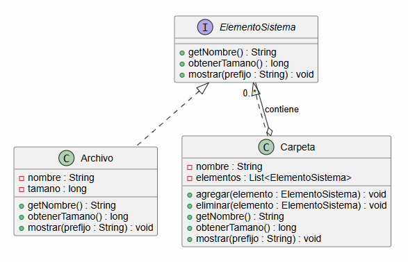
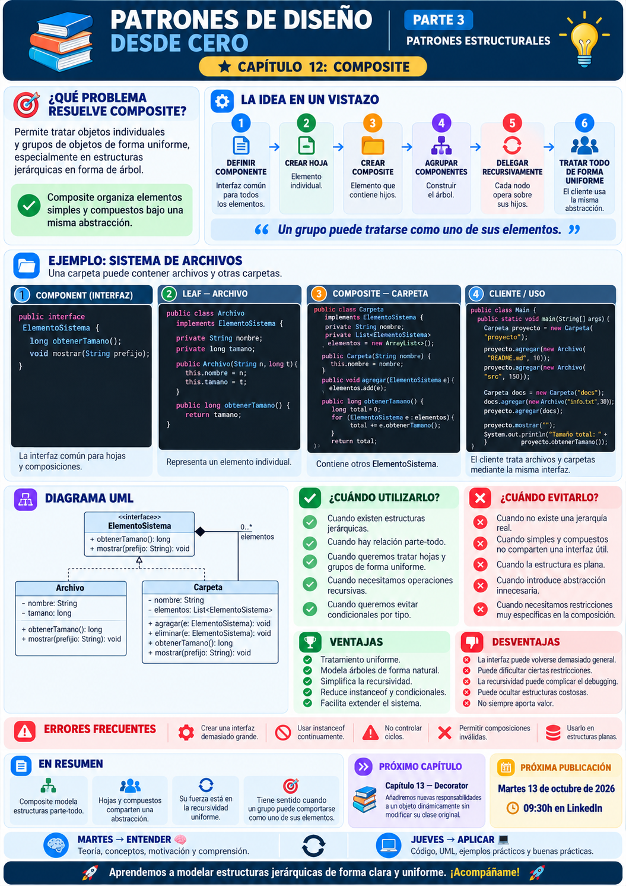

# 📚 Patrones de Diseño desde Cero

> **Aprende a diseñar software mantenible con ejemplos reales.**

# 📖 Capítulo 12 - Composite

> **📚 Patrones de Diseño desde Cero**  
> **🧱 Parte III - Patrones Estructurales**

---

## 🧠 Introducción

Continuamos nuestro recorrido por los **patrones estructurales**.

Hasta ahora hemos estudiado:

### 🔌 Adapter

> **¿Cómo hacemos colaborar interfaces incompatibles?**

### 🌉 Bridge

> **¿Cómo separamos dos dimensiones para que evolucionen de forma independiente?**

Ahora nos encontramos con un problema distinto.

Imaginemos un sistema de archivos.

Tenemos:

```text
Archivo
Carpeta
```

Un archivo es un elemento individual.

Pero una carpeta puede contener:

```text
Archivos
+
Otras carpetas
```

Por ejemplo:

```text
proyecto/
│
├── README.md
├── src/
│   ├── Main.java
│   └── Usuario.java
│
└── docs/
    └── arquitectura.pdf
```

Aquí aparece una estructura jerárquica.

Queremos poder realizar operaciones como:

```text
mostrar()
obtenerTamano()
```

tanto sobre un archivo individual como sobre una carpeta completa.

La pregunta será:

> **¿Cómo podemos tratar objetos individuales y composiciones de objetos de forma uniforme?**

Aquí aparece:

# 🌳 Composite

Composite permite organizar objetos en estructuras de árbol y tratar de manera uniforme tanto a los elementos individuales como a los grupos de elementos.

---

# 🎯 Objetivos de aprendizaje

Al finalizar este capítulo deberías ser capaz de:

- Comprender qué problema intenta resolver Composite.
- Identificar estructuras jerárquicas en forma de árbol.
- Comprender qué significa tratar objetos individuales y compuestos de forma uniforme.
- Identificar `Component`, `Leaf`, `Composite` y `Client`.
- Implementar Composite en Java.
- Comprender cómo un Composite contiene otros componentes.
- Utilizar recursividad sobre estructuras de objetos.
- Diferenciar hojas y contenedores.
- Comprender las ventajas y desventajas del patrón.
- Saber cuándo utilizarlo y cuándo evitarlo.
- Diferenciar Composite de Decorator.
- Comprender los riesgos de una interfaz demasiado general.
- Reconocer errores frecuentes al implementar estructuras Composite.

---

# ❌ El problema

Imaginemos que queremos representar archivos.

Podemos crear:

```java
public class Archivo {

    private String nombre;
    private long tamano;

    public Archivo(
            String nombre,
            long tamano) {

        this.nombre = nombre;
        this.tamano = tamano;
    }

    public long obtenerTamano() {

        return tamano;
    }
}
```

Hasta aquí todo es sencillo.

Pero ahora necesitamos representar carpetas.

Una carpeta puede contener:

```text
Archivo
Archivo
Archivo
```

Podríamos crear:

```java
public class Carpeta {

    private List<Archivo> archivos =
            new ArrayList<>();
}
```

Pero aparece un nuevo requisito:

> **Una carpeta también puede contener otras carpetas.**

Entonces tendríamos:

```java
public class Carpeta {

    private List<Archivo> archivos =
            new ArrayList<>();

    private List<Carpeta> carpetas =
            new ArrayList<>();
}
```

Ahora para calcular el tamaño de una carpeta necesitamos recorrer:

```text
archivos
+
subcarpetas
```

Y cada subcarpeta puede contener:

```text
más archivos
+
más carpetas
```

La lógica empieza a complicarse.

---

# 💡 Motivación

Tenemos dos tipos de elementos:

```text
ELEMENTOS SIMPLES
       ↓
     Archivo
```

Y:

```text
ELEMENTOS COMPUESTOS
       ↓
     Carpeta
```

Pero ambos representan algo parecido:

> **un elemento del sistema de archivos.**

Queremos poder escribir:

```java
elemento.obtenerTamano();
```

sin preocuparnos constantemente de si:

```text
es un Archivo
```

o:

```text
es una Carpeta
```

La idea es crear una abstracción común:

```text
ElementoSistema
```

Entonces:

```text
Archivo
```

y:

```text
Carpeta
```

podrán tratarse mediante la misma interfaz.

---

# 🌳 La solución

Composite organiza los objetos mediante una estructura similar a un árbol.

Conceptualmente:

```text
                Componente
                    ▲
             ┌──────┴──────┐
             │             │
            Hoja        Composite
                           │
                           ├── Componente
                           ├── Componente
                           └── Componente
```

El elemento compuesto contiene otros objetos que implementan la misma abstracción.

En nuestro ejemplo:

```text
ElementoSistema
      ▲
      │
 ┌────┴────┐
 │         │
Archivo  Carpeta
           │
           └── List<ElementoSistema>
```

Una carpeta puede contener:

```text
Archivo
Carpeta
```

porque ambos implementan:

```text
ElementoSistema
```

---

# 🧱 Participantes del patrón

Composite suele estar formado por cuatro participantes principales.

## 1️⃣ Component

Define la interfaz común para todos los elementos.

En nuestro ejemplo:

```java
public interface ElementoSistema {

    String getNombre();

    long obtenerTamano();

    void mostrar(String prefijo);
}
```

---

## 2️⃣ Leaf

Representa los objetos individuales.

En nuestro caso:

```text
Archivo
```

Un archivo no contiene otros componentes.

---

## 3️⃣ Composite

Representa un objeto que contiene otros componentes.

En nuestro caso:

```text
Carpeta
```

Una carpeta puede contener:

```java
List<ElementoSistema>
```

---

## 4️⃣ Client

Es el código que trabaja con la abstracción común.

Por ejemplo:

```java
ElementoSistema raiz;
```

El cliente puede ejecutar:

```java
raiz.obtenerTamano();
```

sin conocer necesariamente toda la estructura interna.

---

# ☕ Implementación en Java

## Component - ElementoSistema.java

```java
public interface ElementoSistema {

    String getNombre();

    long obtenerTamano();

    void mostrar(String prefijo);
}
```

---

# 📄 Leaf - Archivo.java

```java
public class Archivo
        implements ElementoSistema {

    private final String nombre;
    private final long tamano;

    public Archivo(
            String nombre,
            long tamano) {

        this.nombre = nombre;
        this.tamano = tamano;
    }

    @Override
    public String getNombre() {

        return nombre;
    }

    @Override
    public long obtenerTamano() {

        return tamano;
    }

    @Override
    public void mostrar(
            String prefijo) {

        System.out.println(
            prefijo
            + "📄 "
            + nombre
            + " ("
            + tamano
            + " KB)"
        );
    }
}
```

---

# 📁 Composite - Carpeta.java

```java
import java.util.ArrayList;
import java.util.List;

public class Carpeta
        implements ElementoSistema {

    private final String nombre;

    private final List<ElementoSistema>
            elementos =
            new ArrayList<>();

    public Carpeta(
            String nombre) {

        this.nombre = nombre;
    }

    public void agregar(
            ElementoSistema elemento) {

        elementos.add(elemento);
    }

    public void eliminar(
            ElementoSistema elemento) {

        elementos.remove(elemento);
    }

    @Override
    public String getNombre() {

        return nombre;
    }

    @Override
    public long obtenerTamano() {

        long total = 0;

        for (
            ElementoSistema elemento :
            elementos
        ) {

            total +=
                elemento.obtenerTamano();
        }

        return total;
    }

    @Override
    public void mostrar(
            String prefijo) {

        System.out.println(
            prefijo
            + "📁 "
            + nombre
        );

        for (
            ElementoSistema elemento :
            elementos
        ) {

            elemento.mostrar(
                prefijo + "   "
            );
        }
    }
}
```

---

# ▶️ Cliente - Main.java

```java
public class Main {

    public static void main(String[] args) {

        Archivo readme =
                new Archivo(
                    "README.md",
                    10
                );

        Archivo main =
                new Archivo(
                    "Main.java",
                    25
                );

        Archivo usuario =
                new Archivo(
                    "Usuario.java",
                    30
                );

        Archivo arquitectura =
                new Archivo(
                    "arquitectura.pdf",
                    120
                );

        Carpeta src =
                new Carpeta(
                    "src"
                );

        src.agregar(main);
        src.agregar(usuario);

        Carpeta docs =
                new Carpeta(
                    "docs"
                );

        docs.agregar(
            arquitectura
        );

        Carpeta proyecto =
                new Carpeta(
                    "proyecto"
                );

        proyecto.agregar(
            readme
        );

        proyecto.agregar(
            src
        );

        proyecto.agregar(
            docs
        );

        proyecto.mostrar("");

        System.out.println(
            "Tamaño total: "
            + proyecto.obtenerTamano()
            + " KB"
        );
    }
}
```

---

# 📤 Posible salida

```text
📁 proyecto
   📄 README.md (10 KB)
   📁 src
      📄 Main.java (25 KB)
      📄 Usuario.java (30 KB)
   📁 docs
      📄 arquitectura.pdf (120 KB)

Tamaño total: 185 KB
```

---

# 🔎 Explicación paso a paso

## 1️⃣ Creamos una abstracción común

```java
ElementoSistema
```

define las operaciones que podremos ejecutar sobre cualquier elemento.

---

## 2️⃣ Archivo actúa como Leaf

```java
Archivo
```

representa un elemento individual.

No contiene otros componentes.

---

## 3️⃣ Carpeta actúa como Composite

```java
Carpeta
```

también implementa:

```java
ElementoSistema
```

pero además contiene:

```java
List<ElementoSistema>
```

---

## 4️⃣ Una carpeta puede contener archivos

Porque:

```java
Archivo
```

implementa:

```java
ElementoSistema
```

---

## 5️⃣ También puede contener carpetas

Porque:

```java
Carpeta
```

implementa la misma interfaz.

---

## 6️⃣ Aparece la recursividad

Cuando ejecutamos:

```java
proyecto.obtenerTamano();
```

la carpeta pregunta a cada hijo:

```java
elemento.obtenerTamano();
```

Si el hijo es un archivo:

```text
devuelve su tamaño
```

Si es otra carpeta:

```text
vuelve a recorrer sus hijos
```

Y así sucesivamente.

---

# 📊 UML

La estructura puede representarse mediante:



Conceptualmente:

```text
              ElementoSistema
                    ▲
             ┌──────┴──────┐
             │             │
          Archivo        Carpeta
           Leaf         Composite
                           │
                           │ contiene
                           ▼
                    ElementoSistema
```

---

# 🌳 La estructura de árbol

Composite resulta especialmente natural cuando nuestros datos forman estructuras jerárquicas.

Por ejemplo:

```text
Raíz
│
├── Hoja
│
├── Composite
│   ├── Hoja
│   ├── Hoja
│   └── Composite
│       └── Hoja
│
└── Hoja
```

Cada nodo puede tratarse como:

```text
Component
```

Esto hace que las operaciones recursivas resulten mucho más sencillas.

---

# 🔁 La clave: tratamiento uniforme

Sin Composite podemos terminar escribiendo:

```java
if (elemento instanceof Archivo) {

    // lógica para archivo

} else if (
    elemento instanceof Carpeta
) {

    // lógica para carpeta
}
```

Con Composite podemos utilizar:

```java
elemento.obtenerTamano();
```

independientemente del tipo concreto.

La idea fundamental es:

> **El cliente trabaja con la abstracción común y no necesita distinguir constantemente entre hojas y composites.**

---

# ⚖️ Transparencia vs. seguridad

Existe una decisión importante al diseñar Composite.

¿Dónde colocamos operaciones como:

```java
agregar()
eliminar()
```

?

Tenemos dos posibilidades.

---

# 🟦 Opción 1 - Composite seguro

Definimos en `Component` únicamente operaciones comunes:

```java
public interface ElementoSistema {

    long obtenerTamano();

    void mostrar(
        String prefijo
    );
}
```

Y solamente `Carpeta` proporciona:

```java
agregar()
eliminar()
```

### Ventaja

No podemos intentar añadir elementos a un archivo.

### Desventaja

El cliente debe conocer cuándo está trabajando con una carpeta si quiere modificar la estructura.

Este es el enfoque utilizado en nuestro ejemplo.

---

# 🟨 Opción 2 - Composite transparente

Podríamos poner:

```java
agregar()
eliminar()
```

en la interfaz común.

Por ejemplo:

```java
public interface ElementoSistema {

    void agregar(
        ElementoSistema elemento
    );

    void eliminar(
        ElementoSistema elemento
    );

    long obtenerTamano();
}
```

Ahora todos los objetos tienen exactamente la misma interfaz.

Pero:

```java
Archivo
```

tendría que implementar operaciones que no tienen sentido.

Por ejemplo:

```java
@Override
public void agregar(
        ElementoSistema elemento) {

    throw new UnsupportedOperationException();
}
```

Esto aumenta la uniformidad, pero reduce la seguridad semántica.

---

# 🤔 ¿Cuál es mejor?

No existe una respuesta universal.

### Diseño seguro

Prioriza:

```text
coherencia semántica
```

### Diseño transparente

Prioriza:

```text
uniformidad de interfaz
```

La elección depende del contexto.

---

# 🏗️ Caso de uso real: interfaz gráfica

Composite también puede utilizarse en interfaces gráficas.

Podemos tener:

```text
ComponenteUI
│
├── Boton
├── Texto
└── Panel
      │
      ├── Boton
      ├── Texto
      └── Panel
```

Un `Panel` contiene otros componentes.

Pero todos pueden implementar:

```java
renderizar();
```

Entonces:

```java
panel.renderizar();
```

puede renderizar recursivamente todos sus hijos.

---

# 🏢 Caso de uso real: organizaciones

También podemos representar:

```text
Empresa
│
├── Empleado
├── Departamento
│   ├── Empleado
│   └── Departamento
│       └── Empleado
```

Si todos implementan:

```java
obtenerCoste();
```

un departamento puede calcular su coste sumando el de todos sus componentes.

---

# 🍱 Caso de uso real: productos y paquetes

Imaginemos:

```text
Producto
```

y:

```text
Caja
```

Una caja puede contener:

```text
Productos
+
Otras cajas
```

Podemos calcular:

```text
peso
precio
volumen
```

recursivamente.

---

# 🎯 ¿Cuándo utilizar Composite?

Composite puede resultar adecuado cuando:

- Tenemos estructuras jerárquicas.
- Los objetos forman árboles.
- Existen elementos simples y compuestos.
- Queremos tratarlos de forma uniforme.
- Las composiciones pueden contener otras composiciones.
- Necesitamos operaciones recursivas.
- Queremos evitar lógica repetida basada en tipos concretos.

---

# 🚫 ¿Cuándo evitarlo?

Probablemente no necesitamos Composite cuando:

- La estructura no es jerárquica.
- No existen elementos compuestos.
- Los objetos simples y compuestos tienen comportamientos muy diferentes.
- No tiene sentido una interfaz común.
- La estructura es pequeña y fija.
- Introduce más abstracción que beneficio.
- Necesitamos restricciones muy estrictas sobre qué elementos puede contener cada Composite.

---

# ✅ Ventajas

## 🔹 Tratamiento uniforme

Podemos trabajar con:

```java
ElementoSistema
```

sin distinguir continuamente el tipo concreto.

---

## 🔹 Modela árboles de forma natural

La estructura del código refleja la estructura del dominio.

---

## 🔹 Simplifica operaciones recursivas

Por ejemplo:

```text
tamaño
precio
renderizado
búsqueda
```

---

## 🔹 Facilita añadir nuevos tipos de hojas

Podemos crear nuevas implementaciones de `Component`.

---

## 🔹 Reduce condicionales por tipo

Evita muchos:

```java
instanceof
```

y:

```java
if / else
```

basados en tipos concretos.

---

## 🔹 Permite composiciones arbitrariamente profundas

Una carpeta puede contener otra carpeta que contenga otra carpeta.

---

# ❌ Desventajas

## 🔸 Puede hacer la interfaz demasiado general

No todas las operaciones tienen sentido para hojas y composites.

---

## 🔸 Puede dificultar restricciones

Por ejemplo:

> **Una carpeta solo puede contener determinados elementos.**

Puede requerir validaciones adicionales.

---

## 🔸 La recursividad puede complicar el debugging

Las llamadas atraviesan múltiples niveles del árbol.

---

## 🔸 Puede ocultar estructuras grandes

Una simple llamada:

```java
raiz.obtenerTamano();
```

puede recorrer miles de nodos.

---

## 🔸 Puede introducir complejidad innecesaria

Si la estructura es plana, probablemente no necesitamos Composite.

---

# ⚠️ Composite no significa simplemente usar una lista

Esto:

```java
List<Archivo>
```

no implica Composite.

La característica fundamental es:

> **El Composite contiene objetos que implementan la misma abstracción que él mismo.**

Es decir:

```text
Component
   ▲
   │
Composite
   │
   └── List<Component>
```

Esta autorreferencia estructural es la que permite construir árboles.

---

# ⚠️ Composite no significa que todo deba comportarse igual

Archivo y Carpeta comparten determinadas operaciones:

```text
obtenerTamano()
mostrar()
```

pero no son idénticos.

`Carpeta` tiene una responsabilidad adicional:

```text
gestionar hijos
```

La interfaz común debe contener únicamente operaciones que tengan sentido compartir.

---

# 🚨 Errores frecuentes

## ❌ Crear una interfaz demasiado grande

Si `Component` contiene operaciones que solo tienen sentido para algunos tipos, podemos terminar con métodos artificiales.

---

## ❌ Utilizar `instanceof` continuamente

Si el cliente necesita distinguir constantemente:

```java
Archivo
Carpeta
```

quizá no estamos aprovechando correctamente el patrón.

---

## ❌ Introducir lógica especial en el cliente

La lógica recursiva debería estar encapsulada dentro de los componentes.

---

## ❌ No controlar ciclos

Un árbol debería evitar estructuras como:

```text
Carpeta A
   ↓
Carpeta B
   ↓
Carpeta A
```

Esto puede provocar recursión infinita.

---

## ❌ Permitir composiciones inválidas

No cualquier componente tiene por qué poder contener cualquier otro.

---

## ❌ Usarlo en estructuras planas

Si no existe una jerarquía real, Composite probablemente no aporta valor.

---

# 🧠 Buenas prácticas

## 1️⃣ Define una interfaz mínima

Incluye únicamente operaciones comunes.

---

## 2️⃣ Encapsula la recursividad

El cliente debería poder invocar:

```java
raiz.mostrar();
```

sin recorrer manualmente toda la estructura.

---

## 3️⃣ Evita ciclos

Valida las relaciones padre-hijo cuando sea necesario.

---

## 4️⃣ Considera colecciones inmutables

Si el cliente no debe modificar directamente los hijos, puedes devolver vistas protegidas.

---

## 5️⃣ Decide entre transparencia y seguridad

Valora cuidadosamente dónde colocar:

```text
agregar
eliminar
```

---

## 6️⃣ Controla estructuras muy grandes

Una operación recursiva sobre miles de nodos puede tener impacto en rendimiento.

---

# 🆚 Composite vs. Decorator

Ambos patrones suelen compartir una interfaz común y utilizar composición.

Pero su intención es diferente.

| Composite | Decorator |
|---|---|
| Construye estructuras de árbol | Añade comportamiento |
| Puede contener muchos componentes | Normalmente envuelve un componente |
| Trata hojas y grupos uniformemente | Mantiene la misma interfaz |
| Modela relaciones parte-todo | Extiende responsabilidades |

Podemos visualizarlo:

```text
COMPOSITE

Component
   ▲
   │
Composite
   │
   ├── Component
   ├── Component
   └── Component
```

Mientras que:

```text
DECORATOR

Component
   ▲
   │
Decorator
   │
   └── Component
```

Decorator será precisamente el siguiente patrón que estudiaremos.

---

# 🆚 Composite vs. Bridge

| Composite | Bridge |
|---|---|
| Construye árboles | Separa dos jerarquías |
| Relación parte-todo | Relación abstracción-implementación |
| Puede contener múltiples componentes | Mantiene una implementación |
| Busca uniformidad | Busca independencia |

---

# 🆚 Composite vs. Adapter

| Composite | Adapter |
|---|---|
| Organiza objetos jerárquicamente | Hace compatibles interfaces |
| Misma abstracción para hojas y grupos | Traduce entre interfaces |
| Estructura árbol | Estructura puente de compatibilidad |
| Problema estructural jerárquico | Problema de integración |

---

# 🔄 Comparación dentro de la Parte III

Hasta ahora:

```text
10. Adapter
       ↓
Compatibilidad

11. Bridge
       ↓
Independencia

12. Composite
       ↓
Jerarquías parte-todo
```

Podemos verlo así:

```text
PATRONES ESTRUCTURALES
        │
        ├── Adapter
        │      ↓
        │  Conectar
        │
        ├── Bridge
        │      ↓
        │  Separar
        │
        └── Composite
               ↓
           Agrupar
```

---

# 🧠 Principios relacionados

Composite conecta con varios principios de diseño.

## 🧩 Programar hacia abstracciones

El cliente utiliza:

```java
ElementoSistema
```

en lugar de trabajar constantemente con clases concretas.

---

## 🌳 Encapsulación de estructuras

Cada Composite conoce cómo gestionar a sus hijos.

---

## 🔄 Polimorfismo

La misma operación tiene implementaciones diferentes:

```java
obtenerTamano()
```

en:

```text
Archivo
Carpeta
```

---

## 🧱 Separación de responsabilidades

La hoja gestiona su propio comportamiento.

El Composite gestiona una colección de componentes.

---

## 🎯 Simplicidad del cliente

El cliente puede tratar toda la estructura de manera uniforme.

---

# 📌 Resumen

En este capítulo hemos aprendido que:

- Composite pertenece a los patrones estructurales.
- Permite construir estructuras jerárquicas en forma de árbol.
- Trata objetos individuales y grupos de objetos mediante una abstracción común.
- `Component` define la interfaz compartida.
- `Leaf` representa elementos individuales.
- `Composite` contiene otros `Component`.
- Un Composite puede contener tanto hojas como otros composites.
- La recursividad permite recorrer estructuras completas.
- El cliente puede tratar toda la estructura de forma uniforme.
- Existe una decisión entre Composite seguro y transparente.
- Una interfaz común demasiado grande puede generar problemas.
- Composite no significa simplemente utilizar una colección.
- Resulta especialmente útil en relaciones parte-todo.
- No debemos utilizarlo si no existe una jerarquía real.

La pregunta fundamental de Composite es:

> **¿Tenemos objetos individuales y grupos de esos mismos objetos que queremos tratar mediante una interfaz común?**

---

# 🎓 Conclusiones

Composite introduce una idea especialmente elegante:

> **Un grupo puede comportarse como uno de sus elementos.**

Un archivo responde a:

```java
obtenerTamano();
```

Y una carpeta también.

La diferencia es que la carpeta calcula el resultado preguntando a sus hijos:

```text
Carpeta
   │
   ├── Archivo
   ├── Archivo
   └── Carpeta
          │
          └── Archivo
```

Gracias a una abstracción común, el cliente no necesita gestionar toda esa complejidad.

Puede simplemente escribir:

```java
elemento.obtenerTamano();
```

Pero, como siempre, existe un coste.

La interfaz debe diseñarse correctamente.

Debemos controlar estructuras inválidas.

La recursividad puede ocultar operaciones costosas.

Y no toda colección de objetos necesita Composite.

Por eso seguimos aplicando nuestra metodología:

```text
PROBLEMA
   ↓
CONTEXTO
   ↓
¿EXISTE UNA JERARQUÍA?
   ↓
¿HAY RELACIÓN PARTE-TODO?
   ↓
ALTERNATIVAS
   ↓
¿COMPOSITE APORTA VALOR?
```

No utilizamos Composite simplemente porque tengamos:

```java
List<Objeto>
```

Lo utilizamos cuando existe una estructura donde **los elementos individuales y las agrupaciones representan conceptualmente el mismo tipo de componente**.

> **Composite convierte una estructura compleja en algo que el cliente puede tratar de forma sorprendentemente sencilla.**

---

# 🖼️ Infografía

Aquí os dejo una infografía sobre este **capítulo 12**.



---

**📚 Patrones de Diseño desde Cero**

*Aprende a diseñar software mantenible con ejemplos reales.*